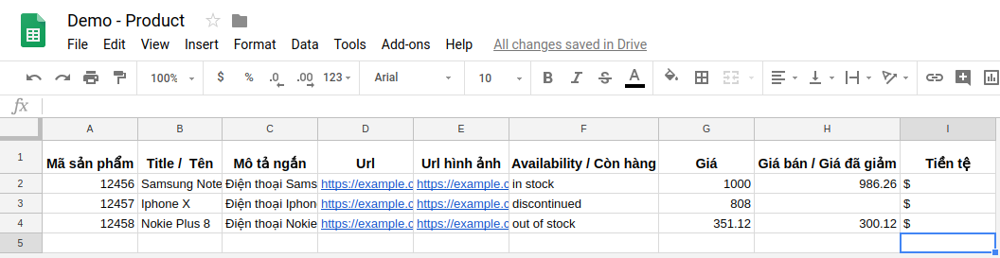

# Sản phẩm

Coming soon! ...

### Quản lý sản phẩm là gì?

Chức năng quản lý sản phầm là cách dễ dàng nhất để bạn lưu trữ thông tin sản phẩm mà doanh nghiệp bạn đang kinh doanh lên Subiz, từ đó bạn có thể gửi sản phẩm cho khách hàng, mời khách hàng mua sản phẩm ngay trên cửa sổ Subiz, hỏi phản hồi về một sản phẩm cụ thể...

Chức năng quản lý sản phẩm giúp bạn lưu trữ chứ không thay thế phần mềm quản lý kho của doanh nghiệp. Nhưng nó có khả năng đồng bộ dữ liệu mạnh mẽ giúp nhân viên trong công ty dễ dàng tiếp cận thông tin và kho hàng. Các cách sau để bạn nhập dữ liệu vào Subiz.

#### Nhập dữ liệu sản phẩm từ file CSV.

CSV \(Comma Separated Values\) là một loại định dạng văn bản đơn giản mà trong đó, các giá trị được ngăn cách với nhau bằng dấu phẩy. File CSV cũng mở được bằng Google Sheet hay Excel. 

#### Tự động đồng bộ dữ liệu từ Website.

