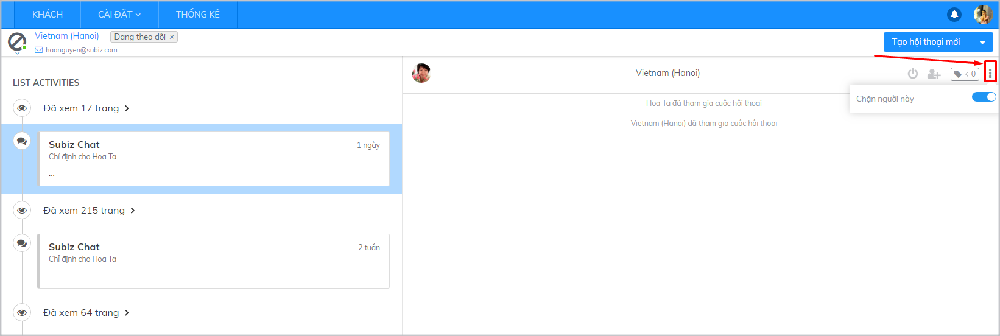
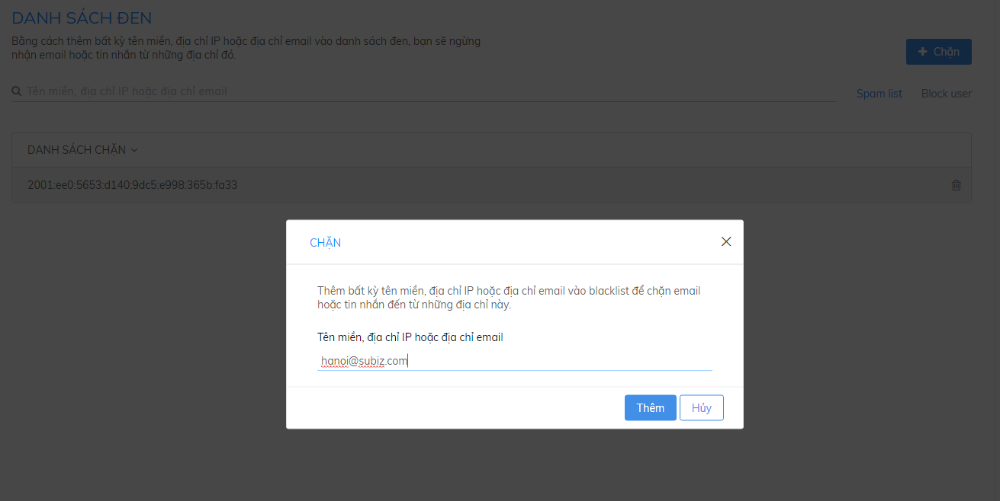
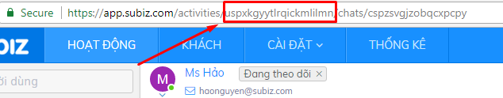
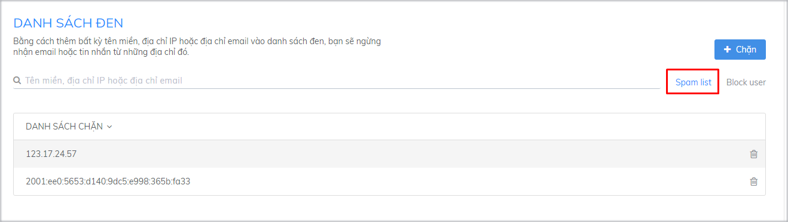
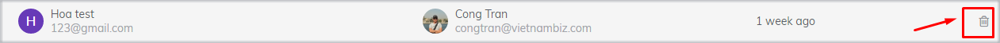
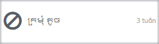

# Làm thế nào để chặn một User

Trong quá trình tương tác với khách hàng trên Subiz, bạn có thể gặp những users gây phiền toái cho cuộc trò chuyện như gửi tin nhắn spam, có những lời nói khiếm nhã hay có những hành vi làm ảnh hưởng đến doanh nghiệp...Vậy làm cách nào để ngăn những user này gửi email/ tin nhắn spam đến doanh nghiệp? Bài viết sau sẽ chia sẻ cho bạn những hướng dẫn cụ thể.

### Chặn một User

Bạn có thể chặn một User theo 2 cách sau:

**1.Chặn trực tiếp User trong tab Activities \(Hoạt động\)**

Trong cuộc hội thoại, bạn có thể chặn user bằng cách click vào biểu tượng ba chấm ở góc phải màn hình và bật nút Block

**2. Chặn User thông qua Blacklist \(Danh sách đen\)**

Blacklist là danh sách những user mà bạn đã chặn. Để thêm vào danh sách này, bạn vào mục **Cài đặt/ Tài khoản/ Danh sách đen/ Chặn**. Tại đây bạn chỉ cần copy địa chỉ **IP, Email** hoặc **ID** của User muốn chặn.



Mỗi user kết nối internet đều có một địa chỉ IP. Bạn có thể nhập địa chỉ IP vào BlackList Ips để chặn User này.

Tuy nhiên, trong trường hợp có nhiều users sử dụng chung 1 IP, cách chặn này sẽ khiến bạn chặn luôn cả những users còn lại.  Ví dụ Subiz Team đang dùng 1 IP là 112.134.233.134, nếu chặn IP này tất cả máy tính tại Văn phòng Subiz sẽ không thấy Widget hiển thị trên cửa sổ website Subiz.com


**Lưu ý:** Việc chặn bằng địa chỉ IP được thực hiện khi bạn muốn chặn user qua kênh Subiz Chat. User này sẽ không thấy được cửa sổ Widget trên website.




Sau khi nhập email của user bạn muốn chặn, tất cả mail được gửi từ địa chỉ này đều bị chặn.


**Lưu ý:** Việc chặn địa chỉ mail được sử dụng khi bạn muốn chặn tương tác trên kênh email.




Mỗi User kết nối được tới Subiz đều được cấp một mã số và gọi là User ID.  Những gì bạn cần làm là copy ID của User muốn chặn trong mục activity và dán vào ô chặn:

Đây là cách chặn chính xác và tổng quan nhất trên tất cả các kênh mà User này kết nối như Email,  Subiz Chat, Messenger.

**Cách lấy User ID**: Click vào 1 User trong tab Activities và lấy URL, copy đoạn đánh dấu đỏ như sau:




### Xem danh sách chặn

Để theo dõi được danh sách các user bị chặn cũng như lịch sử chặn,  bạn có thể theo dõi trong mục **Blacklist**



Đây là  danh sách những địa chỉ IP, Email hoặc ID đã bị chặn.




Bao gồm danh sách các Users đã bị Chặn, Agent thao tác chặn và thời gian chặn 




### Bỏ chặn một User

Để bỏ chặn một User, bạn có thể thao tác theo 2 cách sau:

* **Bỏ chặn trực tiếp trên trang Activities:**  Từ Tab activities -&gt; Tìm User và tắt Chặn User.
* **Bỏ chặn trong Blacklist:** Trong BlackList , click vào biểu tượng remove đối với User muốn bỏ chặn

### Điều gì xảy ra khi bạn chặn một User

* **Với Channel Subiz Chat:** User sẽ không nhìn thấy cửa sổ chat và không thể tạo cuộc hội thoại hay gửi tin nhắn.
* **Với Channel Email:** User gửi email và bị chặn tại Subiz Core. Mail đó sẽ không được hiển thị cho Agent.
* **Với Channel Messenger:** Tin nhắn được chặn ở Subiz Core và không hiển thị cho Agent. Lưu  ý: tin nhắn vẫn tồn tại và hiển thị nếu khách dùng Quản trị fanpage.
* Các agent bị chặn có Avatar gạch chéo  

