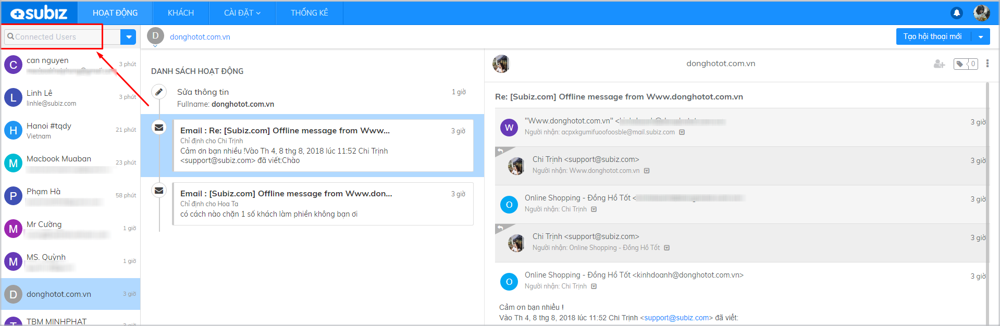

# Sử dụng phân khúc khách hàng mặc định

Để quản lý danh sách User và các cuộc tương tác một cách tổng quan, các Agent hoàn toàn có thể sử dụng các phân khúc mặc định Subiz đã thiết lập trên thanh tìm kiếm trong trang [Hoạt động](https://app.subiz.com/activities). Bài viết sau sẽ giúp Agent hiểu hơn về ý nghĩa và cách sử dụng các phân khúc này.

### **User của tôi**

Đây là danh sách tất cả những User đã có tương tác từng Agent Subiz. Mỗi Agent sẽ có một danh sách User riêng. Tại đây , Agent có thể quan sát lại tất cả các hội thoại theo trình tự thời gian, hoạt động của các User trên website  và lịch sử tương tác của họ.

### **Connected User**

Đây là danh sách tất cả User có tương tác với các Agent của doanh nghiệp.

* _**Nếu bạn là Agent Owner:**_

Danh sách này sẽ giúp bạn nắm được tình hình chăm sóc khách hàng, bán hàng trực tuyến của doanh nghiệp như: lượng User có tương tác mỗi ngày, tỉ lệ chốt hàng thành công, thái độ của Agent tư vấn….. Bạn hoàn toàn có thể đọc được tất cả các cuộc chat của Agent khác, theo dõi lịch sử hoạt động của các User…

* _**Nếu bạn là Agent thành viên:**_

Bạn sẽ quan sát được danh sách các user đã tương tác với bạn và các agent khác. Tuy nhiên tùy vào phân quyền, bạn có thể hoặc không thể xem được chi tiết cuộc hội thoại với User của Agent khác.  
Ví dụ: Bạn bị hạn chế quyền xem tin nhắn của Agent khác:

Bạn sẽ chỉ xem được danh sách tất cả User, lịch sử tương tác  và hoạt động của họ, nhưng không quan sát được nội dung tin nhắn với Agent khác.

Bạn có thể báo Agent có quyền cài đặt tài khoản xem [Phân quyền agent](https://app.subiz.com/settings/agents-list) của bạn trong mục Agent.

### **Cuộc hội thoại chưa phân phối**

Đây là danh danh sách những cuộc hội thoại chưa được phân phối đến Agent phụ trách.

* **Không có cuộc hội thoại chưa phân phối**

* **Có cuộc hội thoại chưa phân phối**

**Nguyên nhân:**

* Do cài đặt rule chưa đúng điều kiện, khiến Agent không nhận được cuộc hội thoại
* Do rule cài đặt chưa đầy đủ các trường hợp để phân phối cuộc hội thoại cho agent

Bạn có thể vào  lại phần [Cài đặt rule](https://app.subiz.com/settings/rule-setting) để kiểm tra lại các kịch bản phân phối hội thoại của mình.


**Lưu ý:** Bạn vẫn có thể tham gia và trả lời những cuộc hội thoại chưa được phân phối này.


  
  
  

  
  
  
****

