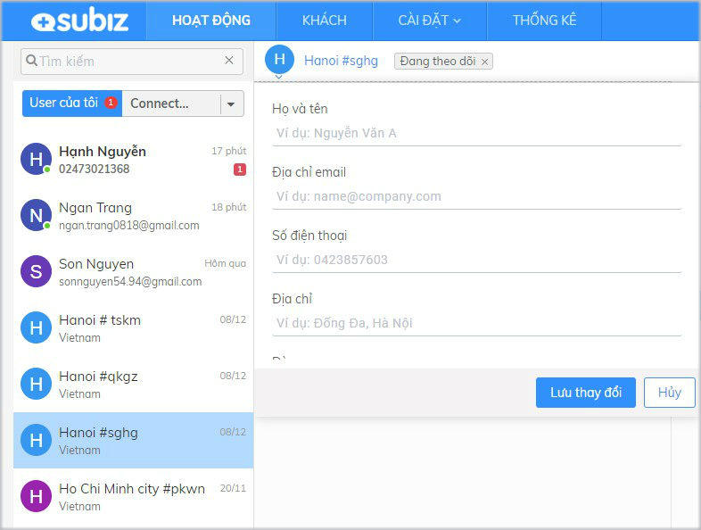
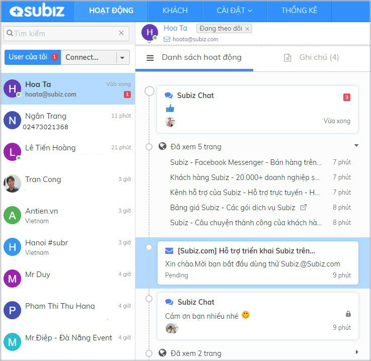

# Quản lý và cập nhật thông tin user

**User là khách hàng có tương tác với bạn qua** [**Subiz**](https://subiz.com/vi/)**,** bao gồm các khách hàng có hội thoại trò chuyện với agent từ website, Fanpage Messenger và Email. Danh sách user được hiển thị bên trái trên trang [**HOẠT ĐỘNG**](https://app.subiz.com/activities)**.**

Tại trang [**HOẠT ĐỘNG**](https://app.subiz.com/activities), bạn có thể quản lý danh sách user đã tương tác, danh sách hoạt động của từng user và lịch sử các cuộc hội thoại trực tiếp với user.

### **Danh sách User** 

**Danh sách user là các user có hội thoại trò chuyện trên các kênh và truy cập website.** Agent có thể tìm kiếm user theo các thông tin như Họ Tên, Địa chỉ email, Số điện thoại.

Có 4 danh sách user được phân nhóm để agent theo dõi và quản lý user:

* **User của tôi:** Mỗi agent sẽ có một danh sách "User của tôi**"** riêng, các user đã có hội thoại với agent. Agent sẽ chủ động theo dõi được các user mình đã chăm sóc tư vấn.
* **Connected users**: Tất cả user đã có hội thoại trò chuyện với các agent trong tài khoản. Connected users giúp người quản lý có thể nắm bắt tình hình khách hàng liên hệ và cách chăm sóc tư vấn của các agent.
* **Hội thoại chưa được phân phối:** Các cuộc hội thoại của khách hàng chưa được chỉ định cho agent sẽ được tự động chuyển về "Hội thoại chưa được phân phối". Agent có thể vào kiểm tra và trả lời khách hàng. Xem thêm [cài đặt Rule phân phối hội thoại cho agen](https://help.subiz.com/bat-dau-voi-subiz/trien-khai-hoat-dong/phan-phoi-cuoc-hoi-thoai/rule-phan-phoi-cuoc-hoi-thoai)t.
* **Tickets** : Danh sách các user có ticket cần theo dõi và xử lý.  Xem thêm [hướng dẫn sử dụng Ticket quản lý chăm sóc khách hàng](https://help.subiz.com/bat-dau-voi-subiz/lam-viec-tren-subiz/ticket-quan-ly-cham-soc-khach-hang).

**Tin nhắn mới của user hiển thị thông báo số màu đỏ để agent nhận biết và trả lời**. Tại ảnh đại diện của user có trạng thái online \(màu xanh\), ngược lại là user offline.

### Thông tin user

**User mới sẽ được phân biệt theo địa chỉ Thành phố + mã user và Quốc gia**. Agent có thể click chọn user và thay đổi các thông tin user như Họ tên, Địa chỉ email, Số điện thoại.....

Để cập nhật và quản lý nhiều dữ liệu khách hàng như Gói dịch vụ, Mã tài khoản, Website,... bạn có thể thêm trường dữ liệu [theo hướng dẫn tại đây](https://help.subiz.com/su-dung-subiz-nang-cao/quan-ly-du-lieu/thong-tin-khach-hang).

### Danh sách hoạt động user 

Khi click chọn user, agent kiểm tra được Danh sách hoạt động của user gồm Đã xem trang trên website, lịch sử cuộc hội thoại trên các kênh Subiz chat, Messenger, Email.

Các cuộc hội thoại có tin nhắn chưa đọc sẽ hiển thị thông báo đỏ.

Agent có thể Ghi chú thông tin user, vấn đề cần lưu ý, tổng quát khi hỗ trợ khách hàng.

\*\*\*\*

