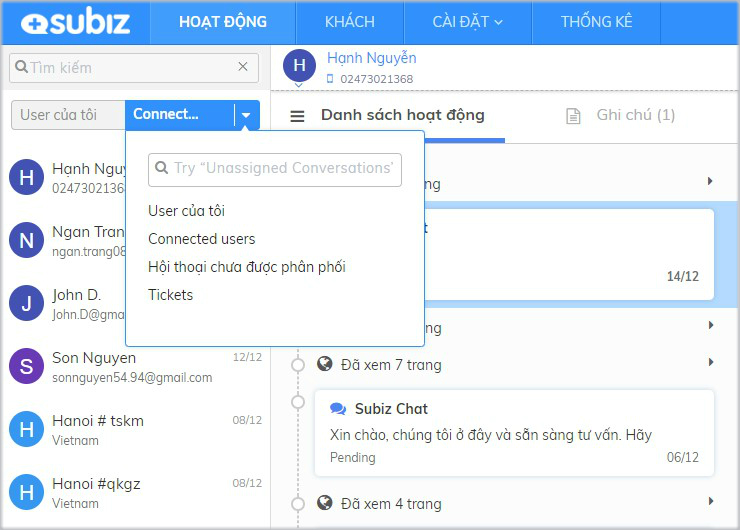

# Quản lý và cập nhật thông tin user

**User là khách hàng có tương tác với bạn qua** [**Subiz**](https://subiz.com/vi/)**,** bao gồm các khách hàng có hội thoại trò chuyện với agent từ website, Fanpage Messenger và Email. Danh sách user được hiển thị bên trái trên trang [**HOẠT ĐỘNG**](https://app.subiz.com/activities)**.**

Tại trang [**HOẠT ĐỘNG**](https://app.subiz.com/activities), bạn có thể quản lý danh sách user đã tương tác, danh sách hoạt động của từng user và lịch sử các cuộc hội thoại trực tiếp với user.

### **Danh sách User** 

**Danh sách user là các user có hội thoại trò chuyện trên các kênh và truy cập website.** Agent có thể tìm kiếm user theo các thông tin như Họ Tên, Địa chỉ email, Số điện thoại.

Có 4 danh sách user được phân nhóm để agent theo dõi và quản lý user:

* **User của tôi:** Mỗi agent sẽ có một danh sách "User của tôi**"** riêng, các user đã có hội thoại với agent. Agent sẽ chủ động theo dõi được các user mình đã chăm sóc tư vấn.
* **Connected users**: Tất cả user đã có hội thoại trò chuyện với các agent trong tài khoản. Connected users giúp người quản lý có thể nắm bắt tình hình khách hàng liên hệ và cách chăm sóc tư vấn của các agent.
* **Hội thoại chưa được phân phối:** Các cuộc hội thoại của khách hàng chưa được chỉ định cho agent sẽ được tự động chuyển về "Hội thoại chưa được phân phối". Agent có thể vào kiểm tra và trả lời khách hàng. Xem thêm [cài đặt Rule phân phối hội thoại cho agen](https://help.subiz.com/bat-dau-voi-subiz/trien-khai-hoat-dong/phan-phoi-cuoc-hoi-thoai/rule-phan-phoi-cuoc-hoi-thoai)t.
* **Tickets** : Danh sách các user có ticket cần theo dõi và xử lý.  Xem thêm [hướng dẫn sử dụng Ticket quản lý chăm sóc khách hàng](https://help.subiz.com/bat-dau-voi-subiz/lam-viec-tren-subiz/ticket-quan-ly-cham-soc-khach-hang).

**Tin nhắn mới của user hiển thị thông báo số màu đỏ để agent nhận biết và trả lời**. Tại ảnh đại diện của user có trạng thái online \(màu xanh\), ngược lại là user offline.

### Thông tin user

**User mới sẽ được phân biệt theo địa chỉ Thành phố + mã user và Quốc gia**. Agent có thể click chọn user và thay đổi các thông tin user như Họ tên, Địa chỉ email, Số điện thoại.....

Để cập nhật và quản lý nhiều dữ liệu khách hàng như Gói dịch vụ, Mã tài khoản, Website,... bạn có thể thêm trường dữ liệu [theo hướng dẫn tại đây](https://help.subiz.com/su-dung-subiz-nang-cao/quan-ly-du-lieu/thong-tin-khach-hang).

### Danh sách hoạt động user 

Khi click chọn user, agent kiểm tra được Danh sách hoạt động của user gồm Đã xem trang trên website, lịch sử cuộc hội thoại trên các kênh Subiz chat, Messenger, Email.

Các cuộc hội thoại có tin nhắn chưa đọc sẽ hiển thị thông báo đỏ.

Agent có thể Ghi chú thông tin user, vấn đề cần lưu ý, tổng quát khi hỗ trợ khách hàng.

Dữ liệu khách hàng là tài sản của doanh nghiệp. Bạn có được danh sách tất cả khách hàng đã tương tác qua Subiz ngay trên trang Danh sách User.

### Danh sách User

Tại đây bạn sẽ xem được 2 danh sách User:

* **User của tôi**: Mỗi agent sẽ có một danh sách "User của tôi" riêng, các user đã có hội thoại với agent đó. Agent sẽ chủ động theo dõi được các user của mình đã chăm sóc tư vấn.
* **Connected User**: Tất cả user đã có hội thoại trò chuyện với các agent trong tài khoản. Connected users giúp người quản lý có thể nắm bắt tình hình khách hàng liên hệ và cách chăm sóc tư vấn của các agent.

Danh sách User được hiển thị dạng bảng với các trường dữ liệu sau:

* **Họ tên**: Hiển thị theo vị trí Thành phố/ Tỉnh nếu khách chưa lưu Họ tên của khách
* **Số điện thoại**: Trống nếu chưa lưu số điện thoại của khách
* **Địa chỉ email**: Trống nếu chưa lưu địa chỉ email của khách
* **Vị trí**: Thành phố/ Tỉnh được tự động định vị theo vị trí địa chỉ
* **Đã tạo**: Thời gian lần đầu khách hàng liên hệ qua Subiz
* **Tương tác cuối cùng**: Thời gian cuối cùng khách hàng có tương tác qua Subiz
* **Số phiên**: Tổng số phiên khách hàng truy cập website
* **Tổng số hội thoại**: Tổng số cuộc hội thoại của khách hàng qua Subiz

### Tùy chỉnh hiển thị thông tin user

Dễ dàng tùy chọn các thông tin khách hàng sẽ được hiển thị trong bảng Danh sách user theo nhu cầu riêng của Doanh nghiệp. Bạn có thể thêm hoặc xóa bớt thông tin hiển thị như sau:

1. Click chuột vào mục **Tùy chỉnh hiển thị**
2. Chọn **+** để thêm thông tin được hiển thị hoặc Chọn **-** để xóa bỏ thông tin không được hiển thị 
3. Chọn **Đóng** để hoàn thành


Tip nhỏ: Bạn được tạo thêm nhiều thông tin khách hàng để thu thập và lưu trữ trên Subiz tại trang [Thông tin khách hàng](https://app.subiz.com/settings/user-attributes)


### Lọc User

Sử dụng chức năng Lọc User để tìm kiếm và xác định nhóm danh sách khách hàng mục tiêu.

Bạn có thể lọc user bằng cách kết hợp nhiều điều kiện dữ liệu khác nhau. Ví dụ: Những khách hàng ở khu vực Hà Nội,  có số điện thoại và địa chỉ email.

Các bước lọc user:

1. Click Lọc User 
2. Click Tùy chỉnh
3. Chọn trường dữ liệu bạn cần lọc &gt; Điền thông tin Chọn Thêm điều kiện khi bạn lọc kết hợp nhiều điều kiện cùng lúc
4. Cuối cùng, chọn Áp dụng

### Xuất dữ liệu user

Để tải dữ liệu khách hàng cho những báo cáo phân tích riêng, bạn có thể chọn Xuất dữ liệu user và gửi tới một hay nhiều email cùng lúc.

File dữ liệu user ở định dạng CSV, bạn có thể chọn mở bằng Google Sheet/ Bảng tính của Google.

### Xem lịch sử hoạt động của user

Subiz lưu trữ tất cả hoạt động của khách hàng như Nguồn truy cập website, Sự kiện xem trang, hội thoại Subiz chat, hội thoại Email,....

Bạn click vào User để chọn xem nhanh lịch sử hoạt động của khách hàng.

### Bỏ theo dõi user

Khi không muốn hiển thị một User trong danh sách User của tôi, bạn chọn Bỏ theo dõi. User chỉ tạm ẩn đi trong User của tôi, không bị xóa mất. 

### Chặn user

Chọn chặn user khi gặp đối tượng spam chat hay có hoạt động ảnh hưởng tới doanh nghiệp. User bị chặn sẽ không nhìn thấy cửa sổ chat nữa và không thể gửi email, tin nhắn messenger tới tài khoản Subiz của bạn.

Xem thêm tài liệu Chặn user trên Subiz.

### Tạo user mới

Với một khách hàng chưa từng tương tác với bạn qua Subiz, bạn có thể tạo thông tin khách hàng trên Subiz để lưu trữ và gửi email.

Hướng dẫn tạo user mới: Vào trang [HOẠT ĐỘNG](https://app.subiz.com/convo) &gt; Click button **Tạo user**  

