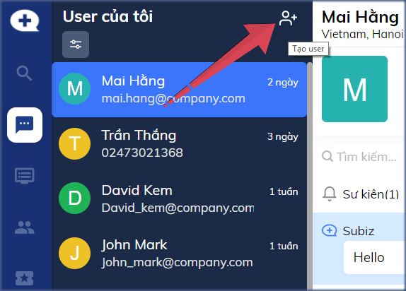

# Quản lý và cập nhật thông tin user

Dữ liệu khách hàng là tài sản của doanh nghiệp. Bạn có được danh sách tất cả khách hàng đã tương tác qua Subiz ngay trên trang [**DANH SÁCH USER**](https://app.subiz.com/contacts).

### Danh sách User

Tại đây bạn sẽ xem được 2 danh sách User:

* **User của tôi**: Mỗi agent sẽ có một danh sách "User của tôi" riêng, các user đã có hội thoại với agent đó. Agent sẽ chủ động theo dõi được các user của mình đã chăm sóc tư vấn.
* **Connected User**: Tất cả user đã có hội thoại trò chuyện với các agent trong tài khoản. Connected users giúp người quản lý có thể nắm bắt tình hình khách hàng liên hệ và cách chăm sóc tư vấn của các agent.

Danh sách User được hiển thị dạng bảng với các trường dữ liệu sau:

* **Họ tên**: Hiển thị theo vị trí Thành phố/ Tỉnh nếu khách chưa lưu Họ tên của khách
* **Số điện thoại**: Trống nếu chưa lưu số điện thoại của khách
* **Địa chỉ email**: Trống nếu chưa lưu địa chỉ email của khách
* **Vị trí**: Thành phố/ Tỉnh được tự động định vị theo vị trí địa chỉ
* **Đã tạo**: Thời gian lần đầu khách hàng liên hệ qua Subiz
* **Tương tác cuối cùng**: Thời gian cuối cùng khách hàng có tương tác qua Subiz
* **Số phiên**: Tổng số phiên khách hàng truy cập website
* **Tổng số hội thoại**: Tổng số cuộc hội thoại của khách hàng qua Subiz

### Tùy chỉnh hiển thị thông tin user

Dễ dàng tùy chọn các thông tin khách hàng sẽ được hiển thị trong bảng Danh sách user theo nhu cầu riêng của Doanh nghiệp. Bạn có thể thêm hoặc xóa bớt thông tin hiển thị như sau:

1. Click chuột vào mục **Tùy chỉnh hiển thị**
2. Chọn **+** để thêm thông tin được hiển thị hoặc Chọn **-** để xóa bỏ thông tin không được hiển thị 
3. Chọn **Đóng** để hoàn thành


Tip nhỏ: Bạn được tạo thêm nhiều thông tin khách hàng để thu thập và lưu trữ trên Subiz tại trang [Thông tin khách hàng](https://app.subiz.com/settings/user-attributes)


### Lọc User

Sử dụng chức năng Lọc User để tìm kiếm và xác định nhóm danh sách khách hàng mục tiêu.

Bạn có thể lọc user bằng cách kết hợp nhiều điều kiện dữ liệu khác nhau. Ví dụ: Những khách hàng ở khu vực Hà Nội,  đã có họ tên và số điện thoại.

Các bước lọc user:

1. Click **Lọc User** 
2. Click **Tùy chỉnh**
3. Chọn trường dữ liệu bạn cần lọc &gt; Điền thông tin Chọn Thêm điều kiện khi bạn lọc kết hợp nhiều điều kiện cùng lúc
4. Cuối cùng, chọn **Áp dụng**

### Xuất dữ liệu user

Để tải dữ liệu khách hàng cho những báo cáo phân tích riêng, bạn có thể chọn **Xuất dữ liệu user** và gửi tới một hay nhiều email cùng lúc.


Lưu ý: File dữ liệu user ở định dạng **.csv**, bạn có thể chọn mở bằng Google Sheet/ Bảng tính của Google.


### Xem lịch sử hoạt động của user

Subiz lưu trữ tất cả hoạt động của khách hàng như Nguồn truy cập website, Sự kiện xem trang, hội thoại Subiz chat, hội thoại Email,....

Bạn click vào User để chọn xem nhanh lịch sử hoạt động của khách hàng.

### Tùy chỉnh thông tin user

Khi cần tùy chỉnh hay cập nhật thông tin user như Họ tên, Số điện thoại, Địa chỉ email,... bạn click đúp vào vùng thông tin user và chọn mục cần sửa.

### Bỏ theo dõi user

Khi không muốn hiển thị một User trong danh sách User của tôi, bạn chọn Bỏ theo dõi. User chỉ tạm ẩn đi trong User của tôi, không bị xóa mất. 

### Chặn user

Chọn chặn user khi gặp đối tượng spam chat hay có hoạt động ảnh hưởng tới doanh nghiệp. User bị chặn sẽ không nhìn thấy cửa sổ chat nữa và không thể gửi email, tin nhắn messenger tới tài khoản Subiz của bạn.

Xem thêm tài liệu [Chặn user trên Subiz](https://help.subiz.com/su-dung-subiz-nang-cao/quan-ly-du-lieu/lam-the-nao-de-chan-mot-user#cach-chan-mot-user).

### Tạo user mới

Với một khách hàng chưa từng tương tác với bạn qua Subiz, bạn có thể tạo thông tin khách hàng trên Subiz để lưu trữ và gửi email.

Hướng dẫn tạo user mới: Vào trang [HOẠT ĐỘNG](https://app.subiz.com/convo) &gt; Click button **Tạo user**

> Bạn cần hỗ trợ quản lý danh sách khách hàng? Hãy liên hệ Support@Subiz.com!

  

