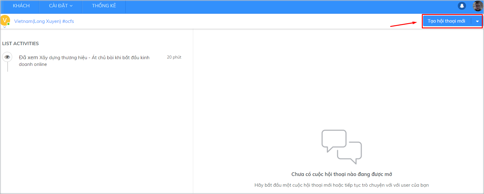
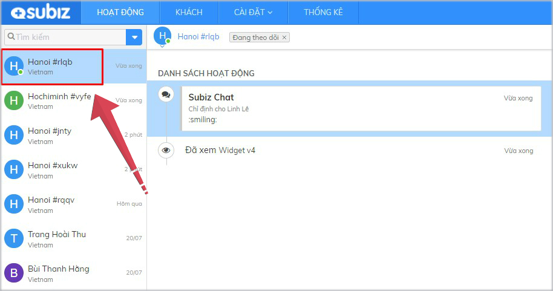

# Quan sát khách truy cập

### Làm thế nào để quan sát khách truy cập?

Doanh nghiệp có thể quan sát khách truy cập website của mình, nắm rõ nhu cầu thông tin, sản phẩm và dịch vụ mà khách hàng mong muốn, từ đó chủ động tiếp cận hỗ trợ họ. 

**Bạn có thể theo dõi các khách đang truy cập website của bạn** tại trang **Khách**. Mỗi khách truy cập được nhận diện bằng [cookie](http://vi.wikipedia.org/wiki/Cookie) trên trình duyệt của họ.

Với mỗi khách truy cập, bạn sẽ biết được những thông tin sau:

* **Ảnh đại diện:** Hiển thị hình ảnh mặc định của [Subiz](https://subiz.com/vi/)
* **Họ tên, Email**: Hiển thị thành phố/ tỉnh hoặc họ tên và địa chỉ email của khách hàng đã được lưu thông trước đây.
* **Vị trí địa lý**:  Hiển thị thành phố/ tình được xác định thông qua địa chỉ IP
* **Trang đang xem**: Địa chỉ trang mà khách đang xem trên website của bạn

Khi click vào từng khách truy cập trên trang **KHÁCH**, bạn sẽ bắt đầu để tương tác trực tiếp với khách hàng đó trên mục **HOẠT ĐỘNG**

### [Subiz](https://subiz.com/vi/) xác định thông tin vị trí khách truy cập dựa vào đâu?

Địa chỉ IP được cung cấp bởi ISP \(Internet Service Provider\) và thường xuyên thay đổi. Do đó, địa chỉ IP sẽ có sự sai lệch với địa điểm thực của khách hàng.

[Subiz](https://subiz.com/vi/) định kỳ 6 tháng 1 lần cập nhật dữ liệu địa chỉ IP của khách truy cập để nâng cao độ chính xác và cam kết chính xác 95% với dữ liệu Quốc Gia, 75% với dữ liệu Thành phố/tỉnh.

[Subiz x](https://subiz.com/vi/)ác định địa chỉ IP của khách hàng dựa trên dữ liệu của Maxmind. Đây là dữ liệu chính xác nhất thế giới về IP to Location và NASA cũng dùng dữ liệu này.

Nếu phát hiện sự sai khác địa chỉ IP của khách hàng, bạn có thể gửi yêu cầu trực tiếp tới Maxmind để yêu cầu cập nhật chính xác: [https://support.maxmind.com/geoip-data-correction-request/](https://support.maxmind.com/geoip-data-correction-request/)

