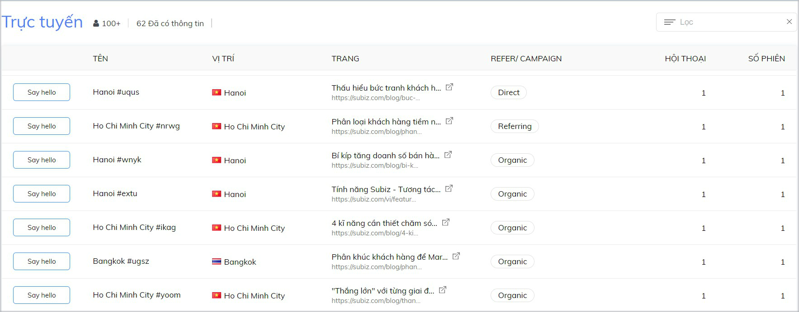

# Quan sát khách truy cập

### Làm thế nào để quan sát khách truy cập website?

Ngay trên trang [KHÁCH](https://app.subiz.com/visitors), bạn có thể quan sát và theo dõi được danh sách khách hàng đang viếng thăm trang web của bạn. 

Có bao nhiêu khách đang trực tuyến online, trong đó có bao nhiêu khách đã có thông tin. Họ là ai, đến từ đâu, đang xem trang nào trên website, khách mới hay khách cũ có hội thoại trò chuyện chưa?

Với mỗi khách truy cập, bạn sẽ biết được những thông tin sau:

* **TÊN**: Mặc định theo mã khách truy cập hoặc hiển thị họ tên khách nếu đã cập nhật thông tin.
* **VỊ TRÍ**:  Thành phố/ tỉnh được xác định thông qua địa chỉ IP.
* **TRANG**: Tiêu đề và đường link dẫn trang khách đang xem trên website của bạn.
* **REFER/ CAMPAIGN**: Nguồn khách truy cập như Direct truy cập trực tiếp trang web, Organics vào web từ kết quả tìm kiếm tự nhiên trên trình duyệt, Referring truy cập web từ các trang giới thiệu, Advertising truy cập web từ link quảng cáo,... Subiz tự động nhận biết được link UTM campaign và khách đến từ chiến dịch nào.
* **HỘI THOẠI**: Tổng số cuộc hội thoại với khách hàng gồm cả Automation tự động gửi tin nhắn 
* **SỐ PHIÊN**: Số phiên khách truy cập website

Bạn xác định được khách hàng tiềm năng và chủ động Say hello nhắn tin tư vấn khách hàng. Tiếp cận khách hàng đúng lúc và đúng thời điểm sẽ tăng cơ hội bán hàng hiệu quả.   
Sử dụng [Mẫu tin nhắn](https://help.subiz.com/bat-dau-voi-subiz/lam-viec-tren-subiz/mau-tin-nhan) để nhanh chóng gửi lời chào tới khách hàng.

### [Subiz](https://subiz.com/vi/) xác định thông tin vị trí khách truy cập dựa vào đâu?

Địa chỉ IP được cung cấp bởi ISP \(Internet Service Provider\) và thường xuyên thay đổi. User cũng có thể sử dụng  IP động. Do đó, địa chỉ IP sẽ có sự sai lệch với địa điểm thực của khách hàng.

[Subiz](https://subiz.com/vi/) định kỳ 6 tháng 1 lần cập nhật dữ liệu địa chỉ IP của khách truy cập để nâng cao độ chính xác và cam kết chính xác 95% với dữ liệu Quốc Gia, 75% với dữ liệu Thành phố/tỉnh.

[Subiz x](https://subiz.com/vi/)ác định địa chỉ IP của khách hàng dựa trên dữ liệu của Maxmind. Đây là dữ liệu chính xác nhất thế giới về IP to Location và NASA cũng dùng dữ liệu này.

Nếu phát hiện sự sai khác địa chỉ IP của khách hàng, bạn có thể gửi yêu cầu trực tiếp tới Maxmind để yêu cầu cập nhật chính xác: [https://support.maxmind.com/geoip-data-correction-request/](https://support.maxmind.com/geoip-data-correction-request/)

