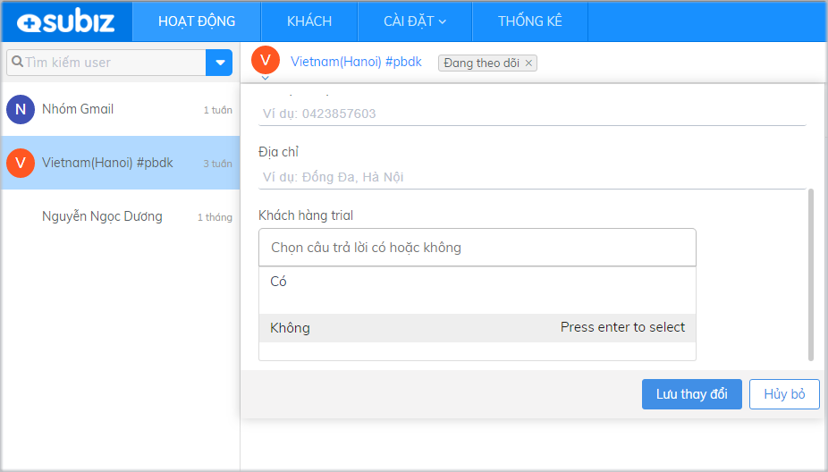

# Tùy chỉnh thông tin khách hàng

Quản lý hệ thống thông tin khách hàng là phương pháp giúp doanh nghiệp được tiếp cận, giao tiếp với khách hàng một cách có hệ thống và hiệu quả dựa trên việc quản lý các thông tin của khách hàng như: liên lạc, nhu cầu, tài khoản… nhằm phục vụ khách hàng tốt hơn.

Từ những thông tin của khách hàng được cập nhật và lưu trữ trong hệ thống quản lý Subiz, doanh nghiệp có thể phân tích, hình thành danh sách khách hàng tiềm năng, từ đó ra chiến lược chăm sóc hợp lý nhằm duy trì mối quan hệ tốt với khách hàng và đạt lợi nhuận tối đa trong kinh doanh.

### Thông tin khách hàng

Để tùy chỉnh thông tin khách hàng, bạn vào mục **Cài đặt &gt; Tài khoản &gt; Thông tin khách hàng**.

Thông thường, tài khoản của bạn sẽ có 4 trường thông tin mặc định: Địa chỉ, Tên, Email và Số điện thoại

Những trường thông tin này sẽ được hiển thị trong phần thông tin của User trong mục Hoạt động như sau:

### Tùy chỉnh thông tin khách hàng

Subiz cho phép bạn thêm trường dữ liệu khách hàng, phục vụ cho việc khai thác và quản lý thông tin khách hàng theo đặc thù riêng biệt của từng doanh nghiệp:

Để tùy chỉnh thông tin khách hàng, bạn vào mục **Cài đặt &gt; Tài khoản &gt; Thông tin khách hàng &gt; Tạo trường dữ liệu mới**

**Trường dữ liệu**: Tên của trường dữ liệu bạn muốn hiển thị trong phần thông tin của khách hàng

**Mô tả về trường dữ liệu**:  Những mô tả về giá trị thông tin, mục tiêu khai thác dữ liệu sẽ giúp bạn dễ dàng quản lý các trường dữ liệu mà bạn tạo ra

**Từ khóa:** Hệ thống sẽ tự động tạo ra từ khóa dựa trên tên trường dữ liệu bạn đặt. 


**Lưu ý**: Bạn có thể chỉnh sửa phần từ khóa, các ký tự viết chữ thường không dấu, có cách chân giữa mỗi chữ.


**Loại dữ liệu**: Là cách hiển thị dữ liệu trong mục thông tin của khách hàng. Bao gồm:



* Dạng hiển thị: Ký tự

* Trường dữ liệu này sẽ được hiển thị trong thông tin khách hàng  như sau:




* Dạng hiển thị: Dạng số \(số nguyên, số âm, số thập phân\)

* Trường dữ liệu này sẽ được hiển thị trong thông tin khách hàng  như sau:




* Dạng hiển thị: Là câu hỏi lựa chọn đúng sai

* Trường dữ liệu này sẽ được hiển thị trong thông tin khách hàng  như sau:




* Dạng hiển thị: Danh sách lựa chọn

* Trường dữ liệu này sẽ được hiển thị trong thông tin khách hàng  như sau




* Dạng hiển thị:  Lựa chọn thời gian

* Trường dữ liệu này sẽ được hiển thị trong thông tin khách hàng  như sau




### Một số lưu ý khi cài đặt

* Bạn được cài đặt tối đa 20 trường dữ liệu thông tin khách hàng
* Giới hạn về Giá trị dữ liệu lưu trữ của 1 trường dữ liệu: 500 ký tự
* Bạn có thể chỉnh sửa hoặc xóa các trường dữ liệu đã được tạo. Tuy nhiên khi xóa 1 trường dữ liệu, toàn bộ thông tin đã được lưu sẽ bị xóa và không thể khôi phục lại 

