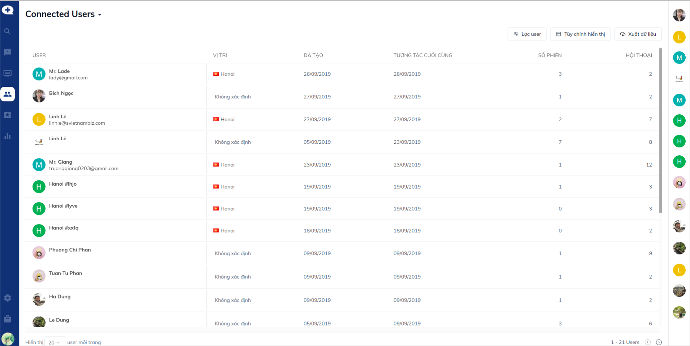
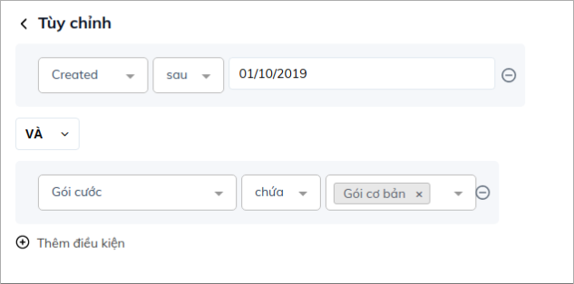
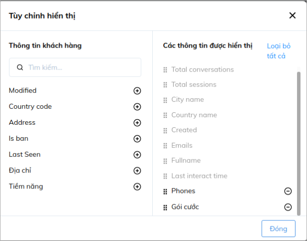
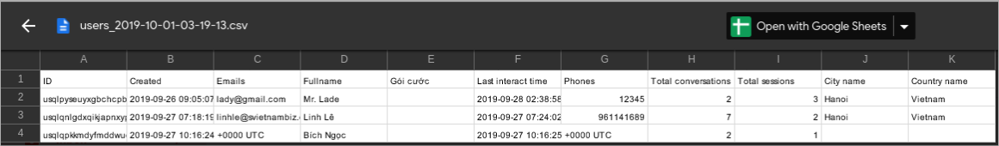
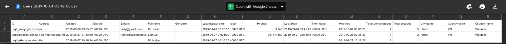

# Xuất File dữ liệu khách hàng

Khách hàng là yếu tố quan trọng quyết định sự tồn tại và phát triển của doanh nghiệp. Do đó, doanh nghiệp cần xây dựng hệ thống dữ liệu khách hàng để có được sự thấu hiểu người dùng nhằm tạo điều kiện thuận lợi trong việc chăm sóc khách hàng cũ và tăng khả năng tiếp cận khách hàng mới.

Ngoài việc quản lý dữ liệu khách hàng trên Subiz, bạn có thể xuất file dữ liệu khách hàng từ Subiz về để lưu trữ trên hệ thống quản trị riêng của doanh nghiệp hoặc thuận tiện cho việc thống kê, báo cáo.

Để xuất file dữ liệu, bạn cần vào trang[ Danh sách User ](https://app.subiz.com/contacts) - nơi quản trị toàn bộ danh sách khách hàng có tương tác với doanh nghiệp của bạn. 

Lựa chọn **Lọc User** nếu bạn muốn xuất file dữ liệu với một hoặc một số điều kiện nhất định.

Ví dụ: Lọc các User được tạo sau ngày 01/10/2019

Bạn có thể kết hơp nhiều điều kiện với nhau:

Ví dụ: Các User được tạo sau 01/10/ 2019 và sử dụng gói cước Cơ bản

Sau khi nhấn **Áp dụng**, danh sách User đã lọc sẽ hiển thị, bạn click vào mục **Xuất dữ liệu** để xuất file về email:

Tại đây bạn có thể lựa chọn:

- _**Xuất dữ liệu với các thuộc tính đang hiển thị**_: là những thuộc tính mặc đinh hoặc do bạn thêm vào trong mục **Tùy chỉnh hiển thị** trước đó:

Khi đó file dữ liệu gửi về sẽ hiển thị như sau:

- _**Xuất dữ liệu với tất cả các thuộc tính**_: Bao gồm tất cả các thuộc tính mặc định của User.

Khi đó file dữ liệu sẽ hiển thị như sau:

* _**Tên dữ liệu**_: Tên file dữ liệu của bạn, sẽ hiển thị dưới dạng tiêu đề email để bạn dễ dàng tìm kiếm
* _**Gửi data đến email**_: Bạn có thể nhập một hoặc nhiều email nhận file dữ liệu

File dữ liệu sẽ được gửi về trong email có dạng như sau:

