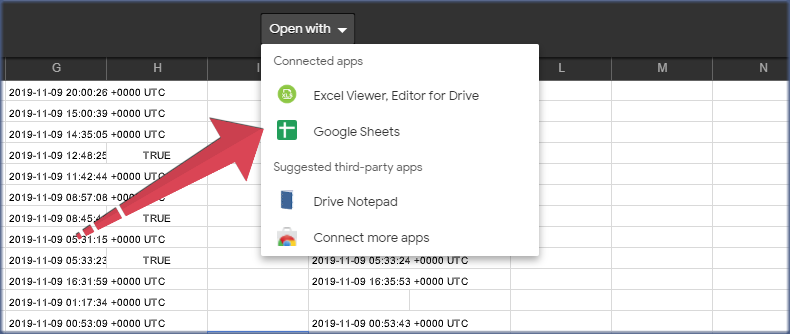
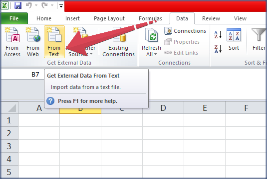
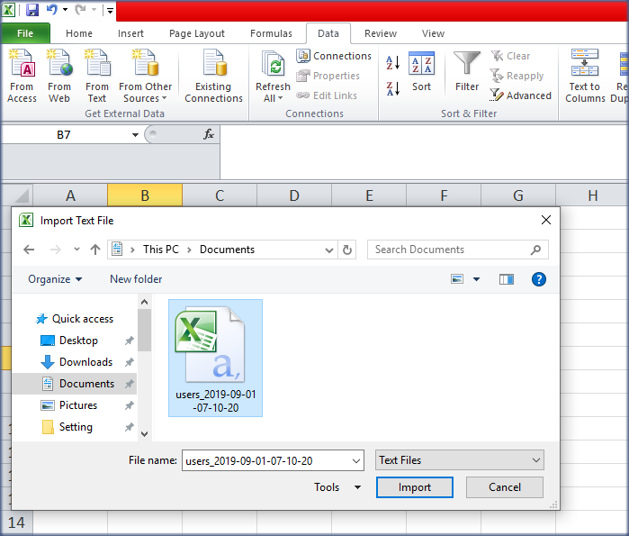
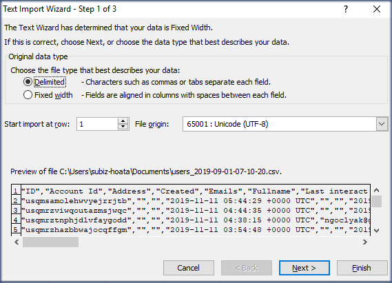
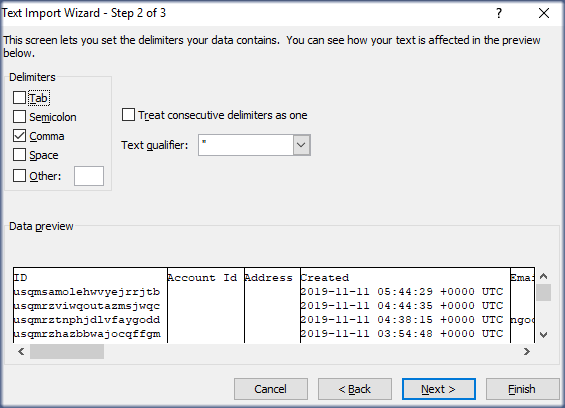
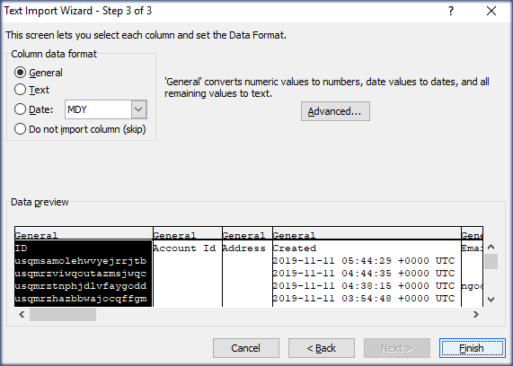
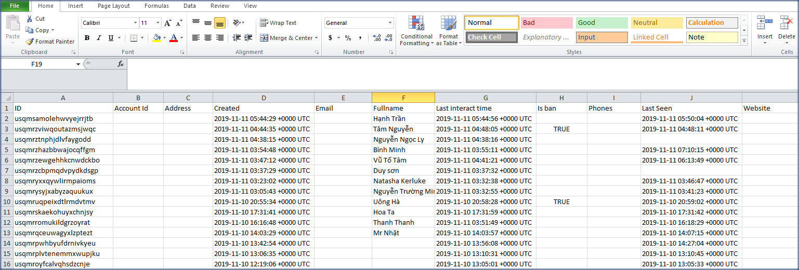

# Xuất File dữ liệu khách hàng

Khách hàng là yếu tố quan trọng quyết định sự tồn tại và phát triển của doanh nghiệp. Do đó, doanh nghiệp cần xây dựng hệ thống dữ liệu khách hàng để có được sự thấu hiểu người dùng nhằm tạo điều kiện thuận lợi trong việc chăm sóc khách hàng cũ và tăng khả năng tiếp cận khách hàng mới.

Ngoài việc quản lý dữ liệu khách hàng trên Subiz, bạn có thể xuất file dữ liệu khách hàng từ Subiz về để lưu trữ trên hệ thống quản trị riêng của doanh nghiệp hoặc thuận tiện cho việc thống kê, báo cáo.

### Xuất file dữ liệu khách hàng

Để xuất dữ liệu, bạn _****_vào trang[ Danh sách User ](https://app.subiz.com/contacts) - nơi quản trị toàn bộ danh sách khách hàng có tương tác với doanh nghiệp của bạn. 

Lựa chọn **Lọc User** nếu bạn muốn xuất file dữ liệu với một hoặc một số điều kiện nhất định.

Ví dụ: Lọc các User được tạo sau ngày 01/10/2019

Bạn có thể kết hơp nhiều điều kiện với nhau:

Ví dụ: Các User được tạo sau 01/10/ 2019 và sử dụng gói cước Cơ bản

Sau khi nhấn **Áp dụng**, danh sách User đã lọc sẽ hiển thị, bạn click vào mục **Xuất dữ liệu** để xuất file về email:

* _**Tên dữ liệu**_: Tên file dữ liệu của bạn, sẽ hiển thị dưới dạng tiêu đề email để bạn dễ dàng tìm kiếm
* _**Gửi data đến email**_: Bạn có thể nhập một hoặc nhiều email nhận file dữ liệu

Tại đây bạn có thể lựa chọn:

- _**Xuất dữ liệu với các thuộc tính đang hiển thị**_: là những thông tin khách hàng trong mục **Tùy chỉnh hiển thị** bạn chọn ****trước đó:

- _**Xuất dữ liệu với tất cả các thuộc tính**_: Bao gồm tất cả các thông tin mặc định của khách hàng.

Subiz sẽ gửi cho bạn email dữ liệu khách hàng và đính kèm file định dạng csv như sau: 

### Cách đọc file dữ liệu .csv

Dữ liệu lịch sử chat của Subiz được xuất ra dưới dạng [file **.csv**](https://en.wikipedia.org/wiki/Comma-separated_values) . Đây là định dạng được sử dụng rất phổ biến trong việc nhập/xuất dữ liệu.

Khi bạn download và mở file csv bằng phần mềm Excel, bạn có thể sẽ thấy font bị lỗi và dữ liệu hiển thị khó nhìn.

Dưới đây là hướng dẫn 2 cách mở file csv dữ liệu khách hàng để xem một cách thuận tiện nhất.

* **Cách 1: Chọn mở file bằng Google Sheet \( Trang tính của Google\)**

* **Cách 2: Tải file dữ liệu về máy tính và mở bằng excel**

**Bước 1**: Mở Microsoft Excel &gt; chọn menu **Data** &gt; **From Text**

**Bước 2:**  Tìm tới thư mục chứa file csv dữ liệu khách hàng và mở lên

 **Bước 3:** Thay đổi một số thông số trong bảng tùy chỉnh file csv như trong ảnh hướng dẫn bên dưới

Chọn Next và chọn thông số như ảnh:

Chọn Next &gt; Chọn thông số như ảnh &gt; chọn Finish

**Bước 4**: Hoàn tất và file dữ liệu khách hàng được hiện font chữ bình thường

> Bạn cần hỗ trợ Xuất dữ liệu khách hàng? Hãy gửi email liên hệ tới Support@Subiz.com.

