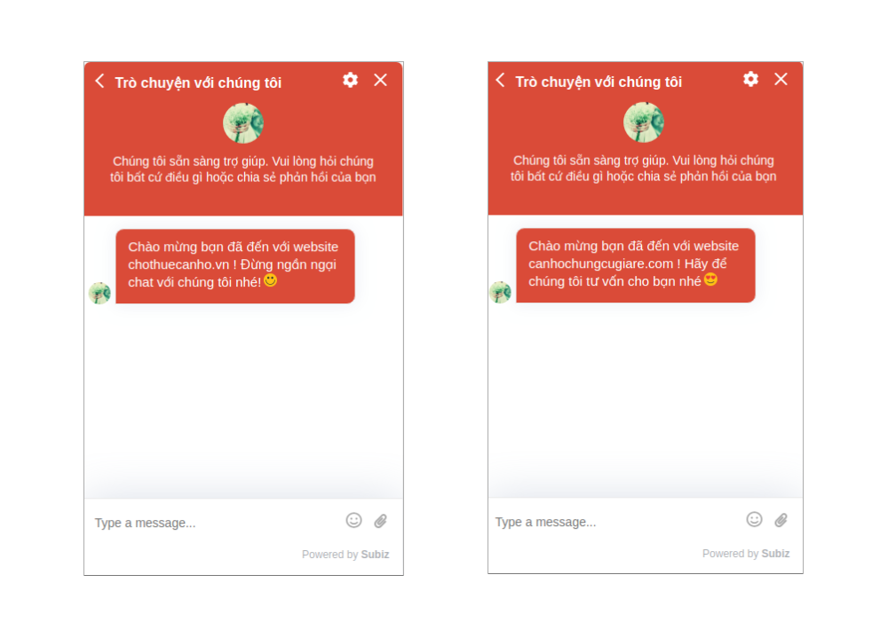
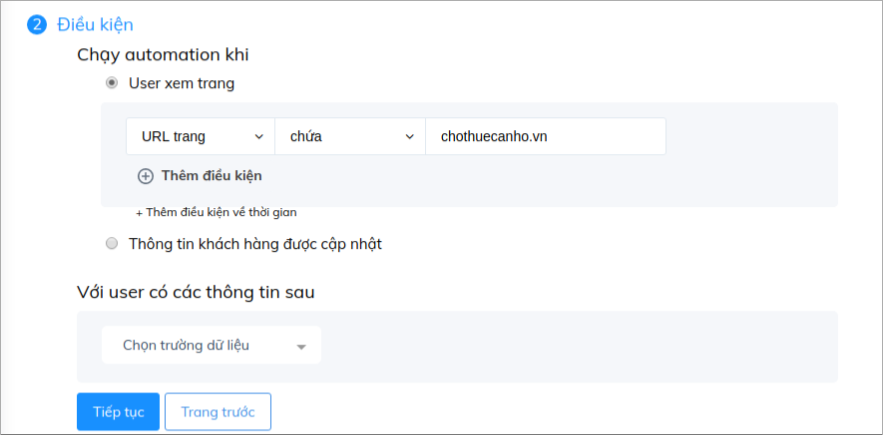
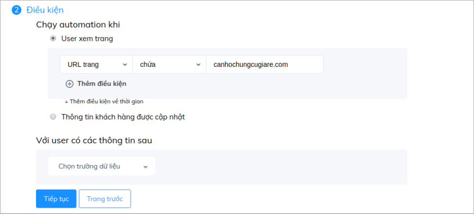
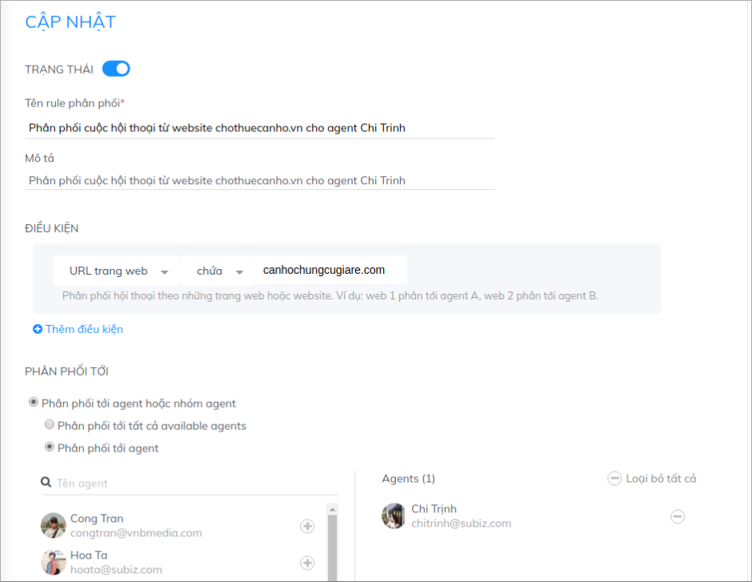
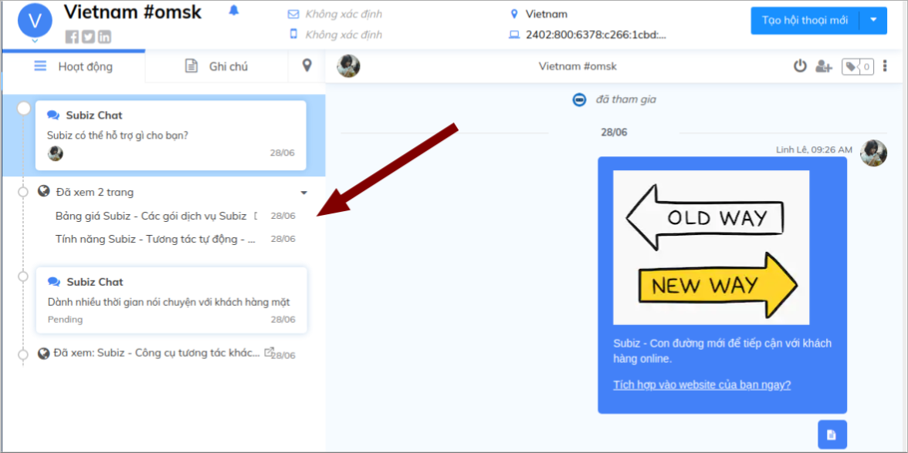

# Tùy chỉnh cửa sổ chat riêng biệt trên từng website

Thay vì sử dụng nhiều tài khoản Subiz để chăm sóc khách hàng trên nhiều website, bạn hoàn toàn có thể chỉ sử dụng **một tài khoản Subiz** duy nhất để **quản lý tất cả tương tác của khách hàng** và **tập trung lưu trữ dữ liệu khách hàng**.

Cửa sổ chat Subiz sẽ được tùy chỉnh riêng cho phù hợp với giao diện từng website, theo từng lĩnh vực và giúp bạn có thể quản trị riêng biệt từng website hiệu quả.

### Tùy chỉnh cửa sổ chat riêng biệt trên từng website

Cùng với sự kết hợp với mã API Javascript, bạn có thể tùy chỉnh nút chat button Subiz và giao diện cửa sổ chat phù hợp với từng website của bạn.

* _**Tùy chỉnh nút chat button Subiz riêng biệt**_

Bước 1: Sao chép và dán mã sau dưới mã nhúng Subiz và trước thẻ &lt;/body&gt;  trong code web của bạn.

```javascript
<script type="text/javascript">window.subiz(‘changeCss’, ‘[css_custom]’)</script>
```

Bước 2: Thay đoạn CSS sau vào phần “\[css\_custom\]”



`.widget_desktop .button-chat {border-radius:  0; -webkit-mask-image: none; background-image: url(`**`image-link`**`); background-repeat: no-repeat;}  .widget_desktop .button-chat-icon { display:  none;} @supports (-ms-ime-align:auto) { .widget_desktop .button-chat{border-radius:50%;}  .widget_desktop .button-chat-icon {display: inline-block;} } .widget_desktop .widget-button {`**`width: 90px; height: 90px;`**`} .widget_desktop .widget-button:after {display:none;} .widget_desktop .widget_mini .close-widget-icon {display: none;} .widget_desktop .button-chat .avatar-preview img {display: none;} .widget_desktop .button-chat {border-radius: 0; box-shadow: none; background-color: transparent; position: inherit;}`



`widget_mobile .button-chat {border-radius:  0; -webkit-mask-image: none; background-image: url(`**`image-link`**`; background-repeat: no-repeat;}  widget_mobile .button-chat-icon { display:  none;} @supports (-ms-ime-align:auto) { .widget_mobile .button-chat{border-radius:50%;}  .widget_mobile .button-chat-icon {display: inline-block;} } .widget_mobile .widget-button {`**`width: 90px; height: 90px;`**`} .widget_mobile .widget-button:after {display:none;} .widget_mobile .widget_mini .close-widget-icon {display: none;} .widget_mobile .button-chat .avatar-preview img {display: none;} .widget_mobile .button-chat {border-radius: 0; box-shadow: none; background-color: transparent; position: inherit;}`




**Lưu ý:** 

* Thay đường link ảnh button của bạn vào **`image-link`**
* Thay đổi kích thước button tại mục **`width: 90px; height: 90px`**


* _**Tùy chỉnh vị trí cửa sổ chat**_

Chọn cài đặt cửa sổ chat ở bên phải hoặc bên trái website

```javascript
 subiz('setPosition', 'left') . 
 //Thay giá trị left hoặc right
```

* _**Tùy chỉnh kiểu cửa sổ chat**_

Chọn cửa sổ chat kiểu Thu gọn hoặc Mở rộng

```javascript
subiz('setWindowMode', 'full') . 
//Thay giá trị full hoặc mini
```

* _**Tùy chỉnh nội dung giới thiệu trên cửa sổ chat**_

```javascript
subiz('setLanguageData', {}) 
VD subiz('setLanguageData', {team_intro: "Chúng tôi sẵn sàng trợ giúp. Vui lòng hỏi chúng tôi bất cứ điều gì hoặc chia sẻ phản hồi của bạn"})
```

Tham khảo chi tiết [Hướng dẫn](https://help.subiz.com/su-dung-subiz-nang-cao/api-javascript-cua-subiz-widget#thay-doi-noi-dung-tren-cua-so-chat)

* _**Một số tùy chỉnh cửa sổ chat khác**_

Ngoài ra bạn có thể sử dụng API tùy chỉnh CSS để thay đổi các yếu tố khác của cửa sổ chat.  
Bạn tham khảo thêm [Bảng CSS tùy chỉnh cửa sổ Subiz chat](https://help.subiz.com/bat-dau-voi-subiz/thiet-lap-moi-truong-tuong-tac/tich-hop-subiz-len-website/bang-css-tuy-chinh-cua-so-chat)!  
Ví dụ: Tùy chỉnh kích thước cửa sổ chat

```javascript
<script type="text/javascript">
    window.subiz('changeCss', '.widget_mini .widget_body {height: 750px !important; max-height: 800px !important;}')
</script>
```

### Tạo lời chào riêng biệt trên từng web

Cùng với chức năng [**Automation gửi tin nhắn tự động**](https://app.subiz.com/settings/automations/add-conversation), bạn có thể tạo những lời chào thu hút ấn tượng trên từng website.

Tham khảo : [Hướng dẫn tạo lời chào tự động trên website ](https://help.subiz.com/su-dung-subiz-nang-cao/tuong-tac-tu-dong/mot-so-automation-thong-dung/automation-gui-tin-nhan-tu-dong)



Bạn cần thiết lập điều kiện theo URL trang để tạo các Automation này:





### Phân phối cuộc chat trên từng web cho tư vấn viên

Với việc tích hợp Subiz trên nhiều website, bạn có thể mời thêm các Agent tham gia vào tài khoản và phân phối cuộc hội thoại từ từng web cho họ nhờ chức năng [**Rule phân phối .** ](https://app.subiz.com/settings/rule-setting)Với vai trò là người quản lý, bạn vẫn có thể theo dõi và quản lý hoạt động chung trên các web.




Ngoài ra, việc chủ động quan sát lịch sử hoạt động của khách trên website ví dụ như họ đang xem trang hay sản phẩm nào cũng giúp bạn có thể biết được khách đến từ website nào và chủ động cung cấp thông tin phù hơp:




