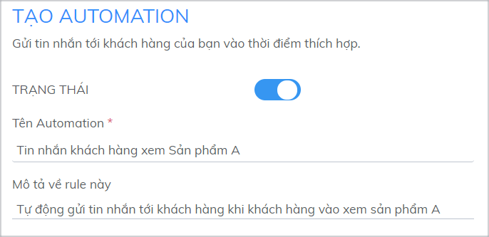
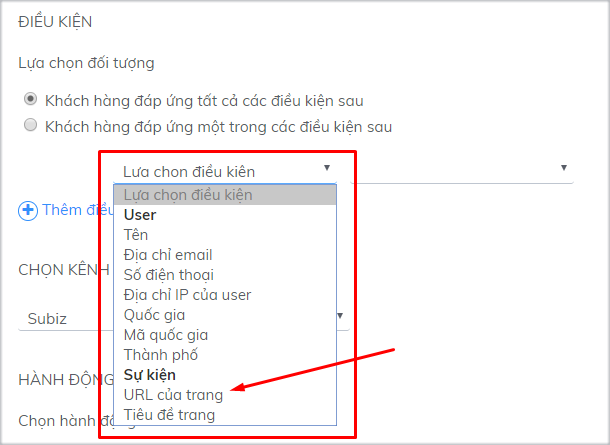
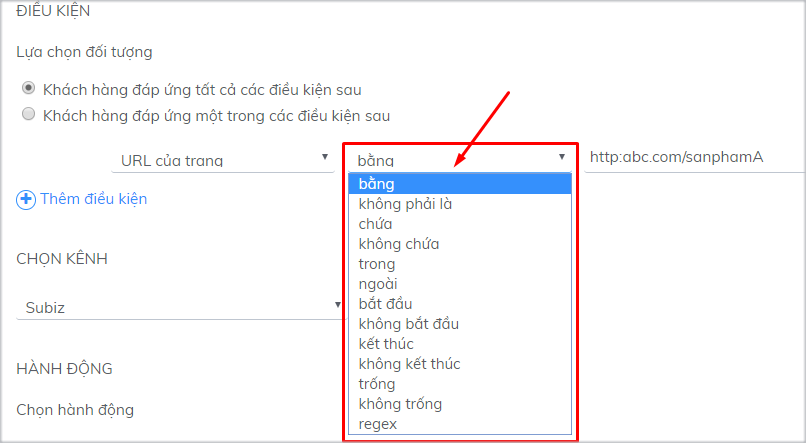
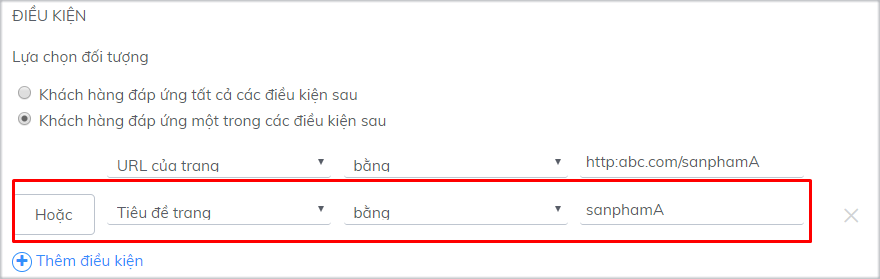

# Tạo Automation

Với tính năng Automation, giờ đây bạn có thể tự động hóa việc tương tác với khách hàng, thu hút sự chú ý của khách ngay khi họ vào website và theo đuổi khách hàng qua các kênh khác nhau. Bạn không còn cần phụ thuộc quá nhiều vào sự hiện diện của nhân viên trực nữa.

Cụ thể, bạn có thể cài đặt các Automation thực hiện các hành động khác nhau với từng đối tượng khách hàng với các điều kiện nhất định.

Tại trang Tạo Automation, bạn cài đặt lần lượt theo các bước sau:

### **Nhập Tên và Mô tả cho Automation**

Tên và Mô tả giúp bạn nhận diện và phân biệt các Automation đã cài đặt

### Lựa chọn điều kiện cho Automation

Lựa chọn điều kiện để xác định Automation sẽ hướng đến đối tượng nào. Bạn có thể lựa chọn nhiều điều kiện đồng thời hoặc thỏa mãn một trong các điều kiện.

Để nhập điều kiện, trước hết bạn lựa chọn loại điều kiện:

Sau đó bạn nhập phép so sánh và giá trị cho điều kiện đó để tạo một điều kiện hoàn chỉnh.

Click **Thêm điều kiện** khi bạn muốn thêm điều kiện khác. Chọn “Khách hàng đáp ứng tất cả các điều kiện” hoặc “Khách hàng đáp ứng một trong các điều kiện” để tạo lập mối quan hệ giữa các điều kiện: Và/ Hoặc.

**Bạn nên tham khảo danh sách các điều kiện**, với những hướng dẫn về cách sử dụng và có những ví dụ cụ thể sau đây:

| **CÁC ĐIỀU KIỆN** | **CÁCH SỬ DỤNG** | **VÍ DỤ** |
| --- | --- | --- | --- | --- | --- | --- | --- | --- | --- | --- |
| **User** |  |  |
| Tên | Thực hiện automation với các user có tên cụ thể | Gửi lời chào đặc biệt hoặc email thông báo chương trình khuyến mãi tới các user có tên là SơnĐiều kiện: Tên – bằng – Sơn |
| Địa chỉ Email | Thực hiện automation với các user có địa chỉ email cụ thể | Gửi lời chào đặc biệt hoặc email tới tất cả các user có địa chỉ email chứa subiz.comĐiều kiện: Địa chỉ email – chứa – subiz.com |
| Số điện thoại | Thực hiện automation với các user có số điện thoại cụ thể | Gửi lời chào hoặc email tới các user đã có thông tin số điện thoạiGửi tin nhắn SMS tự động tới user đã có thông tin số điện thoại về các chương trình khuyến mãi \(chỉ áp dụng được khi tích hợp kênh SMS vào Subiz\) |
| Quốc gia | Thực hiện automation dựa trên quốc gia của userTên quốc gia là tên tiếng Anh của quốc gia, chỉ viết hoa các chữ cái đầu tiên của từ. Ví dụ: Vietnam, United States[Tham khảo danh sách các quốc gia](https://countrycode.org/) | Gửi lời chào đến khách hàng tới từ Việt Nam bằng automation chứa lời chào tiếng Việt.Điều kiện: Quốc gia – bằng – Vietnam |
| Mã quốc gia | Thực hiện automation dựa trên mã quốc giaMã quốc gia căn cứ theo ISO Code \(2 ký tự\), viết hoa cả 2 chữ cái Ví dụ: Việt Nam = VN, Mỹ = US, Trung Quốc = CN, Hàn Quốc = KR, Nhật Bản = JP[Tham khảo danh sách mã quốc gia](https://en.wikipedia.org/wiki/ISO_3166-2) | Gửi tin nhắn đến khách hàng tới từ Việt Nam bằng automation chứa lời chào tiếng Việt.Điều kiện: Mã quốc gia – bằng – VN |
| Thành phố | Thực hiện automation với các user đến từ một thành phố cụ thểLà tên tiếng Anh của các thành phố, chỉ viết hoa các chữ cái đầu tiên của từ. Ví dụ: Hanoi, Ho Chi Minh City, New York, Hong KongDanh sách [mã thành phố của các quốc gia](https://countrycode.org/) \(Click vào từng quốc gia để tra cứu tên thành phố\) | Gửi lời chào đến khách hàng tới từ Hà Nội bằng automationĐiều kiện: Thành phố – bằng – Hanoi |
| **Sự kiện** |  |  |
| Tiêu đề trang | Các website thường đặt tiêu đề trang liên quan đến một chủ đề nhất định, với mỗi chủ đề, bạn có thể đặt một automation để hỗ trợ và hướng dẫn khách hàng đúng thời điểm | Gửi lời chào tới các khách hàng vào xem các trang có tiêu đề chứa từ “máy ảnh”. Điều kiện: Tiêu đề trang – chứa – máy ảnhGửi lời chào tới các khách hàng vào xem trang có tiêu đề chứa từ “giá” |
| URL trang | Thực hiện automation khi khách hàng truy cập vào một trang cụ thể | Gửi tin nhắn tới khách hàng đang xem trang bảng giá: Điều kiện: URL của trang – bằng – https://subiz.com/vi/pricing.html |

### **Chọn kênh thực hiện Automation**

Tiếp theo bạn chọn kênh áp dụng Automation. Mỗi kênh sẽ có các hành động tương ứng phù hợp.

### **Thiết lập hành động cho Automation**


Mỗi Automation sẽ thực hiện 1 hành động duy nhất.




#### Với kênh Subiz Chat, bạn có thể thực hiện 1 trong 2 hành động:

* **Gửi tin nhắn cho User**: bạn có thể gửi tin nhắn ngay khi khách hàng vào website như một lời chào tự động, hoặc gửi tin nhắn với thông điệp riêng cho một đối tượng khách hàng cụ thể.
* **Gửi form hỏi thông tin tới User**: thường dùng trong trường hợp bạn không online hoặc không thể trả lời ngay lập tức. Khách hàng sẽ nhập thông tin để bạn có thể liên hệ lại sau.

Khách hàng sẽ nhìn thấy tin nhắn tự động giống như một tin nhắn thông thường được gửi từ Agent.




#### Với kênh Email, bạn có thể thực hiện hành động **Gửi email tới user**. 


Hành động này chỉ có thể thực hiện với các user đã có địa chỉ email.


Chọn hành động **Gửi email tới user** trên kênh Email

Chọn Agent gửi email, tiêu đề email và nhập nội dung email:

Xem trước nội dung email:





* Bạn có thể cài đặt Agent đại diện để gửi tin nhắn và email đi.

* Bạn có thể tùy chỉnh tin nhắn cho sinh động hơn \(đậm/ nghiêng/ chèn link/ gửi ảnh…\) thông qua công cụ tùy chỉnh văn bản.


### **Lưu Automation**

Sau khi cài đặt xong, bạn click nút **Tạo** để lưu lại Automation.

