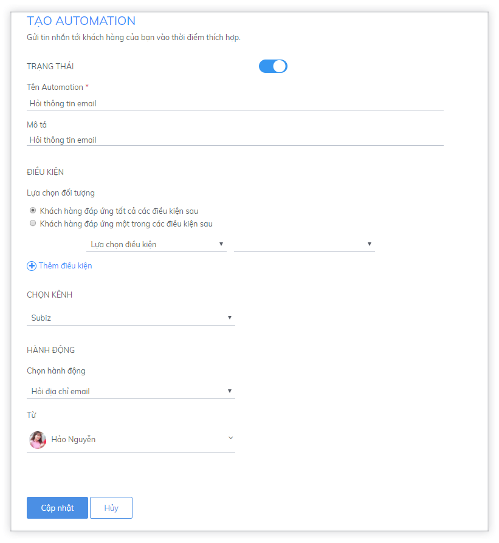
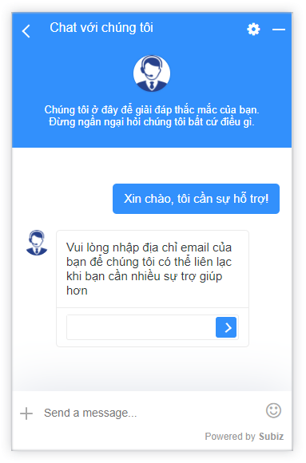
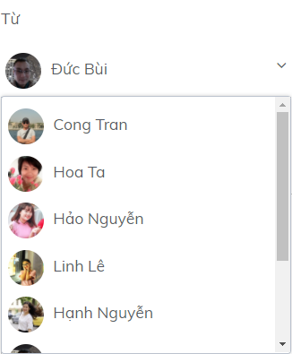

# Tự động hỏi địa chỉ email của khách hàng

Hỏi địa chỉ email là hành động Automation thuộc kênh Subiz Chat. **Thông tin email giúp bạn có thể liên hệ lại khách hàng, nhận diện và phân loại khách hàng, thực hiện các chiến dịch email marketing.**

Để cài đặt Form hỏi thông tin khách hàng, bạn vào phần **Cài đặt &gt; Tài khoản &gt; Automation.** Sau khi đặt tên và mô tả theo cách quản lý của bạn, bạn cần lưu ý các phần sau:

### Điều kiện hỏi địa chỉ Email

Với hành động hỏi địa chỉ email, **bạn có thể để điều kiện trống**, khi đó tin nhắn hỏi địa chỉ email sẽ được gửi với **điều kiện mặc định** như sau:

* Cuộc hội thoại đã và đang diễn ra
* User chưa có thông tin địa chỉ email
* Có tin nhắn từ user gửi tới

**Như vậy các user chưa có thông tin email sẽ nhận được tin nhắn chứa form hỏi email ngay sau khi họ gửi tin nhắn trên cửa sổ Subiz.**

### Ngôn ngữ hỏi thông tin

* Ngôn ngữ tiếng Việt

Khi bạn chọn ngôn ngữ là tiếng Việt cho cửa sổ Subiz trên website của bạn, thì câu hỏi thông tin sẽ là tiếng Việt: **“Vui lòng nhập địa chỉ email để chúng tôi có thể liên lạc khi bạn cần nhiều sự trợ giúp hơn”**

* Ngôn ngữ tiếng Anh

Khi bạn chọn ngôn ngữ là tiếng Anh cho cửa sổ Subiz trên website của bạn, thì câu hỏi thông tin sẽ là tiếng Anh: **“Please provide us your email address, so we could reach out to you later when you need more help”**

* Ngôn ngữ tự động

Khi bạn chọn ngôn ngữ là tự động cho cửa sổ Subiz trên website, Subiz tự động nhận diện khách hàng đang ở Việt Nam hay nước ngoài để hiển thị ngôn ngữ hỏi thông tin email là tiếng Việt hay tiếng Anh một cách phù hợp \(nội dung hỏi như trên\)

* Tùy chỉnh ngôn ngữ

Khi bạn muốn tùy chỉnh ngôn ngữ hỏi thông tin khách hàng, thì bạn cần thực hiện cùng lúc khi bạn tùy chỉnh ngôn ngữ cửa sổ chat, bạn có thể tùy chỉnh ngôn ngữ hỏi và nội dung hỏi [theo hướng dẫn​](https://subiz.gitbook.io/subiz-document/bat-dau-voi-subiz/thiet-lap-moi-truong-tuong-tac/tich-hop-subiz-chat/tuy-chinh-cua-so-subiz-chat#tuy-chinh-ngon-ngu-cua-so-subiz-chat-qua-file-po)

### Hỏi thông tin bởi agent nào?

Bạn cần chọn một agent làm đại diện cho doanh nghiệp của bạn để hỏi thông tin khách hàng

### Lưu ý khi thiết lập Automation hỏi địa chỉ email 


Hành động gửi tin nhắn hỏi địa chỉ email chỉ được thực hiện khi đã có cuộc hội thoại \(conversation\) được khởi tạo – Sau khi khách hàng nhập email, thông tin sẽ được đồng bộ vào dữ liệu của user.


