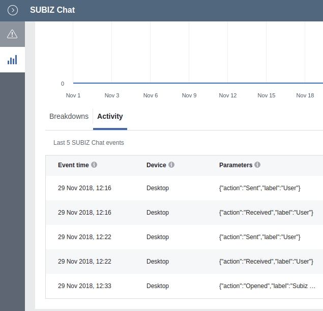

# Subiz và Facebook Pixel

### Cách tích hợp

Để tích hợp [_Subiz_](https://subiz.com/vi) với [Facebook Pixel](https://developers.facebook.com/docs/facebook-pixel/), bạn chỉ cần đặt mã nhúng Facebook Pixel lên website của bạn. Subiz sẽ tự động tìm mã nhúng và làm việc với tài khoản Facebook Pixel được cài trên web. Chúng tôi chỉ hỗ trợ mã nhúng [_**fbevents.js**_](https://developers.facebook.com/docs/facebook-pixel/implementation#base-code). Nếu bạn chưa sử dụng Facebook Pixel, [đây là tài liệu để cài đặt](https://developers.facebook.com/docs/facebook-pixel/implementation#installing-the-pixel). 

### Cách làm việc của Subiz với Facebook 

Subiz sẽ gửi các dữ liệu sự kiện \(event data\) sang Facebook Pixel. Khi đó, bạn có thể xem được các dữ liệu này tại mục Sự kiện \(event\) của Facebook Pixel. Các sự kiện mà Subiz gửi:



Cửa sổ Subiz được mở bởi bất kỳ lý do gì: User mở; API Javascript mở; Automation mở...

Event Name: _SUBIZ Chat_

Parameter "action": _Opened_

Parameter "label": _Subiz Windows_



User nhận được tin nhắn của agents hay automation....

Event Name: _SUBIZ Chat_

Parameter "action": _Received_

Parameter "label": _User_



Event Name: _SUBIZ Chat_

Parameter "action": _Received_

Parameter "label": _User_



### Khai thác dữ liệu

* Sử dụng để tạo Custom Audiences theo nhu cầu của marketer. 
* Sử dụng để thiết lập conversion và chạy quảng cáo như CTA trên Facebook Ads. Từ đó đánh giá hiệu quả của chiến dịch quảng cáo. 
* ...

### Câu hỏi thường gặp

* Web cài nhiều mã Facebook Pixel, Subiz sẽ gửi dữ liệu đến Pixel nào? Subiz gửi đến tất cả các Pixel được cài trên web.
* Facebook Pixel được thiết lập qua Google Tag Manager, Subiz có gửi dữ liệu không? Có. 

Bài liên quan: [Subiz làm việc với Google Analytics](http://help.subiz.com/su-dung-subiz-nang-cao/tich-hop-voi-ben-thu-3/subiz-va-google-analytics).

