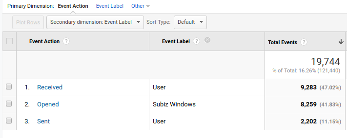

# Subiz và Google Analytics

### Cách tích hợp

Để tích hợp [Subiz](https://subiz.com) với [Google Analytics](https://analytics.google.com/analytics/web/), bạn chỉ cần [đặt mã nhúng Google Analytics](https://developers.google.com/analytics/devguides/collection/) lên website của bạn. Subiz sẽ tự động tìm mã nhúng và làm việc với tài khoản Google Analytics được cài trên web.  Chúng tôi hỗ trợ các loại Google Analytics tracking sau: 

1. [gtagjs](https://developers.google.com/analytics/devguides/collection/gtagjs/)
2. [analytics.js](https://developers.google.com/analytics/devguides/collection/analyticsjs/)

### Cách làm việc của Subiz với Google Analytics 

 Subiz sẽ gửi các dữ liệu sự kiện \(event data\) sang Google Analytics. Khi đó, bạn có thể xem được các dữ liệu này tại mục Sự kiện \(event\) của Google Analytics. Các sự kiện mà Subiz gửi : 



Cửa sổ Subiz được mở bởi bất kỳ lý do gì: User mở; API Javascript mở; Automation mở... 

Event Category: _SUBIZ Chat_ 

Event Action: _Opened_

Event Label: _Subiz Windows_



User nhận được tin nhắn của agents hay automation.... 

Event Category: _SUBIZ Chat_ 

Event Action: _Received_

Event Label: _User_



Event Category: _SUBIZ Chat_ 

Event Action: _Sent_

Event Label: _User_



### Khai thác dữ liệu

Từ những dữ liệu này, bạn có thể sử dụng để phân tích hành vi khách truy cập trên Google Analytics hoặc có thể thiết lập để thành Mục tiêu \(GOAL\) và đồng bộ nó sang tài khoản adwords của bạn. 

* Phân tích khách tương tác Subiz theo Campaign quảng cáo.
* Phân tích khách tương tác Subiz theo Nguồn truy cập \(Traffic Channel\).
* Phân tích khách mua hàng trên website và có tương tác Subiz. 
* Thiết lập Subiz như một channel traffic để hiểu được họ mất bao nhiêu phiên tương tác để mua hàng. 
* Sử dụng để lọc những khách hàng đã tương tác Subiz để chạy quảng cáo Remarketing.
* .... 

### Câu hỏi thường gặp khi tích hợp với Google Analytics

* **Website có nhiều mã nhúng Google Analytics, Subiz sẽ gửi dữ liệu đến tài khoản nào?** _Subiz gửi tới tất cả các tài khoản được tích hợp._
* **Google Analytics được cài qua Google Tag Manager thì Subiz có gửi dữ liệu sang không?** _Có._ 
* **Thời điểm nào Subiz sẽ gửi dữ liệu sang Google Analytics?** _Ngay lúc sự kiện xẩy ra._ 

[Cách xem báo cáo Subiz trên Google Analytics](http://help.subiz.com/bao-cao-and-thong-ke/thong-ke-subiz-chat-tren-google-analytics). 

[Subiz làm việc cùng với Facebook Pixel.](https://help.subiz.com/~/edit/drafts/-LSXtBwNzwZUwy15lt2A/su-dung-subiz-nang-cao/tich-hop-voi-ben-thu-3/subiz-va-facebook-pixel)

