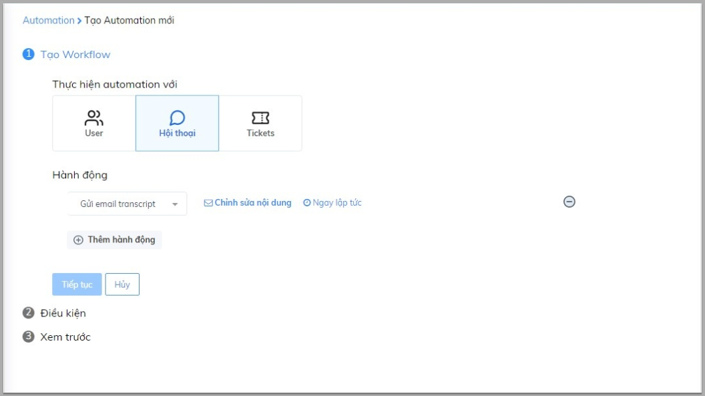
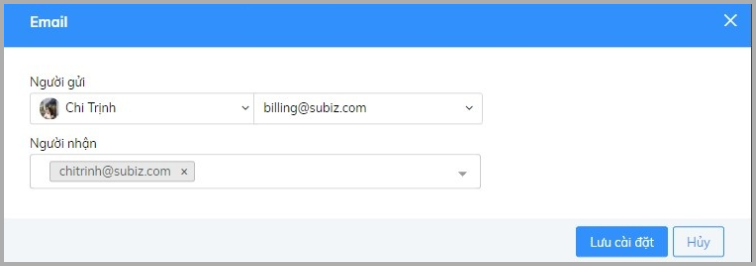
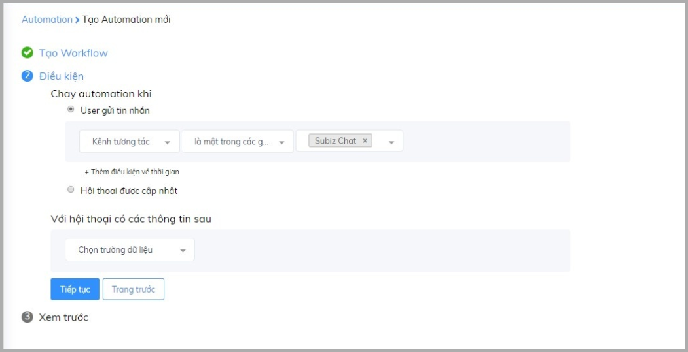
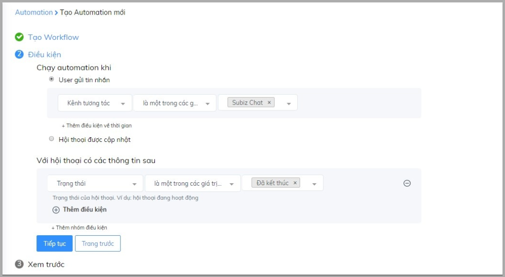

# Automation gửi email transcript

Dữ liệu và lịch sử tương tác của khách hàng là thông tin quan trọng với doanh nghiệp. Ngoài việc giúp doanh nghiệp lưu giữ trên trang quản trị, Subiz còn giúp bạn gửi nội dung hội thoại đến email một cách hoàn toàn tự động bằng ứng dụng mạnh mẽ - Automation gửi email transcript.

**Cài đặt Automation gửi email transcript** 

[Đăng nhập App.subiz.com &gt; Cài đặt &gt; Tài khoản &gt; Automation &gt; Workflow](https://app.subiz.com/settings/automation-workflow).

Bạn sẽ thao tác theo 3 bước cài đặt như sau: 

### Bước 1: Tạo Workflow

Sau khi lựa chọn **Thực hiện Automation với Hội thoại** và hành động **Gửi email transcript**, bạn Chỉnh sửa nội dung để nhập email nhận lịch sử chat.


**Lưu ý:** Bạn có thể thêm nhiều email để cùng nhận hội thoại. Nhập thêm email mới bằng cách nhấn phím Enter sau email đã nhập. 


Sau khi thực hiện xong việc cài đặt nội dung hỏi thông tin, bạn nhấn **Tiếp tục** để chuyển sang bước tiếp theo.

### Bước 2: Điều kiện 

Trong phần điều kiện có 2 mục điều kiện bạn cần quan tâm: 

* Chạy automation khi: Đây là điều kiện bắt buộc bạn cần cài đặt. Automation sẽ chạy khi cuộc hội thoại đáp ứng điều kiện đã thiết lập. 

**Ví dụ:** Gửi Email transcript với các khách hàng chat qua website.

* Với cuộc hội thoại có các thông tin sau: Điều kiện này không nhất thiết phải cài đặt. Đây là điều kiện bổ sung, giúp bạn có thể lựa chọn đối tượng cụ thể để gửi tin nhắn hỏi thông tin. Điều kiện này được hiểu như điều kiện cần có ban đầu. 

**Ví dụ:** Gửi Email transcript đối với cuộc hội thoại có trạng thái đã kết thúc và diễn ra trên kênh Subiz chat \(website\).

Sau khi xong bước cài đặt điều kiện, bạn nhấn **Tiếp tục** để sang bước cuối cùng 

### Bước 3: Đặt tên Automation 

Bạn đặt tên cho Automation và viết mô tả chi tiết để dễ quản lý, sau đó Lưu cài đặt.

