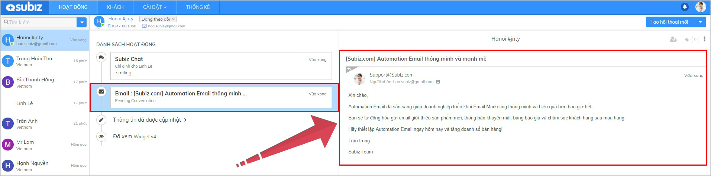
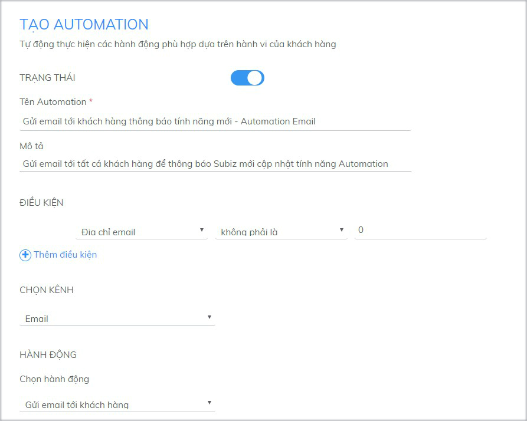
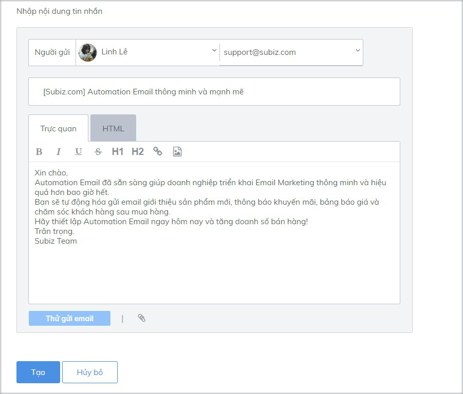
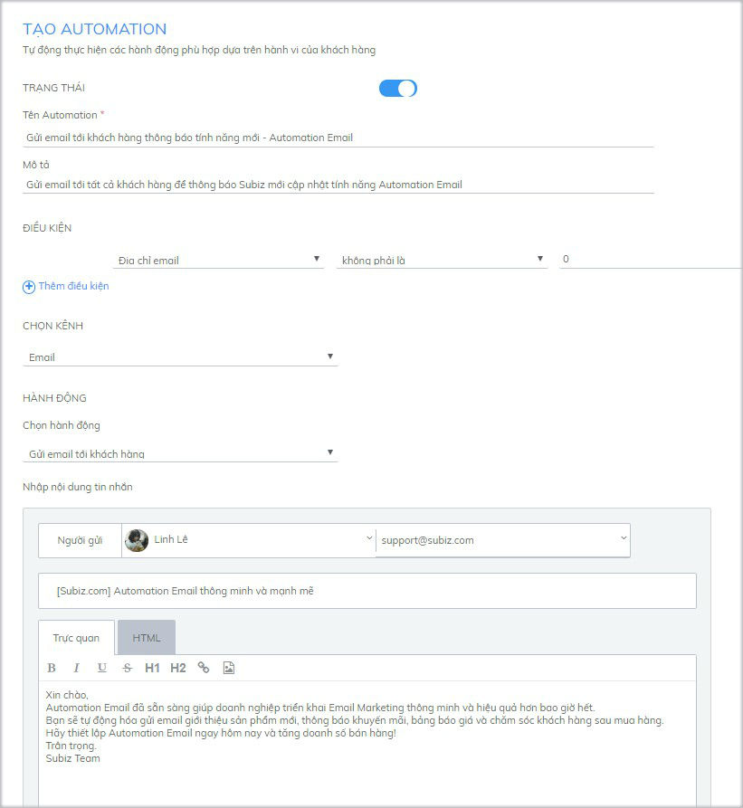
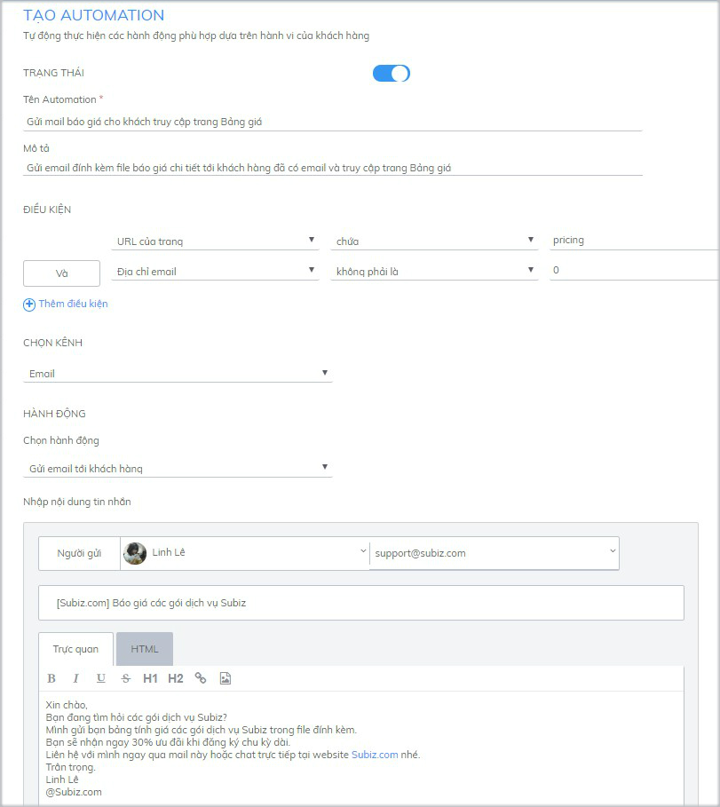

# Automation gửi email tới khách hàng

Email là cách tuyệt vời để giữ chân khách hàng và tăng doanh số bán hàng. Bạn có thể gửi email duy trì kết nối thường xuyên với khách hàng cũ, giới thiệu sản phẩm mới, thông báo chương trình ưu đãi và chăm sóc khách hàng sau mua hàng.

Subiz sẽ giúp bạn triển khai gửi email một cách tự động hóa, đơn giản và dễ dàng với Automation Email.

### **1.Automation Email sẽ hoạt động như thế nào?**

Automation sẽ tự động thực hiện hành động gửi email tới khách hàng ngay sau khi cài đặt thành công. Những khách hàng đã có địa chỉ email và thỏa mãn điều kiện cài đặt sẽ nhận được Automation email.

Ví dụ: Tất cả khách hàng đã có địa chỉ email sẽ được gửi Automation email thông báo tính năng mới

### 2. Tạo Automation gửi email tới khách hàng

Để tạo Automation: [Đăng nhập app.subiz.com &gt; Cài đặt &gt; Tài khoản &gt; Automation &gt; Tạo Automation mới](https://app.subiz.com/settings/automation-add)

Và thực hiện 2 bước sau:

* **Bước 1: Điền thông tin các thông tin cài đặt** 


Lưu ý:

* **Trạng thái:** Bật ON
* **Tên Automation và Mô tả**: điền thông tin giúp bạn xác định và hiểu mục đích của Automation cài đặt
* **Điều kiện**: là những điều kiện hay tiêu chí để thực hiện hành động gửi email tới khách hàng
* **Chọn kênh**: chọn Email
* **Hành động**: chọn Gửi email tới khách hàng


* **Bước 2: Soạn nội dung email gửi tới khách hàng**


Lưu ý:

* Người gửi: Chọn tên agent và địa chỉ email gửi ra
* Tiêu đề email: Điền đầy đủ tiêu đề email gửi cho khách hàng
* Nội dung Email: Subiz có hỗ trợ mã HTML để chỉnh sửa nội dung mail, hỗ trợ đính kèm file


### **3. Một số Automation Email thông dụng**

* **Thông báo sản phẩm mới, hoặc chương trình khuyến mãi**

Bạn đã có một danh sách khách hàng và cập nhật đầy đủ địa chỉ email. 

Bạn có thể sử dụng Automation Email để duy trì kết nối với khách hàng như: gửi email giới thiệu sản phẩm mới hoặc gửi mail thông báo chương trình ưu đãi.


Điều kiện cài đặt đối với tất cả khách đã được cập nhật địa chỉ email:   
**Địa chỉ email - không phải là - 0**


* **Gửi mail báo giá tới khách hàng khi truy cập vào trang bảng giá**

Với những khách hàng quan tâm tới trang bảng giá của công ty, bạn có thể thiết lập Automation gửi email báo giá cho khách hàng.


Điều kiện: 

* Khách truy cập trang bảng giá: **URL của trang - chứa - pricing** \([https://subiz.com/vi/pricing.html](https://subiz.com/vi/pricing.html)\)
* Khách đã được cập nhật địa chỉ email: **Địa chỉ email - không phải là - 0**


