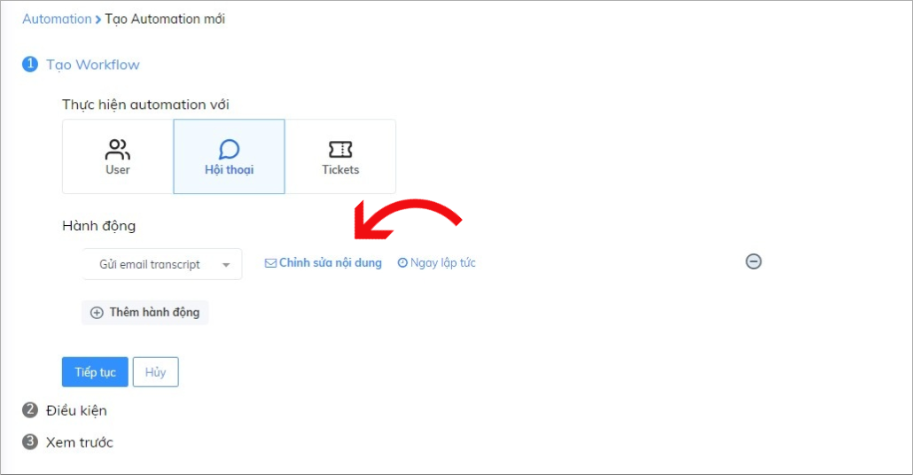

# Automation gửi email transcript

Dữ liệu và lịch sử tương tác của khách hàng là thông tin quan trọng với doanh nghiệp. Ngoài việc giúp doanh nghiệp lưu giữ trên trang quản trị, Subiz còn giúp bạn gửi nội dung hội thoại đến email một cách hoàn toàn tự động bằng ứng dụng mạnh mẽ - Automation gửi email transcript.

### Automation gửi email transcript sẽ hoạt động như thế nào? 

Automation gửi email transcript là tính năng giúp bạn gửi email lịch sử các cuộc hội thoại \(email transcript\)  về địa chỉ email bạn chỉ định. Automation sẽ tự động thực hiện hành động gửi email lịch sử chat tới email của bạn ngay sau khi cài đặt thành công. 

**Ví dụ:** Gửi Email transcript với các khách hàng chat qua website.

### **Cài đặt Automation gửi email transcript** 

[Đăng nhập App.subiz.com &gt; Cài đặt &gt; Tài khoản &gt; Automation &gt; Workflow](https://app.subiz.com/settings/automation-workflow).  
Bạn sẽ thao tác theo 3 bước cài đặt như sau: 

#### Bước 1: Tạo Workflow

Sau khi lựa chọn **Thực hiện Automation với Hội thoại** và hành động **Gửi email transcript**, bạn **Chỉnh sửa nội dung** để nhập email nhận lịch sử chat.


**Lưu ý:** Bạn có thể thêm nhiều email để cùng nhận hội thoại. Nhập thêm email mới bằng cách nhấn phím Enter sau email đã nhập. 


Sau khi thực hiện xong việc nhập email nhận lịch sử hội thoại, bạn nhấn **Tiếp tục** để chuyển sang bước tiếp theo.

#### Bước 2: Điều kiện 

Trong phần điều kiện có 2 mục điều kiện bạn cần quan tâm: 

* **Chạy automation khi:** Điều kiện **CẦN**  **- bắt buộc phải cài đặt để Automation hoạt động**. Automation sẽ chỉ chạy khi cuộc hội thoại đáp ứng được điều kiện đã cài đặt. 

**Ví dụ:** Gửi Email transcript đối với tất cả cuộc hội thoại trên kênh Subiz chat.

* **Với cuộc hội thoại có các thông tin sau:** Điều kiện **ĐỦ**  - bổ sung các thông tin về đối tượng nhận email transcript.

**Ví dụ:** Gửi Email transcript đối với cuộc hội thoại có trạng thái đã kết thúc và diễn ra trên kênh Subiz chat \(website\).

Sau khi xong bước cài đặt điều kiện, bạn nhấn **Tiếp tục** để sang bước cuối cùng 

#### Bước 3: Đặt tên Automation 

Bạn đặt tên cho Automation và viết mô tả chi tiết để dễ quản lý, sau đó Lưu cài đặt.

