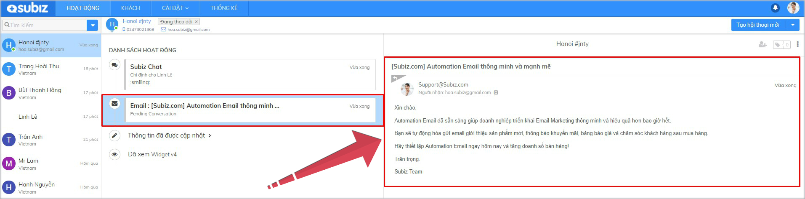
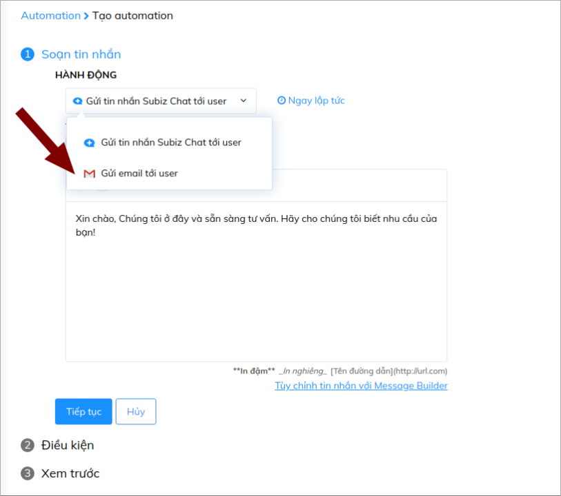

# Automation gửi email tới khách hàng

Email là cách tuyệt vời để giữ chân khách hàng và tăng doanh số bán hàng. Bạn có thể gửi email duy trì kết nối thường xuyên với khách hàng cũ, giới thiệu sản phẩm mới, thông báo chương trình ưu đãi và chăm sóc khách hàng sau mua hàng.

Subiz sẽ giúp bạn triển khai gửi email một cách tự động hóa, đơn giản và dễ dàng với Automation Email.

### **1.Automation Email sẽ hoạt động như thế nào?**

Automation sẽ tự động thực hiện hành động gửi email tới khách hàng ngay sau khi cài đặt thành công. Những khách hàng đã có địa chỉ email và thỏa mãn điều kiện cài đặt sẽ nhận được Automation email.

Ví dụ: Tất cả khách hàng đã có địa chỉ email sẽ được gửi Automation email thông báo tính năng mới

### 2. Tạo Automation gửi email tới khách hàng

Để tạo Automation: [Đăng nhập app.subiz.com &gt; Cài đặt &gt; Tài khoản &gt; Automation &gt; Tạo hội thoại mới](https://app.subiz.com/settings/automations/add-conversation)

Và thực hiện 3 bước sau:

#### **Bước 1: Tùy chỉnh nội dung Email**

**Lưu ý:** 

* Bạn có thể lựa chọn địa chỉ Email gửi đi. Tuy nhiên email này cần được tích hợp vào Subiz : [Hướng dẫn tích hợp Email ](https://help.subiz.com/bat-dau-voi-subiz/thiet-lap-moi-truong-tuong-tac/tich-hop-su-dung-email-tren-subiz)

* Bạn hoàn toàn có thể gửi mail cho khách hàng bằng tên đã lưu trên hệ thống Subiz 

* Cài đặt thời gian gửi email

####  Bước 2: Cài đặt điều kiện

Bạn thiết lập điều kiện như sau:

#### Bước 3: Lưu tên Automation

### **3. Một số Automation Email thông dụng**

* **Thông báo sản phẩm mới, hoặc chương trình khuyến mãi cho khách hàng mục tiêu**

Bạn muốn gửi thông tin khuyến mãi cho những khách hàng mới vào website với một số điều kiện nhất định. Ví dụ bạn chỉ muốn gửi thông tin này đến các khách hàng có địa chỉ truy cập là Hà Nội, điều kiện cần cài đặt như sau:

* **Gửi mail khuyến mãi tới khách hàng cũ khi truy cập vào trang bất kỳ**

Những khách hàng cũ đã có thông tin trong tài khoản Subiz của bạn, họ quay lại website để tìm kiếm các sản phẩm giảm giá trong trang khuyến mãi. Bạn hoàn toàn có thể gửi cho họ những thông tin ưu đãi, sản phẩm bán chạy để thu hút họ hơn. Bạn sẽ cài đặt email này với điều kiện như sau:

