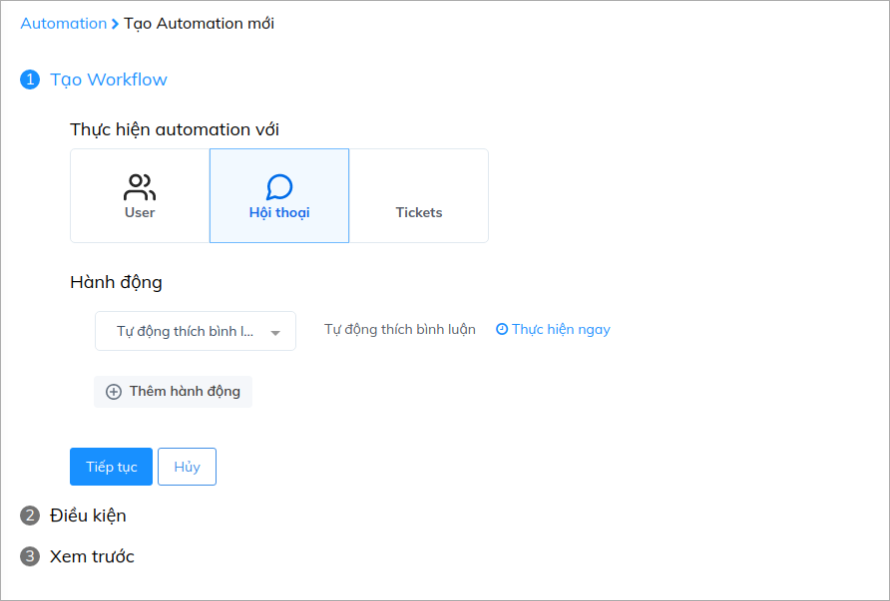
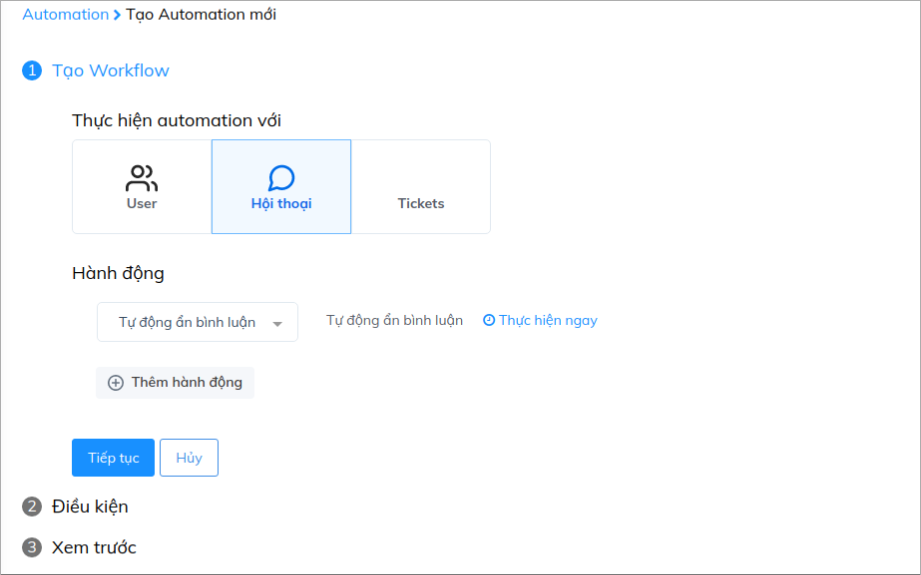
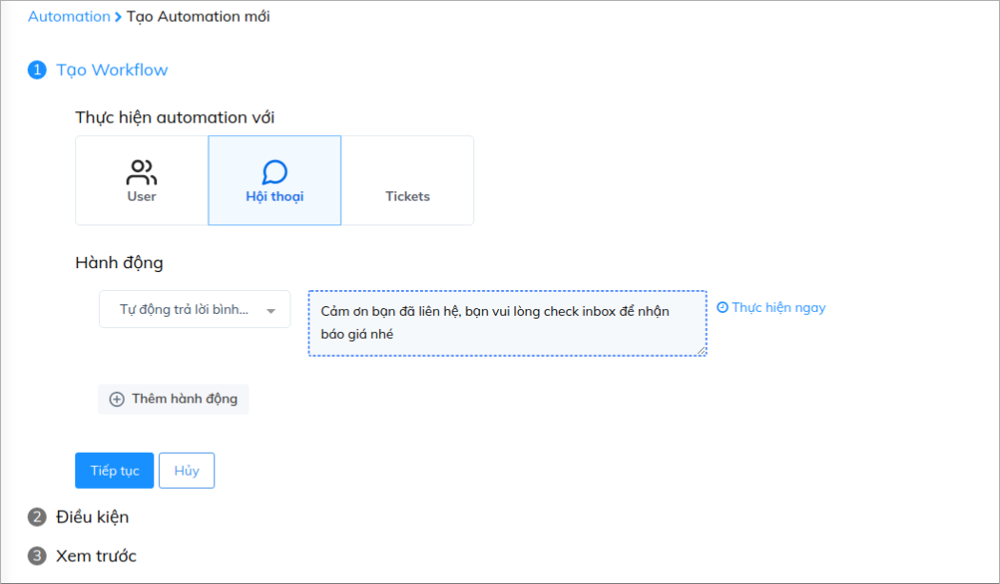
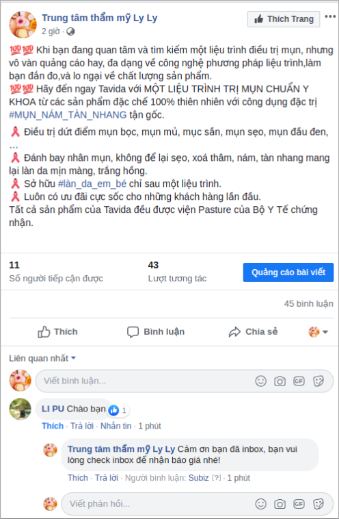
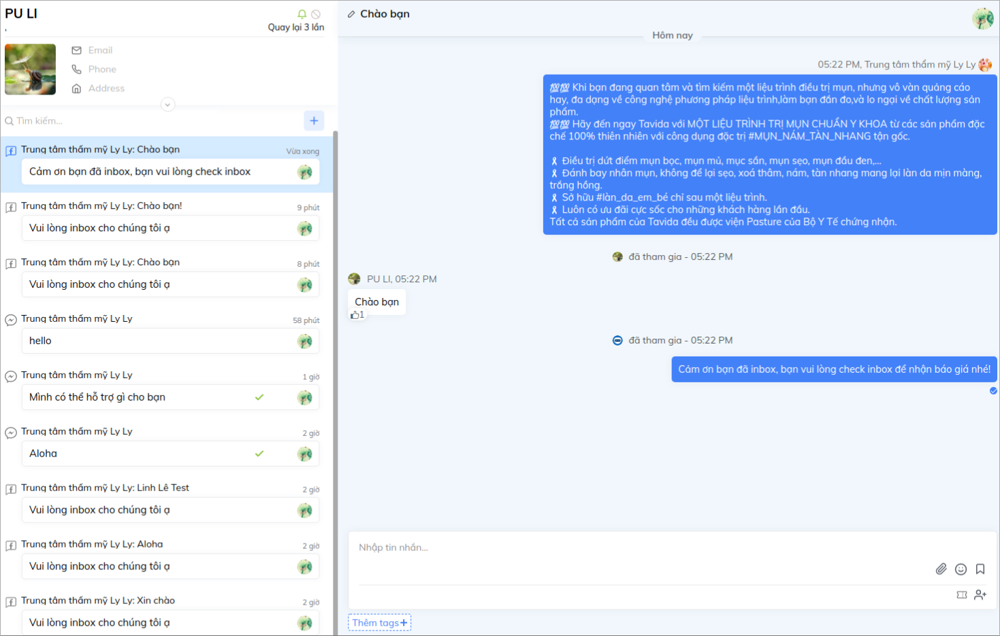

# Automation tự động like, ẩn và trả lời bình luận Facebook

Với việc tích hợp Fanpage và Comment Facebook vào Subiz, giờ đây bạn hoàn toàn có thể quản lý tất cả các tương tác từ Facebook một cách hiệu qủa trên Subiz mà không cần thông qua bất cứ công cụ quản lý nào khác.

Subiz cũng hỗ trợ các chức năng tự động giúp bạn có thể tự động hóa các tương tác trên Facebook như tự động xóa, ẩn, like comment. Cùng tham khảo hướng dẫn sau nhé:

Trước hết bạn sẽ vào mục : ****[**Cài đặt &gt; Automation &gt; Workflow**](https://app.subiz.com/settings/automation-workflow) ****và lựa chọn hành động Automation bạn muốn thực hiện.

### Automation tự động thích bình luận 

Bạn sẽ lựa chọn hành động như sau:

### Automation tự động ẩn bình luận 

### Automation tự động trả lời bình luận

### Thiết lập cả 3 hành động trong một Automation.

Sau bước tạo Automation, bạn nhấn _**Tiếp tục**_ để sang bước tạo điều kiện như sau:

Sau bước cài đặt điều kiện, bạn nhấn tiếp tục để lưu lại tên cho Automation đã cài đặt

Khi đó trên Fanpage của bạn sẽ hiển thị như sau:

Và đây là hiển thị trên trang quản lý Subiz của bạn:

