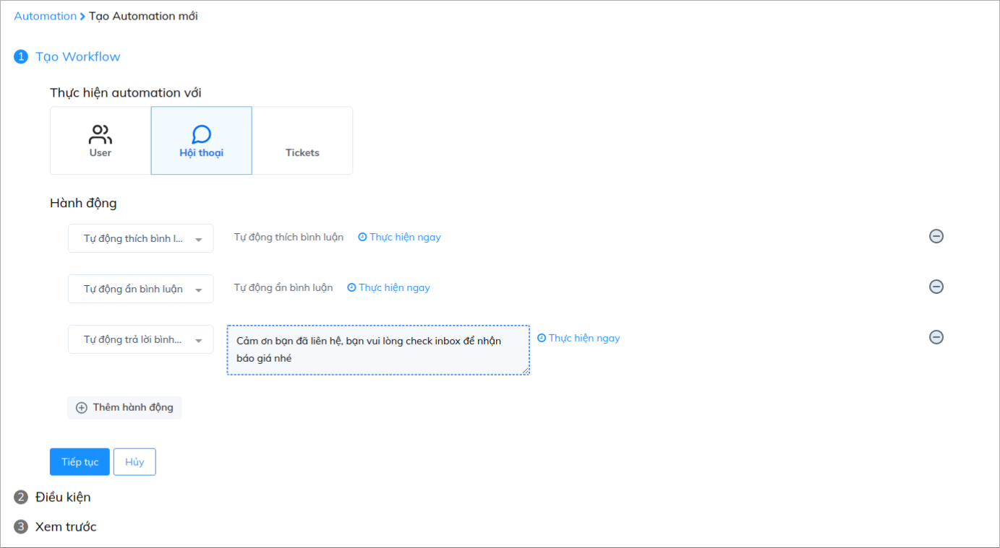
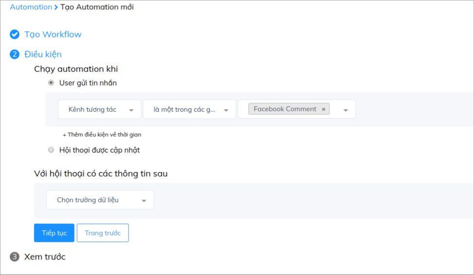
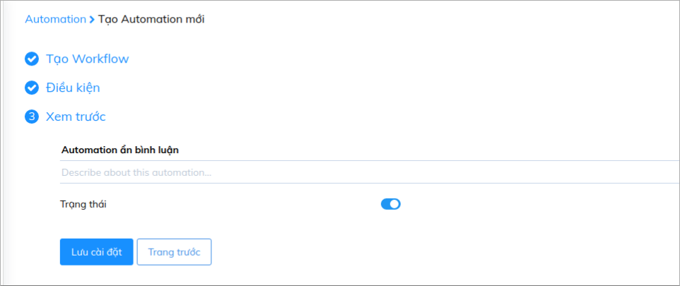

# Quản lý comment Facebook cùng Automation

Với việc tích hợp Fanpage và Comment Facebook vào Subiz, giờ đây bạn hoàn toàn có thể quản lý tất cả các tương tác từ Facebook một cách hiệu qủa trên Subiz mà không cần thông qua bất cứ công cụ quản lý nào khác.

Subiz cũng hỗ trợ các chức năng tự động giúp bạn có thể tự động hóa các tương tác trên Facebook như tự động xóa, ẩn, like comment. Cùng tham khảo hướng dẫn sau nhé:

### Bước 1: Tạo Automation

Bạn sẽ vào mục : ****[**Cài đặt &gt; Automation &gt; Workflow**](https://app.subiz.com/settings/automation-workflow)\*\*\*\*

Tại đây, bạn sẽ chọn hành động cho Automation là _**Tự động thích bình luận**_, _**Tự động ẩn bình luận**_ hoặc _**Tự động xóa bình luận.**_

**Lưu ý:** Bạn có thể lựa chọn được 1 hoặc cả 3 hành động cho Automation.

### Bước 2: Cài đặt điều kiện

Sau bước tạo Automation, bạn nhấn _**Tiếp tục**_ để sang bước tạo điều kiện như sau:

### Bước 3: Lưu tên Automation

Sau bước cài đặt điều kiện, bạn nhấn tiếp tục để lưu lại tên cho Automation đã cài đặt

