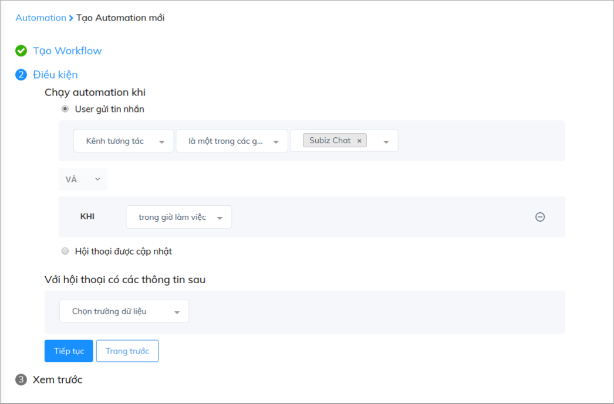

# Hỏi thông tin khách hàng theo thời gian làm việc

Cửa sổ Subiz sẽ luôn mở để khách hàng có thể kết nối với bạn mọi lúc mọi nơi, giúp bạn không bỏ lỡ bất cứ cơ hội bán hàng nào trên website. Tuy nhiên, nếu như khách hàng nhắn tin đến cho bạn ngoài giờ làm việc, làm cách nào để có thể báo cho khách hàng biết bạn đang không ở đó và mời khách để lại thông tin cũng như yêu cầu hỗ trợ để bạn có thể sớm liên hệ với họ khi online trở lại?

 Với chức năng automation hỏi thông tin khách hàng, bạn có thể dễ dàng tạo ra những bảng hỏi thông tin theo thời gian làm việc của doanh nghiệp, để khách hàng có thể biết khi nào bạn sẵn sàng hỗ trợ họ.

Để cài đặt Automation hỏi thông tin khách theo thời gian làm việc, bạn cần thao tác như sau:

### Cài đặt thời gian làm việc của doanh nghiệp 

Bạn vào: [App.subiz.com &gt; Tài khoản &gt; Cài đặt &gt; Giờ làm việc](https://app.subiz.com/settings/business-hours)

Tại đây bạn có thể cài đặt chi tiết thời gian làm việc:

### Automation hỏi thông tin trong giờ làm việc

Đăng nhập [**App.subiz.com** &gt; **Cài đặt** &gt; **Tài khoản** &gt; **Automation** &gt; **Workflow &gt; Tạo**](https://app.subiz.com/settings/automation-workflow)\*\*\*\*

Tùy chỉnh nội dung hỏi thông tin trong giờ làm việc:

Cài đặt điều kiện cho Automation và _**thêm điều kiện về thời gian**_

Lưu tên Automation:

### Automation hỏi thông tin ngoài giờ làm việc 

Bạn tạo một Automation mới và _**Chỉnh sửa nội dung**_ như sau:

Cài đặt điều kiện cho Automation và _**thêm điều kiện về thời gian:**_

Lưu tên Automation:

Như vậy bạn đã tạo lập được 2 Automation phù hợp theo thời gian làm việc của doanh nghiệp

