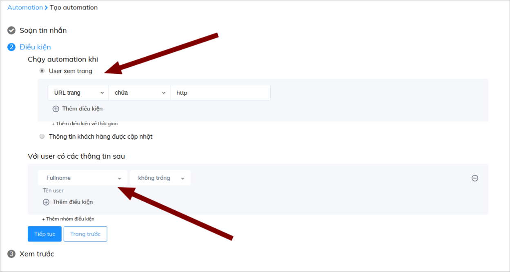
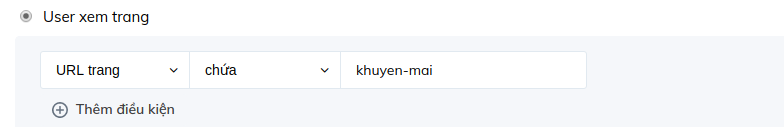
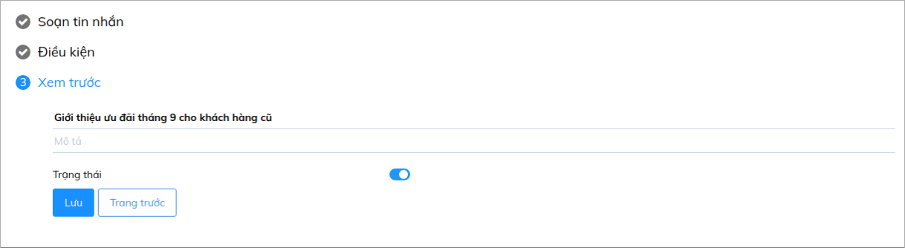

# Kết nối với khách hàng quay lại website cùng Automation

Nhiều khách hàng có thể sẽ không quyết định chốt đơn ngay lần đầu tiên vào website của bạn, họ có thể quay lại web nhiều lần để tìm hiểu thêm thông tin. Hoặc cũng có những khách hàng đã tin dùng sản phẩm của bạn, nên thường xuyên vào web để cập nhật những chương trình ưu đãi, giảm gía hay mua thêm hàng... Vậy với những khách hàng đã từng vào web và lưu lại thông tin, làm thế nào để họ biết bạn nhận ra họ và sẵn sàng cung cấp đến họ những dịch vụ tốt nhất?

Cùng với chức năng Automation của Subiz, bạn có thể đem đến cho khách hàng những trải nghiệm mang tính cá nhân, đặc biệt là với những khách hàng đã từng tương tác với bạn qua cửa sổ Subiz.

Để thiết lập Automation tăng sự kết nối giữa doanh nghiệp và khách hàng cũ, bạn có thể thao tác theo hướng dẫn sau:

### Bước 1: Tạo tin nhắn tự động

Bạn có thể truy cập vào mục: [**Cài đặt &gt; Automation &gt; Tạo hội thoại mới**](https://app.subiz.com/settings/automations/add-conversation)\*\*\*\*

Tại đây bạn có thể thiết lập lời chào tự động với những thông điệp mà bạn muốn truyền tải đến khách hàng cũ, đó có thể là thông tin về chương trình ưu đãi, sản phẩm mới của doanh nghiệp hay đơn giản chỉ là sự sẵn sàng hỗ trợ của doanh nghiệp. Bạn có thể thiết lập, để chào khách hàng bằng tên đã lưu lại trên hệ thống để tăng trải nghiệm cá nhân.

### Bước 2: Tạo điều kiện

Bạn có thể tạo điều kiện như sau:

**Lưu ý:** 

* Trong trường hợp bạn chỉ lưu thông tin Email hoặc Số điện thoại của khách hàng, bạn có thể thay thế trường Fullname để giúp nhận diện khách hàng cũ.

* Nếu bạn muốn chỉ khi khách vào trực tiếp 1 trang chỉ định mới hiển thị lời chào, bạn có thể thay thế như sau:

### Bước 3: Lưu thông tin

Sau khi thiết lập điều kiện, bạn nhấn **Tiếp tục** bạn chuyển sang bước Lưu tên Automation

Như vậy bạn đã hoàn thành xong các bước cài đặt Automation, để thu hút khách hàng cũ vào website. 

**Lưu ý:**

* Một kịch bản Automation sẽ chỉ chạy một lần với 1 khách truy cập, vì vậy bạn có thể thường xuyên tạo mới Automation này theo tuần, tháng hoặc khi có những chương trình đặc biệt.
* Bạn có thể cài song song với Automation chào khách hàng mới truy cập vào web

