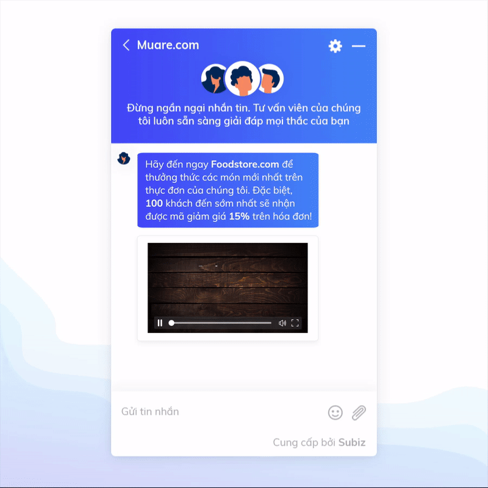
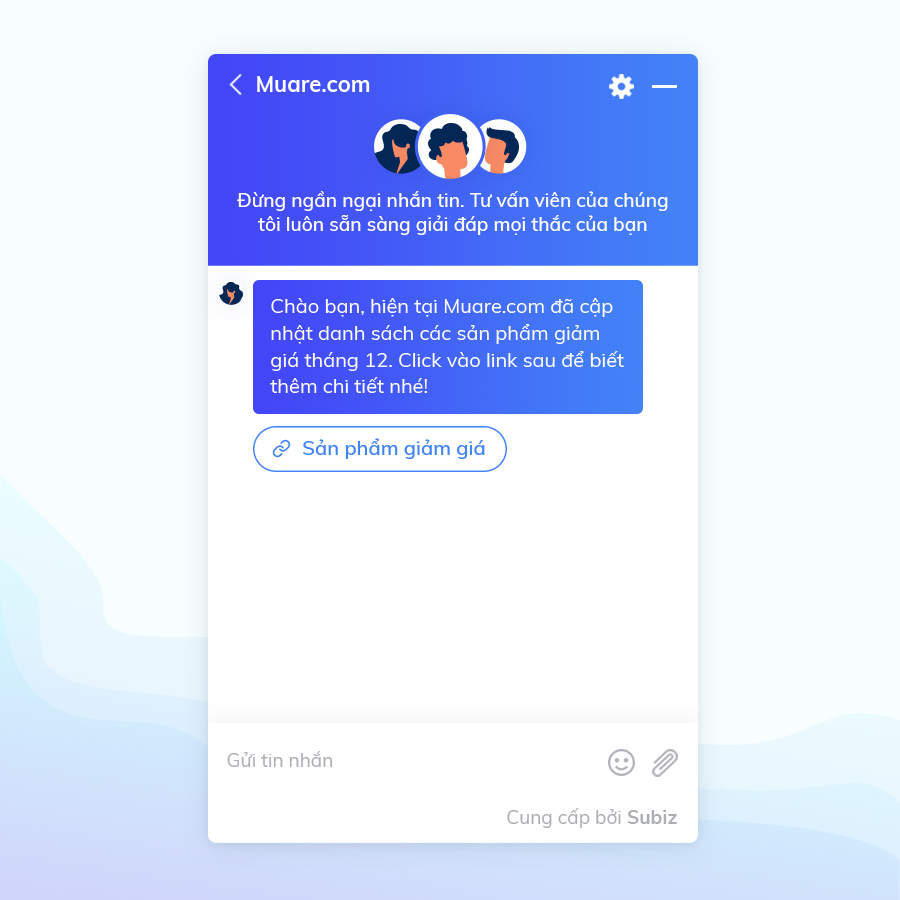
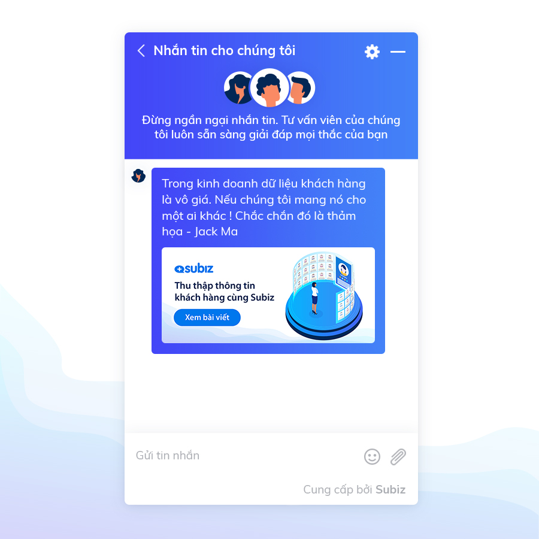
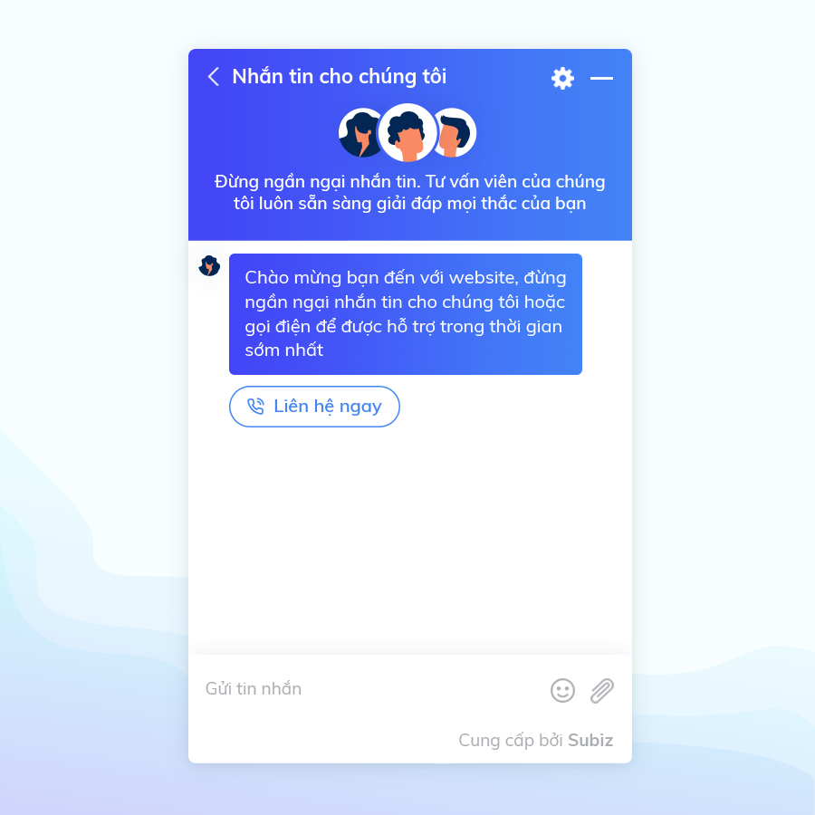

# Một số mẫu tin nhắn trong Automation để chào khách hàng

Với chức năng Automation gửi tin nhắn tự động của Subiz bạn có thể thu hút khách hàng trên website cùng những mẫu tin nhắn đa dạng, phong phú về nội dung. Thông qua đó, bạn có thể gửi đến khách hàng những thông điệp mới: chương trình khuyến mãi, sản phấm mới, hay đơn giản để kích thích sự tương tác từ phía khách hàng bằng cách tạo những câu trả lời nhanh... Dưới đây là một số mẫu tin nhắn Automation mà bạn có thể tham khảo.

### **Gửi tin nhắn cùng video thu hút**

Những video là nam châm thu hút khách hàng. Hãy truyền thông chúng ngay trên cửa sổ Subiz chat - một cách nổi bật để khách hàng hào hứng tìm hiểu thêm về sản phẩm của bạn 



Để thêm Video, bạn có th**ể** vào mục[ Tạo Automation ](https://app.subiz.com/settings/automations/add-conversation)và lựa chọn **Thêm đính kèm** &gt; **Tệp**

**Lưu ý**: Dung lượng video tối đa là 25Mb

### **Gắn link vào tin nhắn**

Đôi khi bạn dự đoán được nhu cầu khách hàng, hoặc đơn giản là muốn giới thiệu những sản phẩm ưu việt hoặc chính sách giá mới nhất. Hãy gắn link vào cửa sổ Subiz để cung cấp thêm thông tin, rút ngắn thời gian quyết định mua hàng của khách. Rất có thể khách sẽ dừng chân tại website thay vì lang thang tìm hiểu thêm trên Google.



### **Gắn kèm ảnh và trả lời nhanh**

Đôi khi khách hàng sẽ ngần ngại trước khi nhắn tin cho bạn vì không biết phải bắt đầu từ đâu. Hãy tạo những câu trả lời nhanh để khách hàng lựa chọn và dễ dàng mở đầu câu chuyện với bạn:


### **Đính kèm link vào hình ảnh**

Để dẫn khách hàng tới trang mà bạn mong muốn, hãy tạo một Automation với hình ảnh bắt mắt và không quên đính kèm link của trang mà bạn muốn điều hướng. Đây là cách hiệu quả, giúp bạn giới thiệu những thông tin cập nhật mới nhất trên website ngay khi khách hàng vào web.



Bạn có thể sử dụng đoạn mã Mardown sau để đính kèm link vào hình ảnh trong mẫu tin nhắn: 

```text
[](Đường dẫn link page)
```

### **Hỏi thông tin khách hàng**

Nếu như doanh nghiệp của bạn cần thu thập thông tin khách hàng để phân loại khách hàng tiềm năng, bạn có thể cài đặt tin nhắn tự động với form hỏi thông tin:


### **Gắn button Hotline vào tin nhắn**

Việc gắn button Hotline vào tin nhắn sẽ giúp khách hàng có thể dễ dàng liên hệ đến bạn trong trường hợp cần thiết. Khi khách hàng click vào số điện thoại, họ sẽ có thể gọi cho bạn trực tiếp trên di động hoặc trên máy tính nếu có phần mềm hỗ trợ.



### **Thêm địa chỉ Messenger**

Nếu bạn muốn điều hướng khách hàng liên hệ sang kênh Messenger, hoặc đơn giản tạo cho khách hàng nhiều sự lựa chọn để tương tác với bạn. Bạn có thể gắn link Messenger ngay trong tin nhắn:


Để cài đặt Automation gửi tin nhắn tự động, bạn có thể tham khảo hướng dẫn chi tiết: [Tại đây](https://help.subiz.com/su-dung-subiz-nang-cao/tuong-tac-tu-dong/mot-so-automation-thong-dung/automation-gui-tin-nhan-tu-dong)  


  
  
  
  
  
  


  
  


###   

