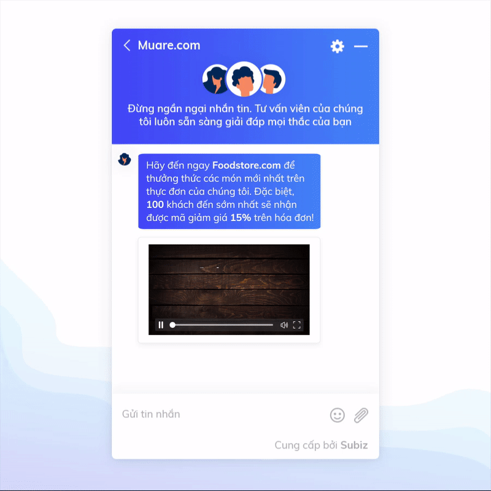
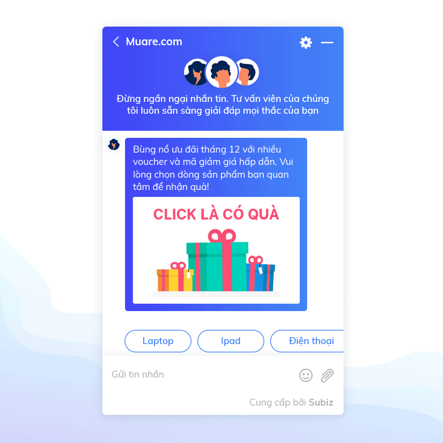
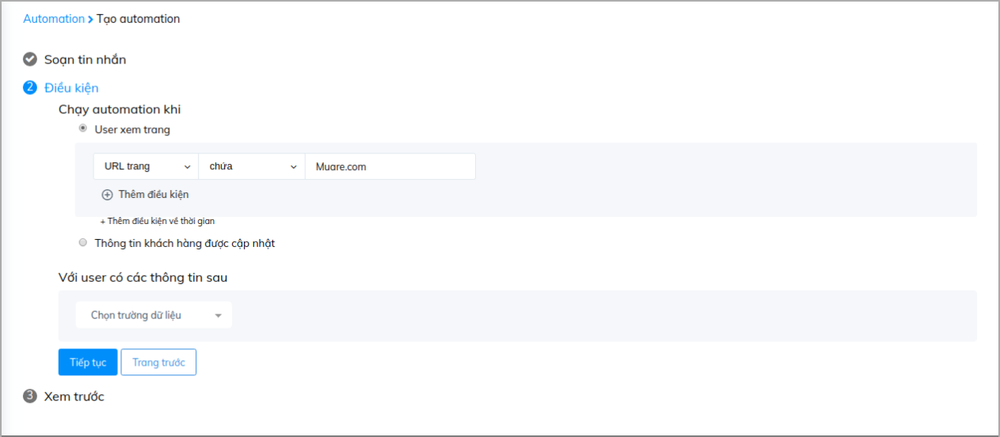
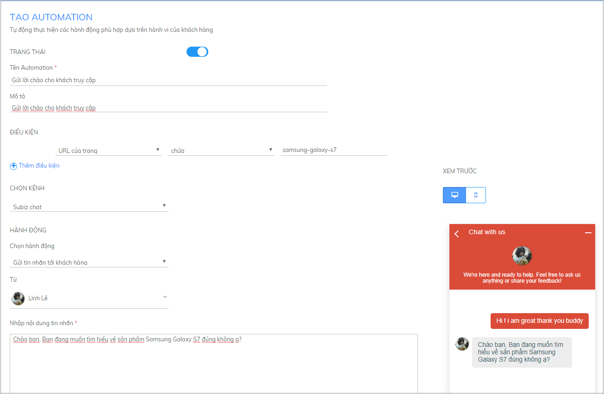

# Những phương án tiếp cận khách hàng và thu thập thông tin qua cửa sổ Subiz

Bên cạnh việc xây dựng nội dung tin nhắn Automation hấp dẫn thu hút khách truy cập, cách tiếp cận khách hàng như thế nào cũng rất quan trọng. Điều then chốt ở đây là bạn cần hiểu rõ khách hàng của bạn là ai, thuộc đối tượng nào, có thói quen ra sao… Khi đó, việc phân loại và đưa ra phương án tiếp cận họ sẽ trở nên đơn giản hơn bao giờ hết. Bài viết này chia sẻ một số phương án tiếp cận và thu thập thông tin khách hàng thông qua tính năng tự động - Automation tại cửa số chat Subiz.

### Chào khách hàng ngay sau khi khách vào web 

Ngay khi khách vào website, cửa sổ chat mở ra cùng tin nhắn chào tự động sẽ là lời chào gửi đến tất cả khách hàng, đồng thời thu hút sự chú ý của khách hàng và gia tăng cơ hội tương tác khách hàng của doanh nghiệp.

Cách cài đặt chi tiết, bạn xem hướng dẫn [TẠI ĐÂY](https://help.subiz.com/su-dung-subiz-nang-cao/tuong-tac-tu-dong/mot-so-automation-thong-dung/automation-gui-tin-nhan-tu-dong).

### Chào khách hàng khi truy cập landing page 

Doanh nghiệp của bạn có nhiều website, landing page bạn lo ngại về việc phân biệt khách đến từ website nào. Vậy hãy tạo dấu ấn riêng với lời chào riêng biệt trên từng website hay các trang sản phẩm khác nhau như sau:

Để cài đặt chào tự động cho landing page, bạn tạo nội dung trong mục Tạo Automation và bổ sung link landing page trong mục cài đặt điều kiện như sau:

### Chào Khách hàng khách quay lại 

Hầu hết khách hàng sẽ chưa chốt mua hàng ngay lần đầu tiếp cận, nhất là với kênh bán hàng trực tuyến. Vậy gửi lời chào đến khách hàng lần đầu truy cập website chưa đủ, bạn nên gây ấn tượng tới các khách hàng quay lại website bằng cách gửi thông điệp riêng tới họ.

Hướng dẫn cài đặt chi tiết bạn xem [TẠI ĐÂY](https://help.subiz.com/su-dung-subiz-nang-cao/tuong-tac-tu-dong/mot-so-ung-dung-automation/ket-noi-voi-khach-hang-quay-lai-website-cung-automation).

### Yêu cầu khách hàng nhập thông tin trước khi trò chuyện 

Doanh nghiệp của bạn có rất nhiều lượt khách truy cập website và trò chuyện tương tác mỗi ngày. Vậy đâu là khách hàng tiềm năng, đâu là đối tượng khách hàng bạn cần tiếp tục chăm sóc và theo đuổi? Bạn có thể phân loại ngay bằng việc [cài đặt hỏi thông tin ngay khi khách truy cập vào website](https://help.subiz.com/su-dung-subiz-nang-cao/tuong-tac-tu-dong/mot-so-automation-thong-dung/automation-gui-tin-nhan-tu-dong#buoc-1-tao-automation-gui-tin-nhan). Bắt buộc hay không bắt buộc điền thông tin, bạn có thể lựa chọn và cài đặt dễ dàng trên Subiz.

Các thông tin khách hàng cung cấp sẽ được cập nhật lên hệ thống Subiz và sẽ là nguồn dữ liệu quý báu để bạn theo đuổi khách hàng trên từng kênh, chủ động hỗ trợ khách hàng đúng thời điểm, gia tăng cơ hội chuyển đổi khách hàng.

### Tự động trả lời và hỏi thông tin khách hàng

Sau khi thu hút được khách hàng truy cập website, việc thu thập thông tin của khách hàng sẽ là bước quan trọng tiếp theo mà doanh nghiệp không thể bỏ qua. Thu thập và lưu giữ thông tin sẽ được thực hiện hoàn toàn tự động chỉ với tính năng [Automation – Hỏi thông tin khách hàng](https://help.subiz.com/su-dung-subiz-nang-cao/tuong-tac-tu-dong/mot-so-automation-thong-dung/hoi-thong-tin-khach-hang). Automation sẽ được hiển thị như sau:

Trong trường hợp bạn muốn phân loại các khách hàng tiềm năng, bạn hoàn toàn có thể cài đặt hỏi thông tin bắt buộc như sau:

### Đồng bộ dữ liệu với khách đã cung cấp thông tin 

Với các khách hàng đã có thông tin trước đó qua việc khách hàng điền form thông tin hay khách hàng có tài khoản đăng nhập trên website, bạn sẽ có thể [đồng bộ dữ liệu về Subiz](https://help.subiz.com/su-dung-subiz-nang-cao/api-javascript-cua-subiz-widget) để tổng hợp và lưu trữ thông tin. Khi đó, bạn sẽ dễ dàng nhận diện ngay khi khách hàng liên hệ tới và chủ động gửi lời chào cũng như tư vấn khách hàng bằng tên đã lưu trước đó:

Chi tiết cách cài đặt, bạn tham khảo [TẠI ĐÂY](https://help.subiz.com/su-dung-subiz-nang-cao/tuong-tac-tu-dong/mot-so-automation-thong-dung/automation-gui-tin-nhan-tu-dong#buoc-1-tao-automation-gui-tin-nhan).

### Tích hợp với nút Tư Vấn trên website 

Bạn bán hàng qua  có rất nhiều icon như tư vấn ngay, khuyến mãi để thu hút khách hàng. Bạn có thể tích hợp ngay các cửa s chat Subiz vào các icon n để thu hút và điều hướng khách hàng chat với tư vấn viên tại cửa sổ chat.

Hướng dẫn chi tiết bạn xem [TẠI ĐÂY](https://help.subiz.com/bat-dau-voi-subiz/thiet-lap-moi-truong-tuong-tac/tich-hop-subiz-len-website/dat-button-subiz-moi-noi-tren-website-voi-api-js).

### 

