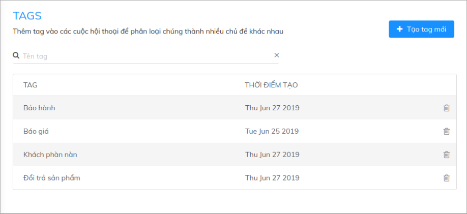
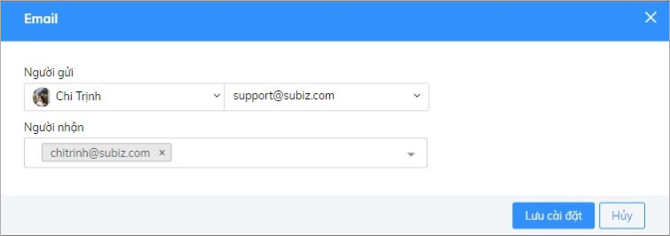
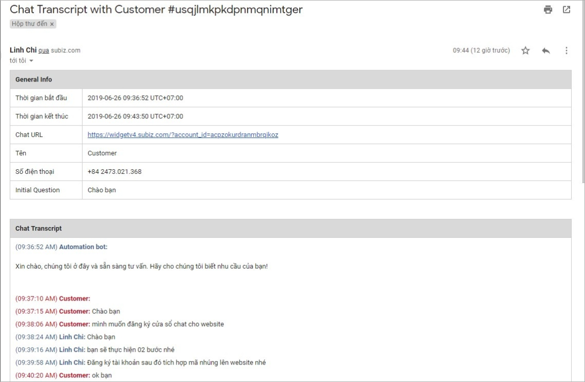

# Quản lý tình hình hỗ trợ khách hàng với email Transcript

Automation gửi email transcript là tính năng giúp bạn gửi email lịch sử các cuộc hội thoại \(email transcript\) về địa chỉ email bạn chỉ định. Thay vì nhận toàn bộ lịch sử hội thoại, bạn có thể phân loại và chọn lọc theo dõi các vấn đề khách hàng thường gặp phải và tình hình hỗ trợ khách hàng. Với việc kết hợp với chức năng gắn Tag hội thoại, quy trình này sẽ diễn ra hoàn toàn tự động, giúp bạn nắm được thông tin chung góp phần ghi nhận cơ hội và nâng cao chất lượng dịch vụ khách hàng. 

Ví dụ: Bạn muốn lưu thông tin và theo dõi các khách hàng Báo giá, bạn sẽ gắn Tag hội thoại để ghi nhận vấn đề đồng thời gửi nội dung cuộc hội thoại của khách về email và tiếp tục chăm sóc hỗ trợ khách hàng.

### Bước 1: Tạo Tag 

Tag là chức năng phân loại hội thoại theo từng nhóm nhằm ghi nhận các vấn đề khách thường gặp phải hay quan tâm đến. Tag giúp bạn tổng quan chung nội dung của cuộc hội thoại với khách hàng. \( [Tìm hiểu thêm về Subiz Tag](https://help.subiz.com/bat-dau-voi-subiz/lam-viec-tren-subiz/gan-tag-cuoc-hoi-thoai) \)

Để tạo Tag bạn vào mục: [Tài khoản &gt; Cài đặt &gt; Tags](https://app.subiz.com/settings/tags).

### Bước 2: Tạo Automation tự động gửi email Transcript 

**1. Thiết lập hành động cho Automation** 

Để tạo Automation tự động gửi email Transcript bạn thao tác như sau:

[​Tài khoản &gt; Cài đặt &gt; Automation &gt; Workflow​](https://app.subiz.com/settings/automation-workflow)

Sau khi lựa chọn **Thực hiện Automation với Hội thoại** và hành động **Gửi email transcript**, bạn **Chỉnh sửa nội dung** để nhập email nhận lịch sử chat.

**2. Tạo điều kiện cho Automation**

Chạy Automation khi -&gt; Hội thoại được cập nhật -&gt; Thêm Tag -&gt; Chọn Tag cần theo dõi.

Ví dụ: Gửi email transcript tất cả các hội thoại được gắn Tag Báo giá.

Thêm vào đó, để có thể nhận được nội dung toàn bộ cuộc hội thoại, bạn tạo điều kiện như sau:

**3. Lưu tên Automation**

Bạn đặt tên cho Automation và viết mô tả chi tiết để dễ quản lý, sau đó Lưu cài đặt.

### **Bước 3: Gắn Tag hội thoại**

Sau khi hoàn tất các bước cài đặt Automation, để nhận được email transcript, bạn lưu ý cần gắn tag với mỗi hội thoại.

Khi đó, bạn sẽ nhận được lịch sử hội thoại qua email như sau:

