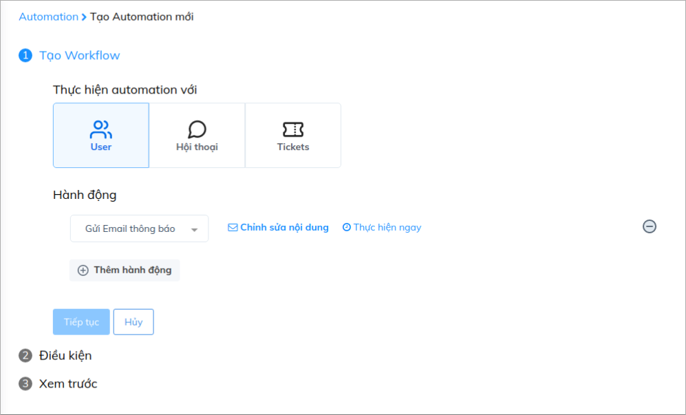
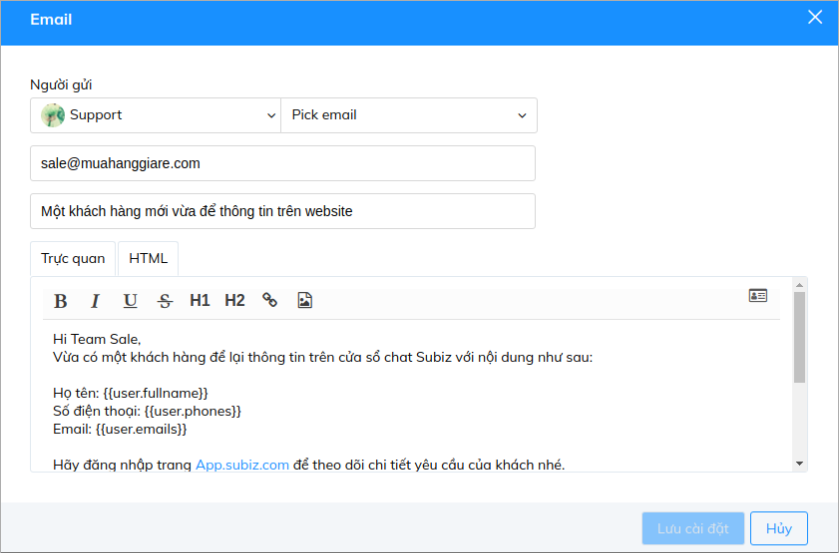
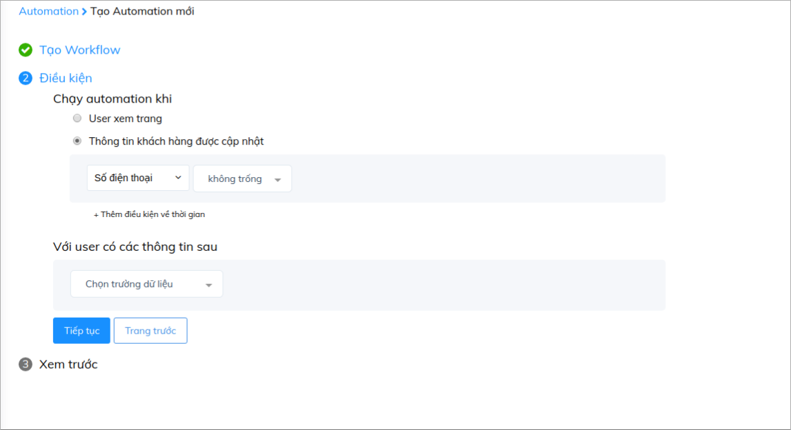
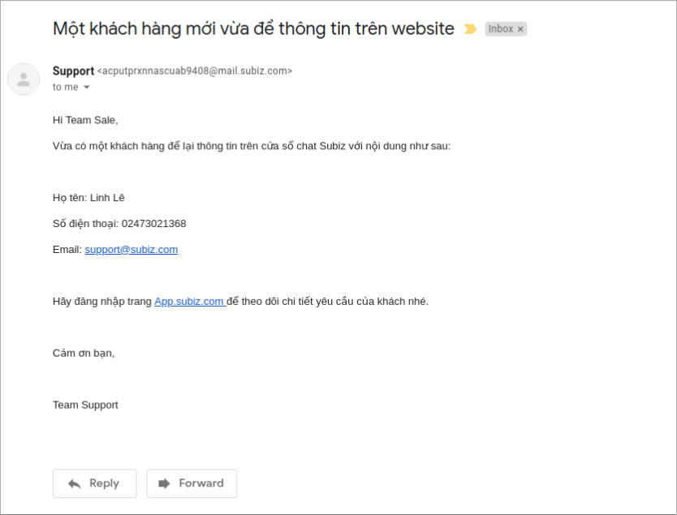

# Nhận email thông báo khi khách hàng cập nhật thông tin

Với mỗi khách hàng để lại thông tin là bạn đã có thêm một cơ hội để tiến gần hơn tới họ và gia tăng cơ hội bán hàng.   
Ngoài việc hỗ trợ bạn có thể tự động thu thập thông tin khách hàng tiềm năng, chức năng Automation của Subiz còn giúp bạn có thể nhận thông báo khi có khách hàng để lại thông tin trên cửa sổ chat qua email, để bạn cùng đồng nghiệp có thể kịp thời đăng nhập tài khoản, theo dõi nội dung yêu cầu của khách và nhanh chóng liên hệ lại trong trường hợp họ đã thoát khỏi website.

Bài viết sau sẽ chia sẻ với bạn hướng dẫn cách nhận email thông báo khi khách hàng nhập thông tin:

### Bước 1: Cài đặt nội dung email thông báo

Để tạo Automation gửi email thông báo, bạn vào mục : [Automation &gt; Workflow &gt; Tạo](https://app.subiz.com/settings/automation-workflow)

Tiếp đó bạn sẽ lựa chọn đối tượng để thiết lập Automation:

Sau khi chọn đối tượng là _**User**_ và hành động _**Gửi email thông báo**_, bạn sẽ _**Chỉnh sửa nội dung email**_ và nhập địa chỉ mail nhận thông báo:

### Bước 2: Thiết lập điều kiện 

Sau khi đã hoàn tất cài đặt nội dung, bạn nhấn _**Tiếp tục**_ để chuyển sang bước cài đặt điều kiện:

### Bước 3: Lưu Automation

Cài đặt điều kiện xong, bạn click _**Tiếp tục**_ để chuyển sang bước lưu lại tên Automation 

Automation sẽ chạy khi khách hàng nhập thông tin của họ qua cửa sổ chat hoặc trong tin nhắn Automation hỏi thông tin \( Tham khảo [hướng dẫn cài đặt](https://help.subiz.com/su-dung-subiz-nang-cao/tuong-tac-tu-dong/mot-so-automation-thong-dung/hoi-thong-tin-khach-hang) \), khi đó team của bạn sẽ nhận email thông báo như sau:

 

