# Tự động hóa quy trình xử lý Ticket

Chức năng Ticket sẽ hỗ trợ doanh nghiệp trong việc theo dõi tình hình hỗ trợ khách hàng, các vấn đề khách hàng đang quan tâm, tình trạng và tiến độ xử lý yêu cầu của khách hàng \( [Tìm hiểu thêm về Ticket](https://help.subiz.com/bat-dau-voi-subiz/lam-viec-tren-subiz/ticket-quan-ly-cham-soc-khach-hang#ticket-la-gi) \). Cùng sự kết hợp với chức năng Automation mới, quy trình này sẽ diễn ra hoàn toàn tự động, giúp bạn ngày càng nâng cao chất lượng dịch vụ khách hàng. 

**Ví dụ:** Khách hàng phàn nàn về về chất lượng sản phẩm, dịch vụ bảo hành , bạn có thể vừa gắn Ticket để ghi nhận vấn đề này đồng thời gửi nội dung cuộc hội thoại của khách sang bộ phận liên quan để họ có thể nắm thông tin và đưa ra phương án xử lý, từ đó bạn có thể phản hồi khách hàng một cách hợp lý nhất.

Bạn có thể kết hợp giữa chức năng **Gắn Tag cuộc hội thoại** cùng với **Automation cập nhật Ticket và gửi email transcript** để có thể tự động hóa quy trình này.

### Bước 1: Tạo Tag

Tag là những vẫn đề khách hàng quan tâm, thường xuyên trao đổi. Tag giúp bạn tổng quan chung nội dung của cuộc hội thoại với khách hàng. \( [Tìm hiểu thêm về Subiz Tag](https://help.subiz.com/bat-dau-voi-subiz/lam-viec-tren-subiz/gan-tag-cuoc-hoi-thoai) \)

Để tạo Tag bạn vào mục: [Tài khoản &gt; Cài đặt &gt; Tags ](https://app.subiz.com/settings/tags)

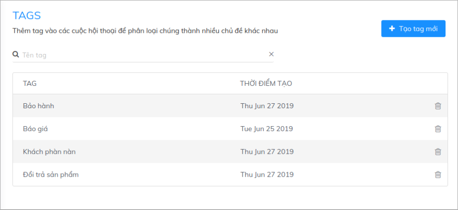

### Bước 2: Tạo Automation tự động gắn Ticket và gửi email Transcript

#### 1. Thiết lập hành động cho Automation

Để tạo Automation tự động gắn Ticket và gửi email Transcript bạn thao tác như sau:

[Tài khoản &gt; Cài đặt &gt; Automation &gt; Workflow](https://app.subiz.com/settings/automation-workflow)

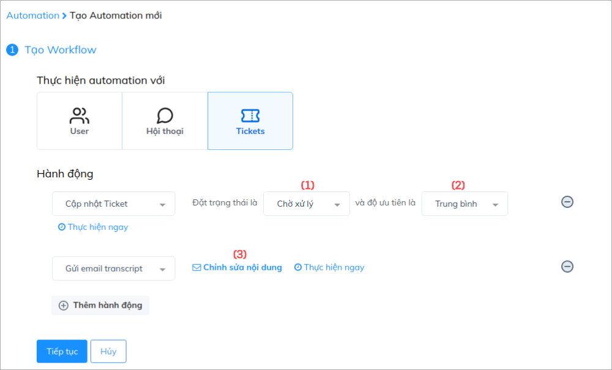

**Lưu ý:** 

*  _**\(1\) : Trạng thái của Ticket**_: Tùy vào tiến độ xử lý Ticket mà bạn để trạng thái phù hợp. Thông thường nếu vấn đề mới phát sinh, bạn có thể để là _**Đang mở**_ hoặc _**Chờ xử lý.**_
* _**\(2\) :**_ ****_**Độ ưu tiên của Ticket**_: Cần dựa vào vấn đề của khách hàng để đưa ra mức độ ưu tiên xử lý phù hợp. Với mỗi mức độ ưu tiên cũng sẽ có một thời gian xử lý riêng.
* _**\(3\) :  Chỉnh sửa nội dung:**_ Tại đây bạn có thể thêm địa chỉ mail của người / bộ phận sẽ nhận Email Transcript nội dung cuộc hội thoại bằng cách nhập email và ấn Enter.

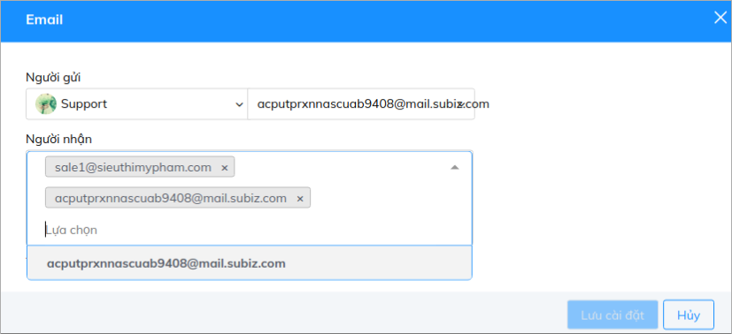

#### 2. Tạo điều kiện cho Automation

Tùy thuộc vào nhu cầu mà bạn chọn Tags phù hợp. 

**Ví dụ 1**: Bạn muốn gắn Ticket các cuộc Báo gía và chuyển nội dung cho bộ phận Sale nắm thông tin.

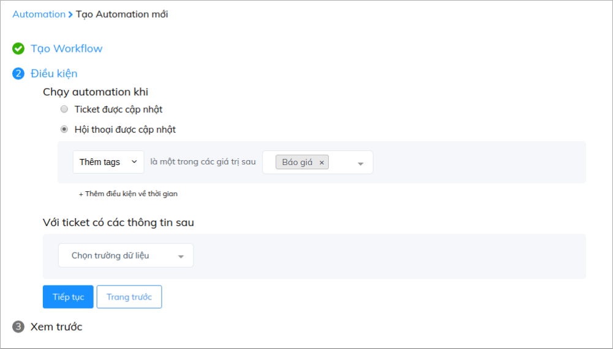

**Ví dụ 2**: Bạn muốn gắn Ticket các cuộc khách phàn nàn và chuyển qua cho người quản lý nắm thông tin:

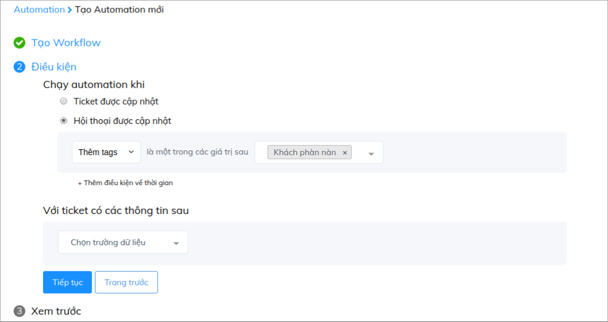

**Ví dụ 3**: Bạn muốn gắn Ticket các cuộc liên quan đến sản phẩm và chuyển qua cho bên phụ trách sản phẩm:

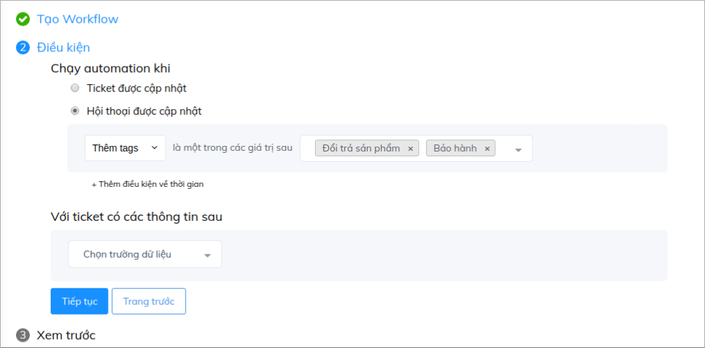

#### 3. Lưu tên Automation

Tùy vào nội dung Automation mà bạn lưu tên phù hợp để dễ quản lý 

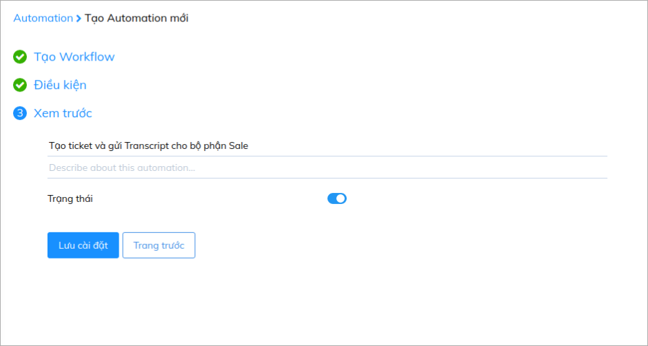

### Bước 3: Gắn Tag cuộc hội thoại

Sau khi đã hoàn thành xong các bước cài đặt Automation, từ những cuộc hội thoại sau đó, bạn cần chú ý gắn Tag:

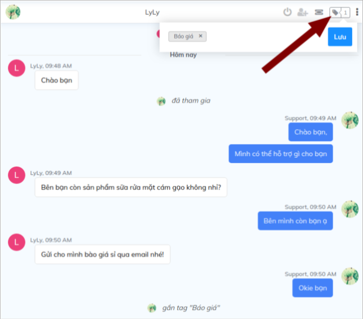

Khi đó Automation sẽ chạy, cuộc hội thoại của bạn sẽ tự động được gắn Ticket:

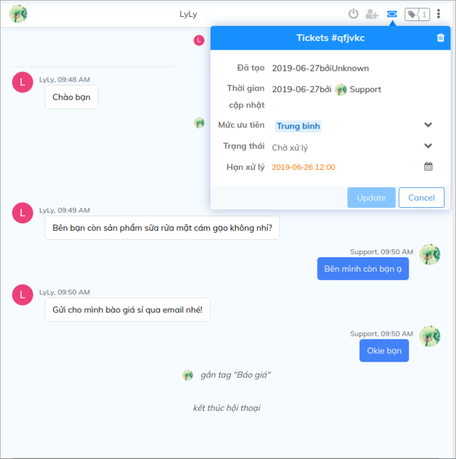

Và bộ phận phụ trách sẽ đồng thời nhận được email nội dung cuộc hội thoại:

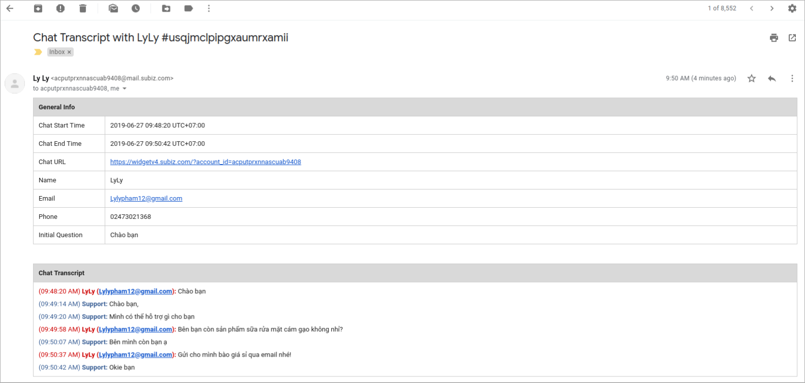

Ngoài ra, bạn có thể kiểm tra các Ticket cần xử lý trong danh sách Ticket để chủ động quản lý tiến độ xử lý vấn đê của khách:

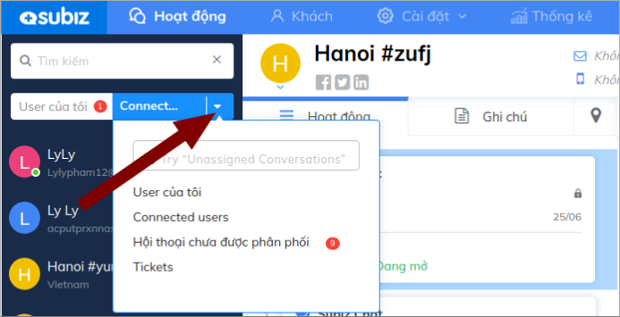

