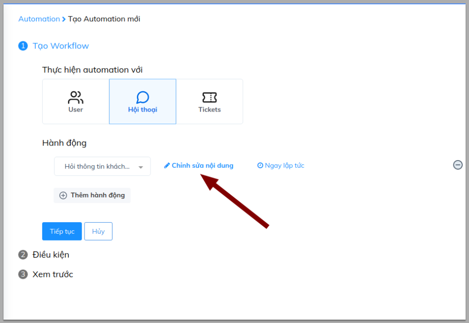
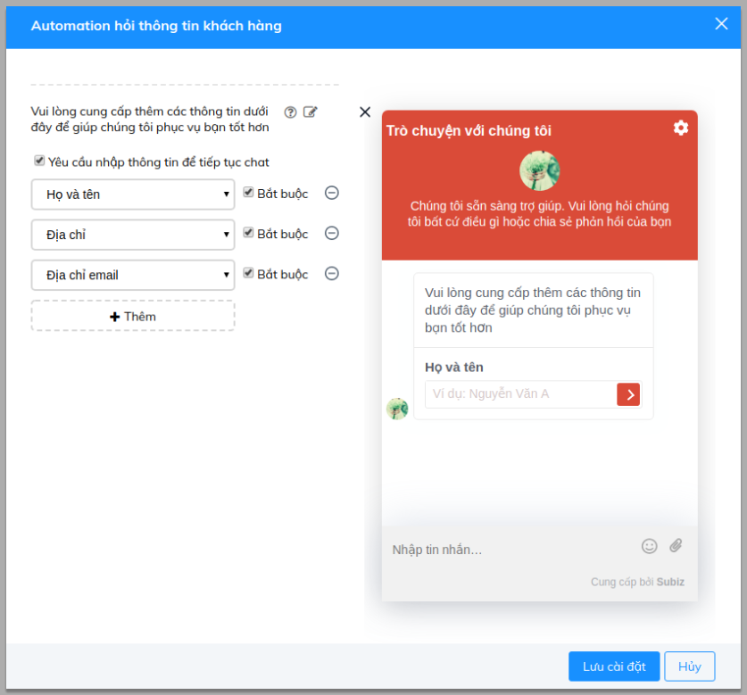
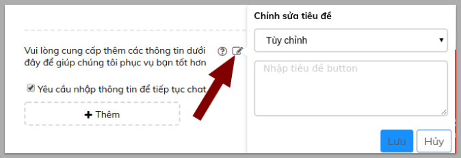
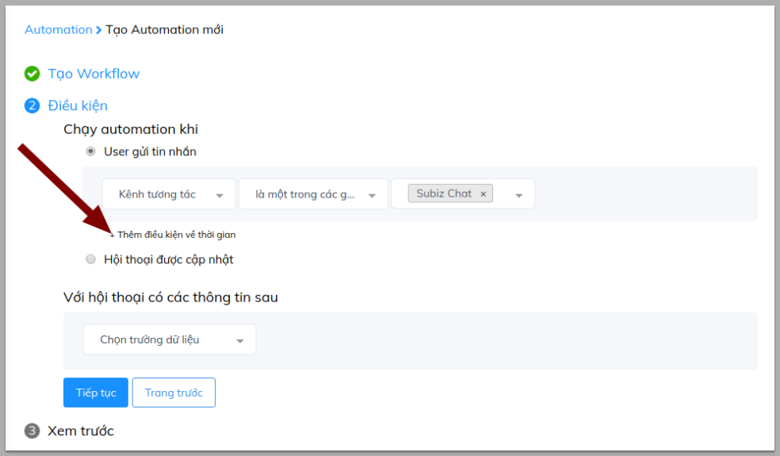
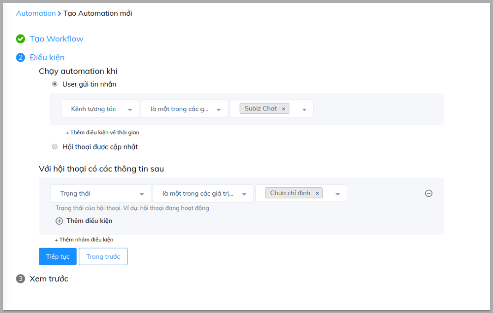
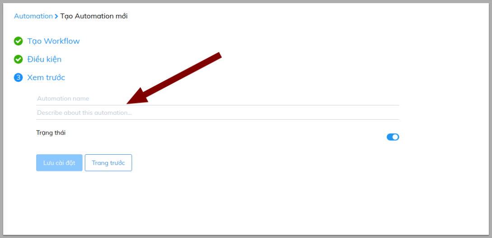
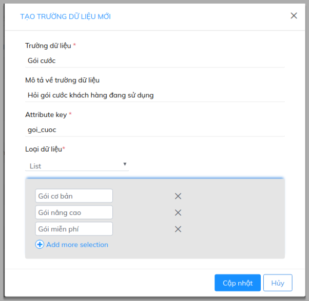
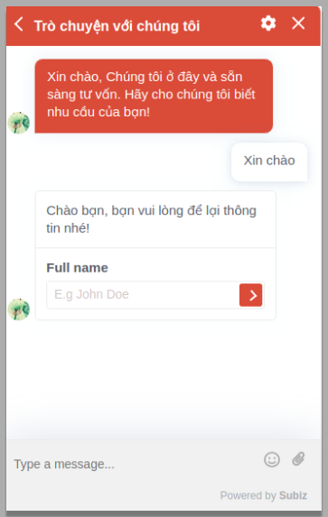
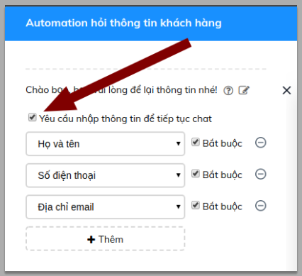

# Hỏi thông tin khách hàng

Khách hàng tiềm năng là người đang có nhu cầu về sản phẩm và dịch vụ bạn cung cấp. [Subiz ](https://subiz.com/vi/)sẽ giúp bạn xác định, thu thập và lưu trữ thông tin khách hàng tiềm năng với tính năng mạnh mẽ Automation - Hỏi thông tin khách hàng

### Cài đặt Automation hỏi thông tin khách hàng

 Đăng nhập [**App.subiz.com** &gt; **Cài đặt** &gt; **Tài khoản** &gt; **Automation** &gt; **Workflow**](https://app.subiz.com/settings/automation-workflow)\*\*\*\*

Bạn sẽ thao tác theo 3 bước cài đặt như sau:

### Bước 1: Tạo workflow

Sau khi lựa chọn **Thực hiện Automation với Hội thoại** và hành động **Hỏi thông tin khách hàng**, bạn **Chỉnh sửa nội dung** để tạo nội dung mẫu hỏi mong muốn.

**Lưu ý:** Nếu bạn muốn tùy chỉnh nội dung tin nhắn hỏi, bạn có thể click vào phần chỉnh sửa để thay đổi

Sau khi thực hiện xong việc cài đặt nội dung hỏi thông tin, bạn nhấn **Tiếp tục** để chuyển sang bước tiếp theo.

### Bước 2: Điều kiện

Trong phần điều kiện có 2 mục điều kiện bạn cần quan tâm:

* **Chạy automation khi:** Đây là điều kiện bắt buộc bạn cần cài đặt. Automation sẽ chạy khi cuộc hội thoại đáp ứng điều kiện đã thiết lập. 

 ​Ví dụ:  Gửi Automation hỏi thông tin khi khách hàng chat qua website

Trong trường hợp bạn muốn lựa chọn khung thời gian hỏi thông tin khách hàng, bạn có thể lựa chọn **Thêm điều kiện về thời gian**:

* **Với cuộc hội thoại có các thông tin sau**: Điều kiện này không nhất thiết phải cài đặt. Đây là điều kiện bổ sung, giúp bạn có thể lựa chọn đối tượng cụ thể để gửi tin nhắn hỏi thông tin. Điều kiện này được hiểu như điều kiện cần có ban đầu.

Ví dụ: Gửi Automation hỏi thông tin đối với cuộc hội thoại có trạng thái chưa chỉ định và diễn ra trên kênh Subiz chat \(website\)

Sau khi xong bước cài đặt điều kiện, bạn nhấn **Tiếp tục** để sang bước cuối cùng

### Bước 3: Đặt tên Automation

Bạn đặt tên cho Automation và viết mô tả chi tiết để dễ quản lý, sau đó **Lưu cài đặt**.

### **Một số lưu ý**

* Thêm trường thông tin \([ Chi tiết ](https://help.subiz.com/su-dung-subiz-nang-cao/quan-ly-du-lieu/thong-tin-khach-hang)\)

Ngoài những trường thông tin hỏi mặc định: Tên, Số điện thoại, Email, Địa chỉ. Bạn có thể thêm các trường thông tin mới tùy vào nhu cầu khai thác thông tin khách hàng của doanh nghiệp:

[Tài khoản &gt; Cài đặt &gt; Thông tin khách hàng &gt; Tạo trường dữ liệu mới](https://app.subiz.com/settings/user-attributes)

* Automation hỏi thông tin sẽ hiển thị sau tin nhắn đầu tiên của khách hàng

* Bạn có thể cài đặt 2 chế độ: _**Buộc khách hàng phải nhập thông tin mới có thể chat**_  hoặc _**Khách hàng nhập thông tin hay không đều chat được**_.

 

