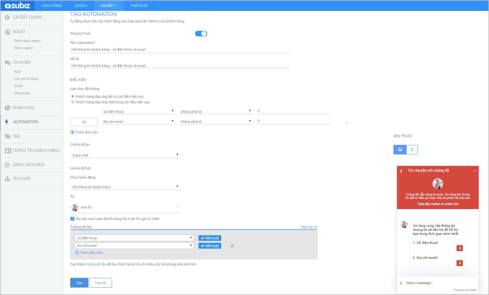
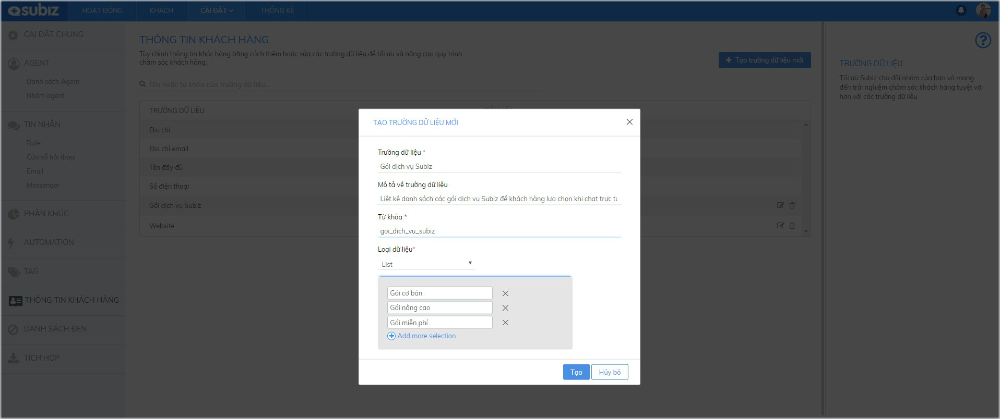
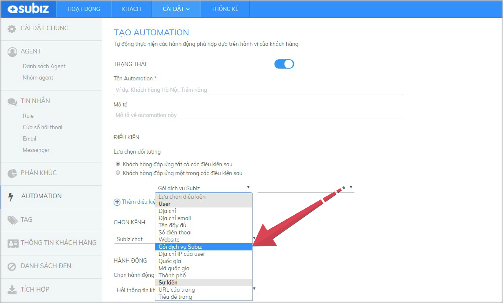
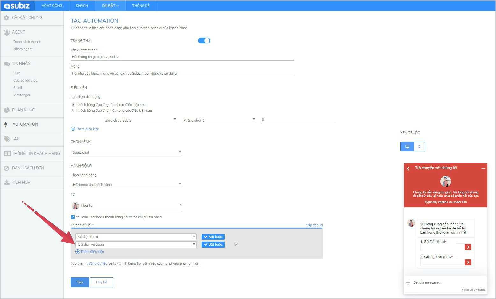
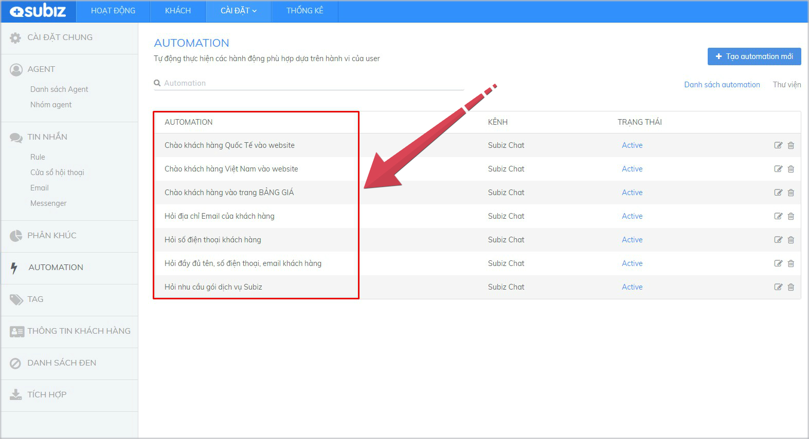
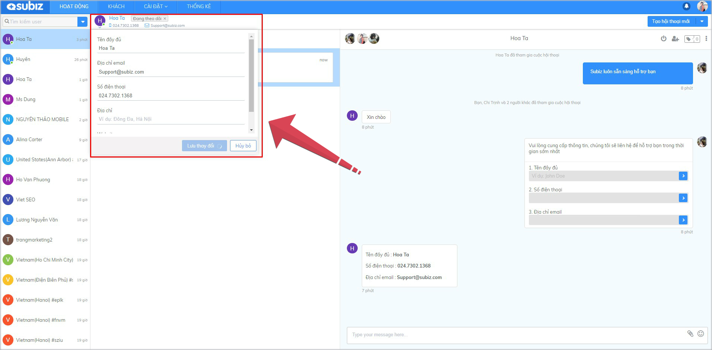

# Hỏi thông tin khách hàng

Khách hàng tiềm năng là người đang có nhu cầu về sản phẩm và dịch vụ bạn cung cấp. [Subiz ](https://subiz.com/vi/)sẽ giúp bạn xác định, thu thập và lưu trữ thông tin khách hàng tiềm năng với tính năng mạnh mẽ Automation - Hỏi thông tin khách hàng

Đặc biệt, Subiz cho phép bạn tạo thêm trường dữ liệu khách hàng để khai thác và thu thập tập thông tin khách hàng tiềm năng riêng biệt của Doanh Nghiệp. Từ đó, bạn sẽ vẽ được bức tranh tổng quan khách hàng mục tiêu rõ nét và hiệu quả.

### Cài đặt Automation hỏi thông tin khách hàng

 Đăng nhập [**App.subiz.com** &gt; **Cài đặt** &gt; **Tài khoản** &gt; **Automation** &gt; **Tạo Automation mới** ](https://app.subiz.com/settings/automation-add)

Ví dụ kịch bản cài đặt Automation - Hỏi thông tin khách hàng thu thập TÊN, SỐ ĐIỆN THOẠI, EMAIL của khách hàng như sau:

* **Trạng thái:** Bật ON
* **Tên Automation và Mô tả**: điền thông tin giúp bạn xác định và hiểu mục đích của kịch bản Automation cài đặt
* **Điều kiện**: là những điều kiện hay tiêu chí để thực hiện hành động hỏi thông tin khách hàng tiềm năng
* **Chọn kênh**: Subiz chat 
* **Hành động**: chọn Nắm bắt khách hàng tiềm năng
* **Từ**: Chọn tên Agent hiển thị hỏi thông tin khách hàng
* **Chọn Yêu cầu user hoàn thành bảng hỏi trước khi gửi tin nhắn**
* **Chọn thêm điều kiện hỏi thông tin khách hàng**

### Thêm trường dữ liệu hỏi thông tin khách hàng

[Subiz](https://subiz.com/vi/) cho phép bạn tạo thêm trường dữ liệu khách hàng để khai thác và thu thập thông tin khách hàng tiềm năng riêng biệt của Doanh Nghiệp. Từ đó, bạn sẽ vẽ được bức tranh tổng quan khách hàng mục tiêu rõ nét và hiệu quả. 

Hướng dẫn chi tiết như sau:

**Bước 1**: Thêm trường dữ liệu khách hàng

[**Cài đặt** &gt; **Tài khoản** &gt; **Thông tin khách hàng** &gt; **Tạo trường dữ liệu mới** &gt; **Điền thông tin theo mẫu** &gt; **Tạo**  ](https://app.subiz.com/settings/user-attributes#)


Lưu ý: Loại dữ liệu viết chữ thường không dấu, có cách chân giữa mỗi chữ


**Bước 2**: Trường dữ liệu đã được tự động cập nhật thêm vào trong Điều kiện của Automation và Thông tin khách hàng

**Bước 3**: Cài đặt Automation - Nắm bắt khách hàng tiềm năng hỏi trường dữ liệu đã tạo thêm

### Một số lưu ý khi cài đặt

1. Bạn được cài đặt không giới hạn kịch bản Automation tương tác tự động

  2. Hành động hỏi thông tin sẽ chạy ngay sau tin nhắn đầu tiên của khách hàng

  3. Thông tin trả lời của khách hàng sẽ được tự động cập nhật và lưu trữ trong mục Thông tin khách hàng

> Bạn còn băn khoăn? Hãy chat trực tuyến với hỗ trợ viên ngay trên website [Subiz.com](https://subiz.com/vi/feature.html) nhé!

