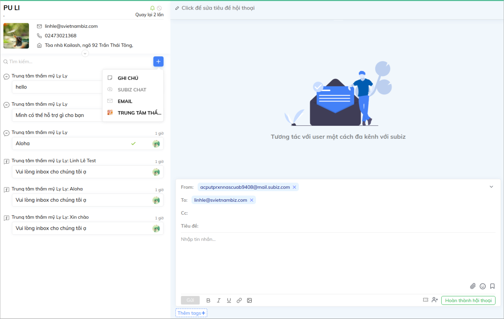

# Phân loại và theo đuổi khách hàng tiềm năng

Chức năng Automation mới của Subiz không chỉ hỗ trợ bạn với các tương tác tự động đơn giản như gửi lời chào tự động hay hỏi thông tin khách hàng. Bằng việc kết hợp các Automation, bạn hoàn toàn có thể vận hành doanh nghiệp một cách hoàn toàn tự động mà vẫn đảm bảo tính hiệu qủa cao. Bài viết sau sẽ hướng dẫn bạn sử dụng phối hợp các Automation để phân loại và theo đuổi khách hàng tiềm năng.

### Bước 1: Thêm trường thông tin khách hàng

Trước hết, bạn cần thêm trường thông tin khách hàng tiềm năng:[ Tài khoản &gt; Cài đặt &gt; Thông tin khách hàng &gt; Tạo trường dữ liệu mới](https://app.subiz.com/settings/user-attributes#)

Tạo trường thông tin khách hàng tiềm năng:

Thông tin này sẽ được hiển thị ngay tại phần thông tin User:

### Bước 2: Automation cập nhật thông tin User

Automation này sẽ giúp bạn có thể tự động phân loại khách hàng theo điều kiện cài sẵn. 

Bạn vào mục: [Tài khoản &gt; Cài đặt &gt; Automation &gt; Workflow](https://app.subiz.com/settings/automation-workflow)

Tùy thuộc vào cách định nghĩa khách hàng tiềm năng để bạn có thể tạo điều kiện phù hợp. Ví dụ: Khách hàng vào trang khuyến mãi/ báo giá sẽ được cập nhật là khách Tiềm năng:

Nhấn _**Tiếp tục**_ để lưu lại tên Automation

### Bước 3: Automation gửi email cho khách hàng tiềm năng

Ở bước thiết lập email này, bạn có thể tạo những mẫu email sẵn với thông tin, hình ảnh, tệp đính kèm nhắm thu hút khách hàng. Bạn có thể tham khảo cách tạo Automation gửi email: [Tại đây ](https://help.subiz.com/su-dung-subiz-nang-cao/tuong-tac-tu-dong/automation-gui-email-toi-khach-hang)

Hãy bắt đầu bằng cách thiết lập mẫu email: [Tài khoản &gt; Cài đặt &gt; Automation &gt; Tạo hội thoại mới](https://app.subiz.com/settings/automations/add-conversation)

Và tiếp tục bằng cách tạo điều kiện để gửi email này đến khách hàng tiềm năng:

Và cuối cùng, bạn cần lưu lại tên automation:

Automation sẽ giúp bạn tự động phân loại và gửi email tới những khách tiềm năng:

