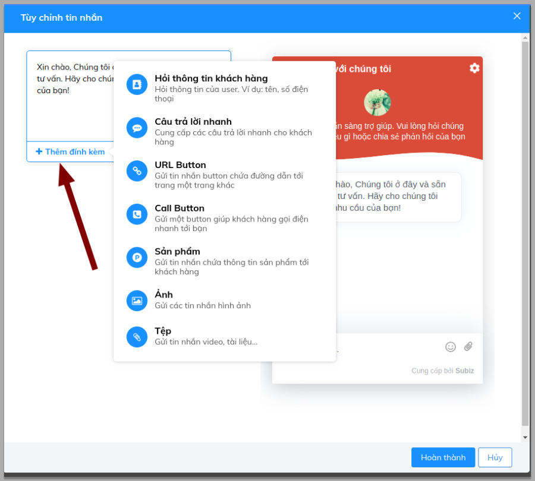
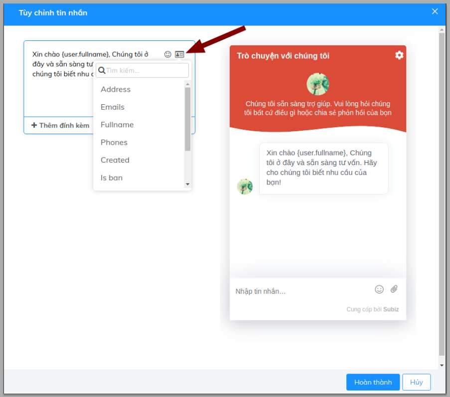
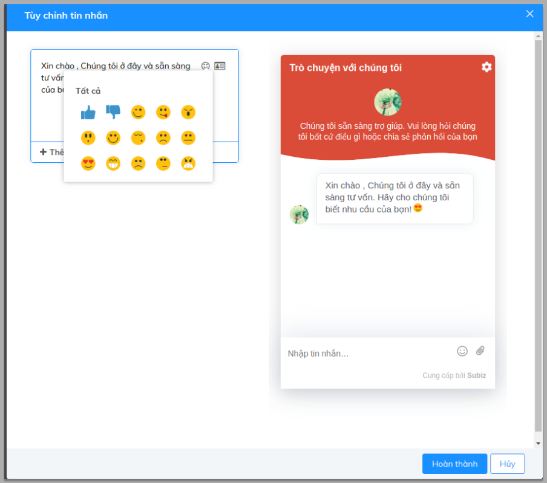
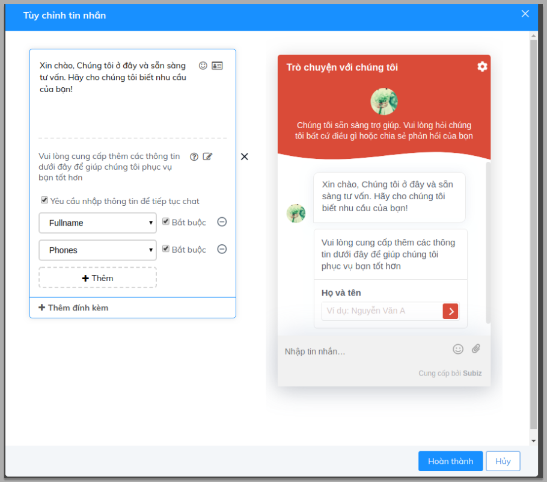
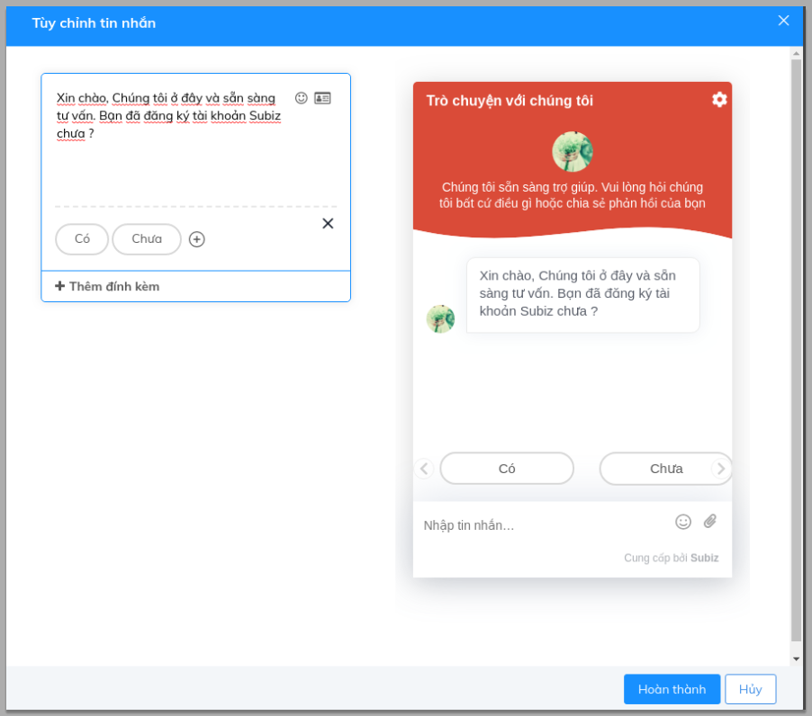
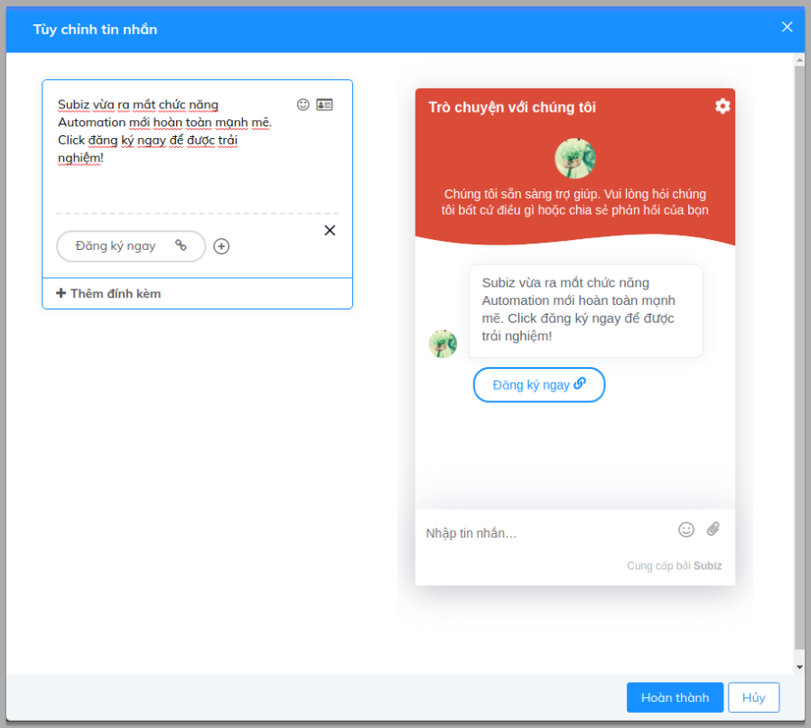
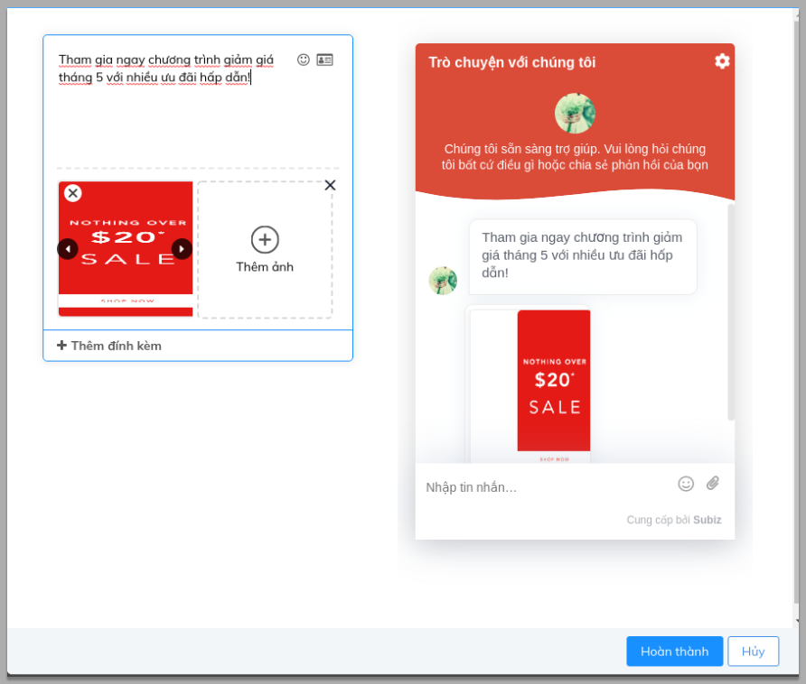
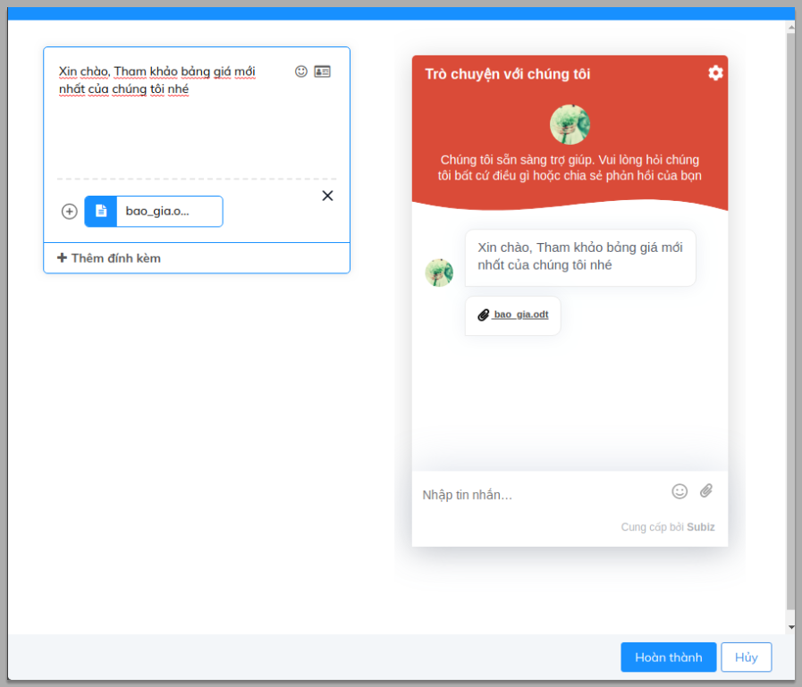
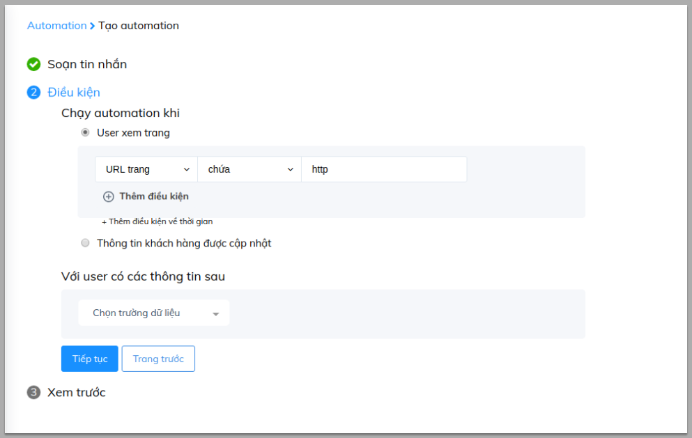
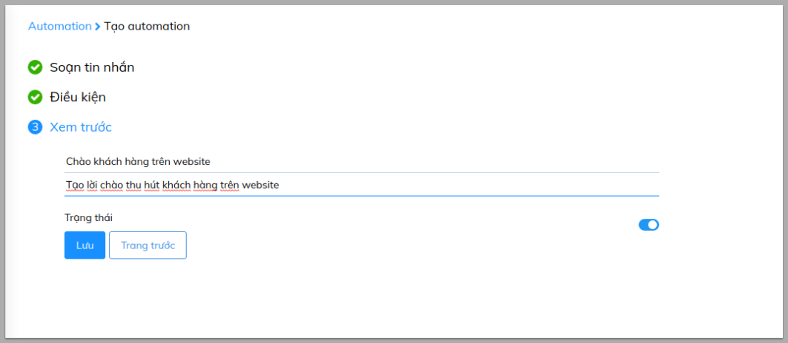

# Sáng tạo tin nhắn Automation

Ngoài cài đặt Automation gửi tin nhắn tự động để thu hút sự chú ý của khách hàng vào website nhằm gia tăng lượng tương tác với khách hàng, việc thiết lập nội dung những tin nhắn tự động này cũng vô cùng quan trọng. 

Một tin nhắn được trình bày rõ ràng,  ngắn gọn, nội dung đầy đủ với hình ảnh thiết kế bắt mắt chắc chắn sẽ gây được nhiều ấn tượng với khách hàng. Bài viết sau đây sẽ hướng dẫn việc sử dụng các mẫu đính kèm có sẵn của Automation để bạn có thể thu hút khách hàng tương tác nhiều hơn.

Trước hết để có thể tạo tin nhắn tự động bạn cần thao tác theo các bước sau:[ Cài đặt/ Automation/ Tạo hội thoại mới](https://app.subiz.com/settings/automations)

Cùng sự kết hợp với **Tùy chỉnh tin nhắn với Message Builder** bạn có thể tạo những mẫu tin nhắn đầy sáng tạo.

### Chào khách hàng bằng tên

Đối với những khách hàng đã để lại thông tin, bạn hoàn toàn có thể tạo những trải nghiệm cá nhân cho khách khi chào họ bằng tên đã lưu trước đó:

### Thêm icon cảm xúc trong tin nhắn

Việc thêm biểu tượng cảm xúc vào tin nhắn sẽ mang đến cho khách hàng của bạn nhiều trải nghiệm cảm xúc thú vị khi vào website của bạn và gia tăng tỷ lệ phản hồi của họ đối với thông điệp bạn gửi. Bạn có thể thêm biểu tượng cảm xúc theo ví dụ sau:

### **Hỏi thông tin khách hàng**

Bạn có thể xác định được đối tượng khách hàng tiềm năng ngay khi họ vào website của bạn bằng việc hỏi thông tin khách hàng:

### **Câu trả lời nhanh**

Với việc đặt ra câu hỏi và đưa ra câu trả lời sẵn có, bạn sẽ tiết kiệm thời gian trong việc xác định vấn đề ban đầu của khách hàng và hỗ trợ khách hàng nhanh hơn:

### URL Button

Tạo button kêu gọi khách hàng và điều hướng khách vào trang bạn mong muốn sẽ tăng cơ hội để bạn giới thiệu các chương trình ưu đãi và thu hút khách hàng hơn:

### Call Button

Bạn muốn khách hàng có thể gọi cho bạn ngay trên cửa sổ chat Subiz, việc gắn link số điện thoại vào Button sẽ gúp cho việc này thật đơn giản:

### **Gắn link vào hình ảnh**

Gắn hình ảnh vào tin nhắn sẽ tạo sự thu hút cho lời chào của bạn và truyền tải thông điệp bạn mong muốn tới khách hàng một cách nhanh chóng:

### Gắn tệp 

Chức năng này sẽ giúp bạn có thể gắn những File Báo giá, giới thệu doanh nghiệp, sản phẩm đến khách hàng một cách nhanh nhất:

Sau khi đã hoàn tất bước tạo tin nhắn bạn có thể **Tiếp tục** đến bước thứ 2: **Tạo điều kiện**

Nhấn **Tiếp tục** để sang bước cuối cùng: **Đặt tên cho Automation** và **Lưu** 

