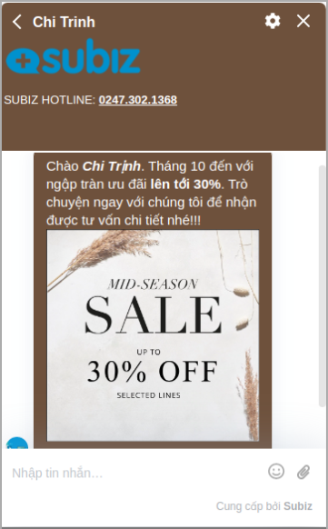

# Sáng tạo tin nhắn Automation với mã Markdown

Ngoài cài đặt Automation gửi tin nhắn tự động để thu hút sự chú ý của khách hàng vào website nhằm gia tăng lượng tương tác với khách hàng, việc thiết lập nội dung những tin nhắn tự động này cũng vô cùng quan trọng. 

Một tin nhắn được trình bày rõ ràng,  ngắn gọn, nội dung đầy đủ với hình ảnh thiết kế bắt mắt chắc chắn sẽ gây được nhiều ấn tượng với khách hàng. Bài viết sau đây sẽ hướng dẫn việc sử dụng mã Markdown để thiết kế tin nhắn trong Automation.

### **In đậm và in nghiêng font chữ**

Để tạo sự chú ký của khách hàng tới nội dung quan trọng trong tin nhắn của bạn, bạn hoàn toàn có thể in đậm hoặc in nghiêng phông chữ theo hướng dẫn sau:

* **In đậm**

```text
**text**  hoặc __text__
```


* **In nghiêng**

```text
*text* hoặc _text_
```


### **Tùy chỉnh font chữ**

Bạn sử dụng đoạn mã sau để tùy chỉnh font chữ phù hợp:

```text
# h1
## h2
### h3
#### h4
##### h5
###### h6
```


### **Gắn link vào đoạn text**

Bạn có thể gắn link vào đoạn text, để dẫn khách hàng tới trang mà bạn muốn giới thiệu:

```text
[Đoạn text được gắn link](link muốn gắn)
```


### **Gắn hình ảnh vào tin nhắn**

Sử dụng hình ảnh sẽ làm nội dung tin nhắn của bạn thêm phần thú vị và thu hút khách hàng tới cửa sổ chat. Bạn hoàn toàn có thể gắn hình ảnh vào tin nhắn theo hướng dẫn sau:

```text

```


Bạn có thể tìm kiếm hình ảnh trên Google, và lấy link hình ảnh theo hướng dẫn:



###  **Gắn link vào hình ảnh**

Khi khách hàng click vào hình ảnh, bạn hoàn toàn có thể dẫn khách hàng tới trang mà bạn mong muốn bằng cách gắn link vào hình ảnh này:

```text
[](link muốn gắn vào hình ảnh)
```


### Kết hợp các mã markdown trong một tin nhắn

Hãy kết hợp các mã markdown để tạo một lời chào thu hút, hấp dẫn trên website của bạn!


  


###  

