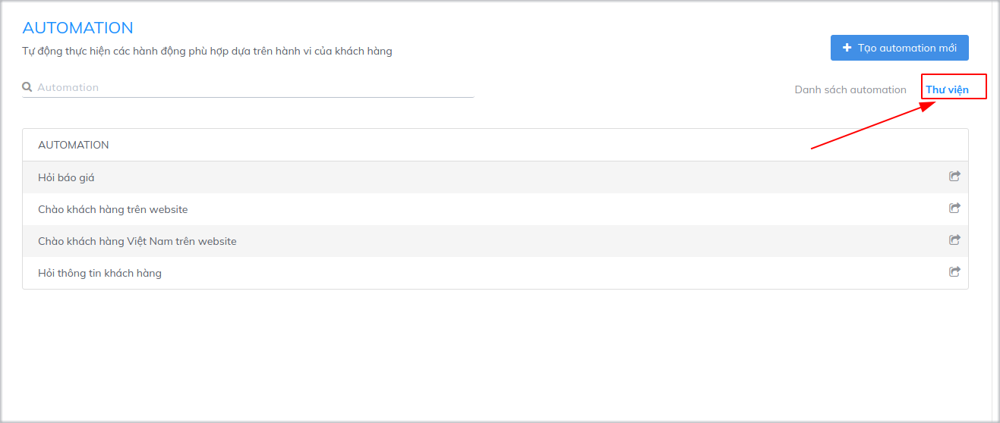
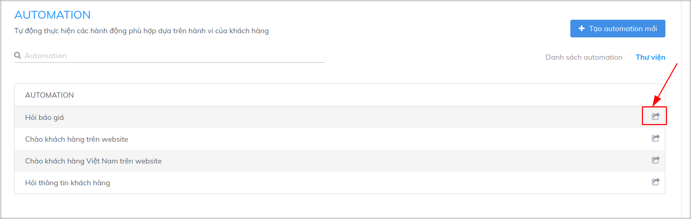
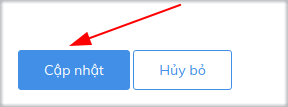

# Sử dụng Thư viện Automation

Với tính năng Automation của Subiz, bạn hoàn toàn có thể thiết lập những tương tác tự động để gửi lời chào tới khách hàng trên website, thu hút khách hàng tới cửa sổ Subiz, hỏi thông tin khách hàng... Bài viết sau sẽ giúp bạn có thể dễ dàng sử dụng Thư viện Automation để kích hoạt nhanh chóng những kịch bản Automation thông dụng trên Subiz nhằm tối ưu hiệu quả tương tác với khách hàng.

Để vào mục thư viện Automation của Subiz, bạn thao tác theo các bước: [Cài đặt &gt; Tài khoản &gt; Automation &gt; Thư viện Automation**.**](https://app.subiz.com/settings/automation-list)  
****Tại đây, thư viện sẽ hiển thị danh sách kịch bản Automation.

Bạn lưạ chọn Automation phù hợp, sau đó kích vào biểu tượng chỉnh sửa của Automation đó.

Sau đó, bạn nhấn nút **Cập nhật** để kích hoạt Automation đó.


**Lưu ý:** 

* Bạn có thể thay đổi các nội dung trong Automation để phù hợp với nhu cầu sử dụng: tên Automation, điều kiện, Agent gửi tin nhắn, nội dung tin nhắn...
* Hiện tại trong thư viện Automation đang có 4 kịch bản thông dụng:

  - Hỏi báo giá  
  - Chào khách hàng trên website  
  - Chào khách hàng Việt Nam trên website  
  - Hỏi thông tin khách hàng

* Bạn có thể kích hoạt nhiều Automation cùng lúc


