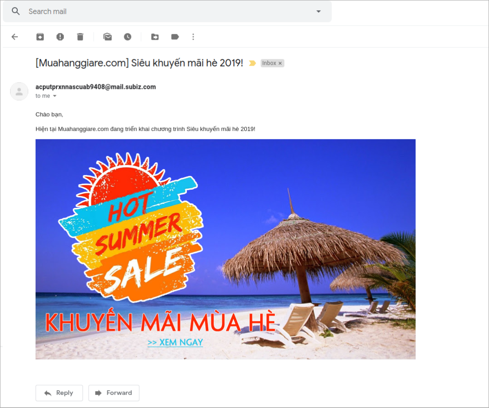
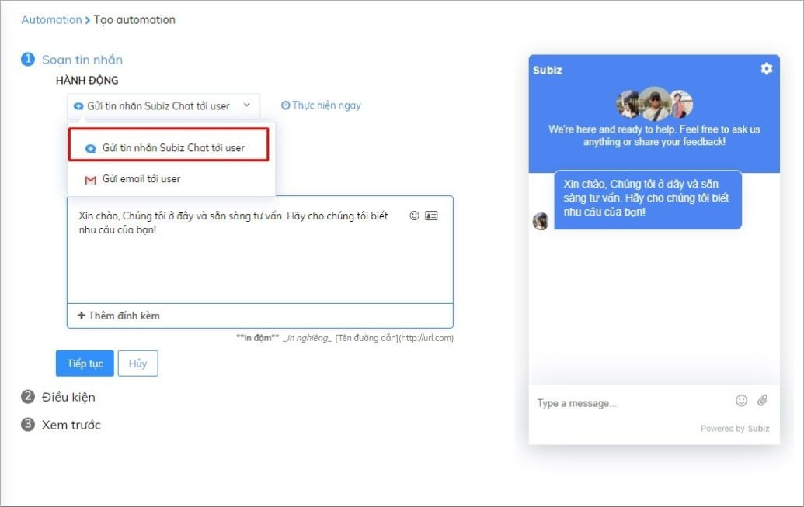
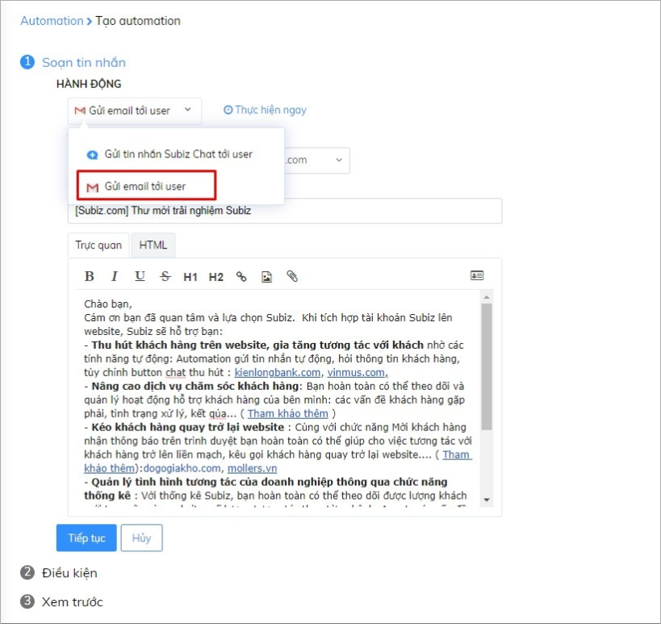
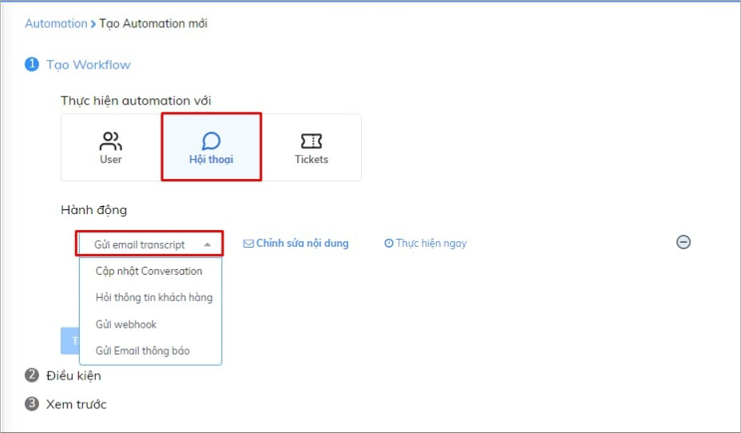
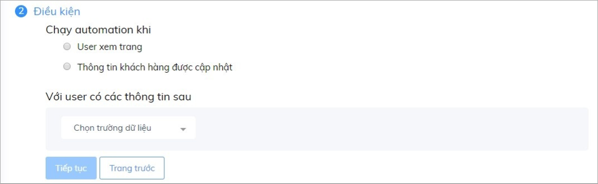
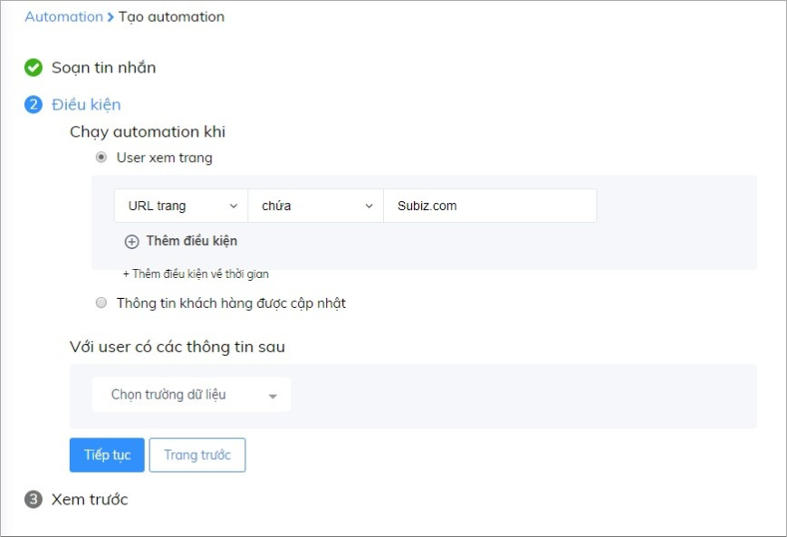
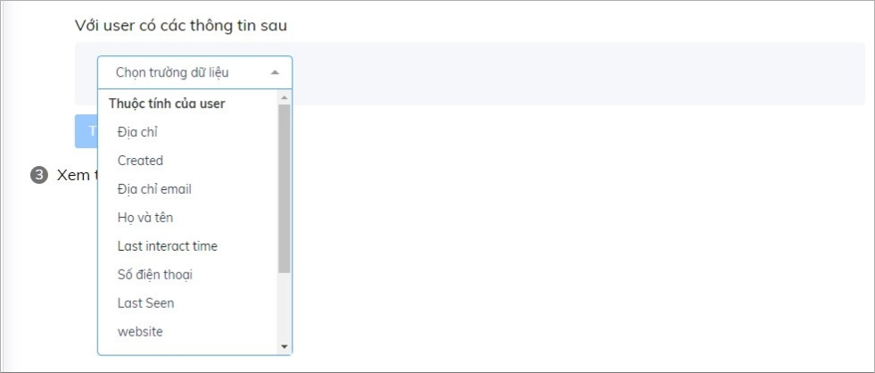
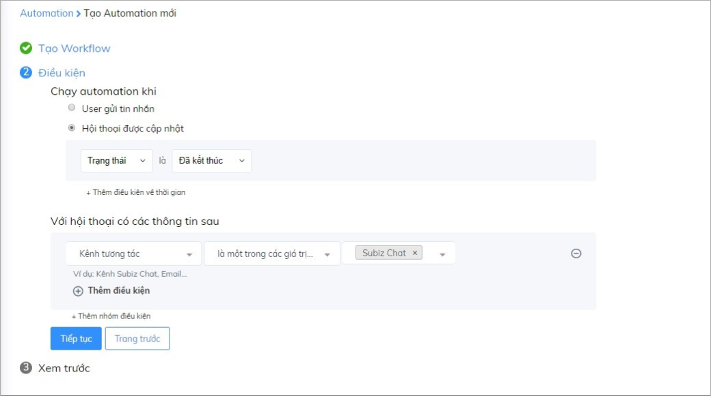
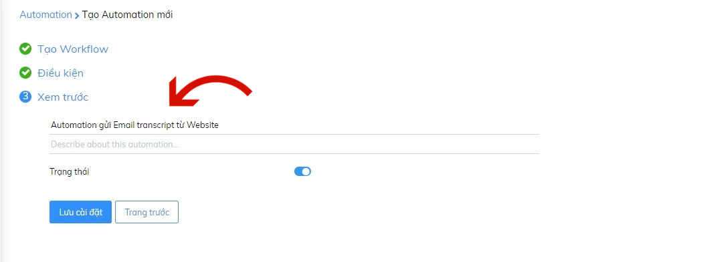

# Tổng quan về Automation

## Automation là gì? 

Automation là các hành động tương tác tự động được thiết lập để thu hút sự chú ý của khách hàng ngay khi khách truy cập website, thu thập thông tin và tự động theo đuổi khách hàng qua các kênh trên Subiz. 

Dựa trên các đối tượng khách hàng bạn có, cách thức bạn muốn chăm sóc và theo đuổi khách hàng, bạn có thể thiết lập nhiều hành động Automation khác nhau. Qua đó, hướng đến vận hành doanh nghiệp một cách tự động mà vẫn đem lại hiệu quả cao.  
Đầu tiên, bạn có thể bắt đầu bằng việc tạo [Automation gửi thông tin sản phẩm khuyến mãi tới các khách hàng truy cập website](https://help.subiz.com/su-dung-subiz-nang-cao/tuong-tac-tu-dong/mot-so-automation-thong-dung/automation-gui-tin-nhan-tu-dong):

Thêm vào đó, bạn cũng có thể [tạo các mẫu email tự động để theo đuổi khách hàng tiềm năng](https://help.subiz.com/su-dung-subiz-nang-cao/tuong-tac-tu-dong/mot-so-ung-dung-automation/phan-loai-va-theo-duoi-khach-hang-tiem-nang) bằng cách kết hợp các Automation như sau:

## Phân loại Automation 

Dựa vào tính chất của việc tương tác tự động với khách hàng, Subiz đã chia Automation thành hai loại như sau: 

* Tạo Automation mới: Dùng để thiết lập các hành động chủ động tiếp cận khách hàng như: Gửi tin nhắn chào tự động cho khách hàng, gửi Email tự động cho khách hàng.
* Workflow: Dùng để thiết lập các quy trình xử lý một cách hoàn toàn tự động.  Ví dụ: tự động hỏi thông tin, gửi email lịch sử hội thoại \(email transcript\), gửi email thông báo cho agent,...

## Tạo Automation mới

 Để tạo Automation mới, bạn thực hiện các bước sau:

### Lựa chọn đối tượng/hành động gửi Automation

* Hành động gửi Automation: Sử dụng trong Automation tạo hội thoại mới. Cụ thể, bạn sẽ chọn Kênh áp dụng Automation để thực hiện hành động gửi tin nhắn tự động \(Subiz chat\), gửi email tự động \(Subiz Email\).

1. [x] Gửi tin nhắn chào tự động cho khách hàng. Xem hướng dẫn cách tạo Automation chào khách truy cập [TẠI ĐÂY](https://help.subiz.com/su-dung-subiz-nang-cao/tuong-tac-tu-dong/mot-so-automation-thong-dung/automation-gui-tin-nhan-tu-dong).

1. [x] Gửi email tự động cho khách hàng. Xem hướng dẫn chi tiết [TẠI ĐÂY](https://help.subiz.com/su-dung-subiz-nang-cao/tuong-tac-tu-dong/mot-so-automation-thong-dung/automation-gui-email-tu-dong).

* Lựa chọn đối tượng: Sử dụng trong Automation tạo Workflow. Cụ thể, bạn sẽ chọn Đối tượng Áp dụng Automation \(User, hội thoại, Tickets\) và hành động để thực hiện Automation.  Ví dụ: Gửi email transcript lịch sử hội thoại trên kênh Subiz chat. Khi đó, bạn sẽ tạo Workflow với đối tượng và hành động tương ứng như sau:

Bạn tham khảo danh sách các đối tượng, Hành động và hướng dẫn áp dụng với việc Tạo Workflow theo bảng sau:

| **Hành động** | **Cách sử dụng** | **Ví dụ** |
| :--- | :--- | :--- |
| **User** |  |  |
| Gửi Email thông báo | Thực hiện Automation với các user thực hiện hành động xem trang hoặc được cập nhật thông tin như: tên, email, số điện thoại... | Gửi Email thông báo tới user khi có bất kỳ khách hàng nào để lại thông tin số điện thoại. |
| Gửi webhook | Thực hiện Automation cho phép cập nhật dữ liệu đính kèm thông tin khách hàng, cuộc hội thoại hoặc ghi chú vào dữ liệu CRM của doanh nghiệp. | Cập nhật dữ liệu khách hàng về CRM với tất cả khách hàng tương tác qua kênh Subiz chat. |
| Cập nhật thông tin khách hàng | Thực hiện cập nhật thông tin với một nhóm khách hàng có đặc điểm chung. | Cập nhật thông tin khách hàng là khách hàng tiềm năng với bất kỳ khách hàng nào để lại Email. |
| **Hội thoại** |  |  |
| Cập nhật Conversation | Thực hiện Automation cho hành động cập nhật hội thoại theo các hành động như: Add agent, Add Tag, Cập nhật trạng thái hội thoại. | Tự động cập nhật Tag cho hội thoại là Khách hàng tiềm năng khi khách truy cập trang Báo giá. |
| Gửi Email transcript | Thực hiện Automation tự động gửi lịch sử hội thoại về email bạn chỉ định. | Gửi Email transcript đối với cuộc hội thoại có trạng thái đã kết thúc và diễn ra trên kênh Subiz chat |
| Hỏi thông tin khách hàng | Thực hiện Automation tự động hỏi thông tin khách hàng. Automation này sẽ hoạt động sau tin nhắn đầu tiên của khách hàng. | Hỏi thông tin khách hàng trên kênh Subiz chat |
| Gửi Email thông báo | Thực hiện Automation gửi thông báo cho agent theo kênh tương tác của user hoặc khi hội thoại được cập nhật thông tin như: Add Tag, Add agent hay cập nhật trạng thái hội thoại \(pending, đã kết thúc, hoạt động, chưa chỉ định\). | Gửi email thông báo cho agent khi cuộc hội thoại được gắn Tag Khách hàng tiềm năng. |
| Gửi webhook | Thực hiện Automation cho phép cập nhật cuộc hội thoại vào dữ liệu CRM của doanh nghiệp. | Cập nhật dữ liệu hội thoại về CRM với tất cả khách hàng tương tác qua kênh Subiz chat. |
| **Ticket** |  |  |
| Cập nhật Ticket | Thực hiện Automation tự động cập nhật trạng thái Ticket cho hội thoại. | Cập nhật Ticket với trạng thái Chờ xử lý với mức ưu tiên Cao khi cuộc hội thoại được gắn Tag là Phàn nàn. |
| Gửi webhook | Thực hiện Automation cho phép cập nhật Ticket vào dữ liệu CRM của doanh nghiệp. | Cập nhật dữ liệu Ticket về CRM với tất cả khách hàng tương tác qua kênh Subiz chat. |
| Gửi Email thông báo | Thực hiện Automation gửi thông báo cho agent khi Ticket được cập nhật. | Ví dụ, gửi email thông báo cho agent khi Ticket được cập nhật trạng thái là Chờ xử lý |

Sau khi thực hiện xong, bạn nhấn **Sau khi thực hiện xong, bạn nhấn Tiếp tục để chuyển sang điều kiện tiếp theo.**

### **Lựa chọn điều kiện cho Automation**

Lựa chọn điều kiện là việc xác định hành động để Automation hoạt động. Bạn cần bắt buộc phải cài đặt để Automation hoạt động. 

Cụ thể, bạn sẽ lựa chọn loại hành động Automation: 

* **Chạy automation khi:** Điều kiện **CẦN**  **- bắt buộc phải cài đặt để Automation hoạt động**. Automation sẽ chỉ chạy khi cuộc hội thoại đáp ứng được điều kiện đã cài đặt. 

**Ví dụ:** Gửi Automation chào khách truy cập trên trang Subiz.com.

* **Với cuộc hội thoại có các thông tin sau:** Điều kiện **ĐỦ**  - bổ sung các thông tin user để xác định đối tượng gửi Automation.

**Ví dụ:** Gửi Email transcript đối với cuộc hội thoại có trạng thái đã kết thúc và diễn ra trên kênh Subiz chat.


Lưu ý: Các trường dữ liệu bổ sung sẽ thay đổi phụ thuộc theo đối tượng được chọn để thực hiện Automation \(User, Hội thoại, Tickets\).


Bạn nên tham khảo danh sách các điều kiện, với những hướng dẫn về cách sử dụng và có những ví dụ cụ thể sau đây:

<table>
  <thead>
    <tr>
      <th style="text-align:left"><b> </b>C&#xC1;C &#x110;I&#x1EC0;U KI&#x1EC6;N<b> </b>
      </th>
      <th style="text-align:left">C&#xC1;CH S&#x1EEC; D&#x1EE4;NG</th>
      <th style="text-align:left">V&#xCD; D&#x1EE4;</th>
    </tr>
  </thead>
  <tbody>
    <tr>
      <td style="text-align:left"><b>Ch&#x1EA1;y automation khi</b>
      </td>
      <td style="text-align:left"></td>
      <td style="text-align:left"></td>
    </tr>
    <tr>
      <td style="text-align:left">User xem trang</td>
      <td style="text-align:left">Th&#x1EF1;c hi&#x1EC7;n automation khi kh&#xE1;ch h&#xE0;ng truy c&#x1EAD;p
        v&#xE0;o website ho&#x1EB7;c m&#x1ED9;t trang c&#x1EE5; th&#x1EC3;.</td>
      <td
      style="text-align:left">G&#x1EED;i tin nh&#x1EAF;n t&#x1EDB;i kh&#xE1;ch h&#xE0;ng &#x111;ang
        truy c&#x1EAD;p trang Subiz.com:
         &#x110;i&#x1EC1;u ki&#x1EC7;n: URL c&#x1EE7;a trang &#x2013; ch&#x1EE9;a
        &#x2013; https://subiz.com</td>
    </tr>
    <tr>
      <td style="text-align:left">Ti&#xEA;u &#x111;&#x1EC1; trang</td>
      <td style="text-align:left">C&#xE1;c website th&#x1B0;&#x1EDD;ng &#x111;&#x1EB7;t ti&#xEA;u &#x111;&#x1EC1;
        trang li&#xEA;n quan &#x111;&#x1EBF;n m&#x1ED9;t ch&#x1EE7; &#x111;&#x1EC1;
        nh&#x1EA5;t &#x111;&#x1ECB;nh, v&#x1EDB;i m&#x1ED7;i ch&#x1EE7; &#x111;&#x1EC1;,
        b&#x1EA1;n c&#xF3; th&#x1EC3; &#x111;&#x1EB7;t m&#x1ED9;t automation &#x111;&#x1EC3;
        h&#x1ED7; tr&#x1EE3; v&#xE0; h&#x1B0;&#x1EDB;ng d&#x1EAB;n kh&#xE1;ch h&#xE0;ng
        &#x111;&#xFA;ng th&#x1EDD;i &#x111;i&#x1EC3;m</td>
      <td style="text-align:left">G&#x1EED;i l&#x1EDD;i ch&#xE0;o t&#x1EDB;i c&#xE1;c kh&#xE1;ch h&#xE0;ng
        v&#xE0;o xem c&#xE1;c trang c&#xF3; ti&#xEA;u &#x111;&#x1EC1; ch&#x1EE9;a
        t&#x1EEB; &#x201C;m&#xE1;y &#x1EA3;nh&#x201D;. &#x110;i&#x1EC1;u ki&#x1EC7;n:
        Ti&#xEA;u &#x111;&#x1EC1; trang &#x2013; ch&#x1EE9;a &#x2013; m&#xE1;y
        &#x1EA3;nh.</td>
    </tr>
    <tr>
      <td style="text-align:left">K&#xEA;nh t&#x1B0;&#x1A1;ng t&#xE1;c</td>
      <td style="text-align:left">Th&#x1EF1;c hi&#x1EC7;n automation theo k&#xEA;nh t&#x1B0;&#x1A1;ng t&#xE1;c:
        Subiz chat, Messenger, Email.</td>
      <td style="text-align:left">G&#x1EED;i Automation h&#x1ECF;i th&#xF4;ng tin t&#x1EF1; &#x111;&#x1ED9;ng
        tr&#xEA;n k&#xEA;nh Subiz chat. &#x110;i&#x1EC1;u ki&#x1EC7;n: K&#xEA;nh
        t&#x1B0;&#x1A1;ng t&#xE1;c - l&#xE0; m&#x1ED9;t trong c&#xE1;c gi&#xE1;
        tr&#x1ECB; - Subiz chat</td>
    </tr>
    <tr>
      <td style="text-align:left">Ngu&#x1ED3;n h&#x1ED9;i tho&#x1EA1;i</td>
      <td style="text-align:left">Th&#x1EF1;c hi&#x1EC7;n automation theo ngu&#x1ED3;n c&#x1EE5; th&#x1EC3;
        l&#xE0; Fanpage ho&#x1EB7;c &#x111;&#x1ECB;a ch&#x1EC9; Email n&#xE0;o.</td>
      <td
      style="text-align:left">G&#x1EED;i email transcript v&#x1EDB;i c&#xE1;c kh&#xE1;ch h&#xE0;ng &#x111;&#x1EBF;n
        t&#x1EEB; k&#xEA;nh Fanpage. &#x110;i&#x1EC1;u ki&#x1EC7;n: Ngu&#x1ED3;n
        h&#x1ED9;i tho&#x1EA1;i - l&#xE0; m&#x1ED9;t trong c&#xE1;c gi&#xE1; tr&#x1ECB;
        - t&#xEA;n Fanpage</td>
    </tr>
    <tr>
      <td style="text-align:left">Ticket &#x111;&#x1B0;&#x1EE3;c c&#x1EAD;p nh&#x1EAD;t</td>
      <td style="text-align:left">Th&#x1EF1;c hi&#x1EC7;n automation theo tr&#x1EA1;ng th&#xE1;i ho&#x1EB7;c
        m&#x1EE9;c &#x1B0;u ti&#xEA;n c&#x1EE7;a Ticket.</td>
      <td style="text-align:left">T&#x1EF1; &#x111;&#x1ED9;ng g&#x1EED;i email th&#xF4;ng b&#xE1;o cho agent
        khi cu&#x1ED9;c h&#x1ED9;i tho&#x1EA1;i &#x111;&#x1B0;&#x1EE3;c g&#x1EAF;n
        m&#x1EE9;c &#x1B0;u ti&#xEA;n l&#xE0; Cao.
         &#x110;i&#x1EC1;u ki&#x1EC7;n: Ticket &#x111;&#x1B0;&#x1EE3;c c&#x1EAD;p
        nh&#x1EAD;t - M&#x1EE9;c &#x1B0;u ti&#xEA;n - l&#xE0; m&#x1ED9;t trong
        c&#xE1;c gi&#xE1; tr&#x1ECB; - Cao.</td>
    </tr>
    <tr>
      <td style="text-align:left">H&#x1ED9;i tho&#x1EA1;i &#x111;&#x1B0;&#x1EE3;c c&#x1EAD;p nh&#x1EAD;t</td>
      <td
      style="text-align:left">
        
Th&#x1EF1;c hi&#x1EC7;n automation theo c&#xE1;c &#x111;i&#x1EC1;u ki&#x1EC7;n
          sau:

        <ul>
          <li>Tr&#x1EA1;ng th&#xE1;i c&#x1EAD;p nh&#x1EAD;t c&#x1EE7;a H&#x1ED9;i tho&#x1EA1;i:
            Pending, &#x111;&#xE3; k&#x1EBF;t th&#xFA;c, &#x111;ang m&#x1EDF;, ch&#x1B0;a
            ch&#x1EC9; &#x111;&#x1ECB;nh).</li>
          <li>Th&#xEA;m agent: H&#x1ED9;i tho&#x1EA1;i &#x111;&#x1B0;&#x1EE3;c c&#x1EAD;p
            nh&#x1EAD;t khi h&#x1ED9;i tho&#x1EA1;i &#x111;&#xE3; &#x111;&#x1B0;&#x1EE3;c
            th&#xEA;m agent.</li>
          <li>Th&#xEA;m Tag: H&#x1ED9;i tho&#x1EA1;i &#x111;&#x1B0;&#x1EE3;c c&#x1EAD;p
            nh&#x1EAD;t khi h&#x1ED9;i tho&#x1EA1;i &#x111;&#xE3; &#x111;&#x1B0;&#x1EE3;c
            th&#xEA;m Tag</li>
        </ul>
        </td>
        <td style="text-align:left">
          <ul>
            <li>T&#x1EF1; &#x111;&#x1ED9;ng g&#x1EED;i email transcript khi cu&#x1ED9;c
              h&#x1ED9;i tho&#x1EA1;i &#x111;&#x1B0;&#x1EE3;c c&#x1EAD;p nh&#x1EAD;t
              tr&#x1EA1;ng th&#xE1;i &#x110;&#xE3; k&#x1EBF;t th&#xFA;c
               &#x110;i&#x1EC1;u ki&#x1EC7;n: H&#x1ED9;i tho&#x1EA1;i &#x111;&#x1B0;&#x1EE3;c
              c&#x1EAD;p nh&#x1EAD;t - Tr&#x1EA1;ng th&#xE1;i - K&#x1EBF;t th&#xFA;c.</li>
            <li>T&#x1EF1; &#x111;&#x1ED9;ng g&#x1EED;i email transcript khi cu&#x1ED9;c
              h&#x1ED9;i thoa&#x1ECB; &#x111;&#x1B0;&#x1EE3;c add th&#xEA;m agent.
               &#x110;i&#x1EC1;u ki&#x1EC7;n: H&#x1ED9;i tho&#x1EA1;i &#x111;&#x1B0;&#x1EE3;c
              c&#x1EAD;p nh&#x1EAD;t - Th&#xEA;m tag - ch&#x1ECD;n t&#xEA;n agent</li>
            <li>T&#x1EF1; &#x111;&#x1ED9;ng g&#x1EED;i email transcript khi cu&#x1ED9;c
              h&#x1ED9;i thoa&#x1ECB; &#x111;&#x1B0;&#x1EE3;c add th&#xEA;m tag.
               &#x110;i&#x1EC1;u ki&#x1EC7;n: H&#x1ED9;i tho&#x1EA1;i &#x111;&#x1B0;&#x1EE3;c
              c&#x1EAD;p nh&#x1EAD;t - Th&#xEA;m tag - ch&#x1ECD;n Tag.</li>
          </ul>
        </td>
    </tr>
    <tr>
      <td style="text-align:left">Th&#xF4;ng tin kh&#xE1;ch h&#xE0;ng &#x111;&#x1B0;&#x1EE3;c c&#x1EAD;p
        nh&#x1EAD;t</td>
      <td style="text-align:left">Th&#x1EF1;c hi&#x1EC7;n automation khi Automation &#x111;&#x1B0;&#x1EE3;c
        c&#x1EAD;p nh&#x1EAD;t th&#xF4;ng tin (h&#x1ECD; t&#xEA;n, email, s&#x1ED1;
        &#x111;i&#x1EC7;n tho&#x1EA1;i,...)</td>
      <td style="text-align:left">T&#x1EF1; &#x111;&#x1ED9;ng g&#x1EED;i email th&#xF4;ng b&#xE1;o cho agent
        v&#x1EDB;i c&#xE1;c user c&#xF3; s&#x1ED1; &#x111;i&#x1EC7;n tho&#x1EA1;i.
         &#x110;i&#x1EC1;u ki&#x1EC7;n: S&#x1ED1; &#x111;i&#x1EC7;n tho&#x1EA1;i
        - kh&#xF4;ng tr&#x1ED1;ng</td>
    </tr>
    <tr>
      <td style="text-align:left"><b>V&#x1EDB;i user c&#xF3; c&#xE1;c th&#xF4;ng tin sau</b>
      </td>
      <td style="text-align:left">&#x110;i&#x1EC1;u ki&#x1EC7;n b&#x1ED5; sung &#x111;&#x1EC3; x&#xE1;c
        &#x111;&#x1ECB;nh &#x111;&#x1ED1;i t&#x1B0;&#x1EE3;ng nh&#x1EAD;n Automation</td>
      <td
      style="text-align:left"></td>
    </tr>
    <tr>
      <td style="text-align:left">Thu&#x1ED9;c t&#xED;nh</td>
      <td style="text-align:left">Th&#x1EF1;c hi&#x1EC7;n automation khi user &#x111;&#x1B0;&#x1EE3;c c&#x1EAD;p
        nh&#x1EAD;t c&#xE1;c thu&#x1ED9;c t&#xED;nh (t&#xEA;n, s&#x1ED1; &#x111;i&#x1EC7;n
        tho&#x1EA1;i,...)</td>
      <td style="text-align:left">G&#x1EED;i Email transcript &#x111;&#x1ED1;i v&#x1EDB;i cu&#x1ED9;c h&#x1ED9;i
        tho&#x1EA1;i c&#xF3; tr&#x1EA1;ng th&#xE1;i &#x111;&#xE3; k&#x1EBF;t th&#xFA;c
        v&#xE0; di&#x1EC5;n ra tr&#xEA;n k&#xEA;nh Subiz chat (website).
         &#x110;i&#x1EC1;u ki&#x1EC7;n: H&#x1ED9;i tho&#x1EA1;i &#x111;&#x1B0;&#x1EE3;c
        c&#x1EAD;p nh&#x1EAD;t - Tr&#x1EA1;ng th&#xE1;i - &#x110;&#xE3; k&#x1EBF;t
        th&#xFA;c.
         K&#xEA;nh t&#x1B0;&#x1A1;ng t&#xE1;c - l&#xE0; m&#x1ED9;t trong c&#xE1;c
        gi&#xE1; tr&#x1ECB; - Subiz.</td>
    </tr>
    <tr>
      <td style="text-align:left">Trace</td>
      <td style="text-align:left">Th&#x1EF1;c hi&#x1EC7;n automation khi user &#x111;&#x1B0;&#x1EE3;c c&#x1EAD;p
        nh&#x1EAD;t tr&#x1B0;&#x1EDD;ng d&#x1EEF; li&#x1EC7;u Trace (Th&#xE0;nh
        ph&#x1ED1;, M&#xE3; qu&#x1ED1;c gia, &#x111;&#x1ECB;a ch&#x1EC9; IP)</td>
      <td
      style="text-align:left"></td>
    </tr>
    <tr>
      <td style="text-align:left">Th&#xE0;nh ph&#x1ED1;</td>
      <td style="text-align:left">Th&#x1EF1;c hi&#x1EC7;n automation v&#x1EDB;i c&#xE1;c user &#x111;&#x1EBF;n
        t&#x1EEB; m&#x1ED9;t th&#xE0;nh ph&#x1ED1; c&#x1EE5; th&#x1EC3;. L&#xE0;
        t&#xEA;n ti&#x1EBF;ng Anh c&#x1EE7;a c&#xE1;c th&#xE0;nh ph&#x1ED1;, ch&#x1EC9;
        vi&#x1EBF;t hoa c&#xE1;c ch&#x1EEF; c&#xE1;i &#x111;&#x1EA7;u ti&#xEA;n
        c&#x1EE7;a t&#x1EEB;. V&#xED; d&#x1EE5;: Hanoi, Ho Chi Minh City, New York,
        Hong Kong.
         Danh s&#xE1;ch<a href="https://countrycode.org/"> m&#xE3; th&#xE0;nh ph&#x1ED1; c&#x1EE7;a c&#xE1;c qu&#x1ED1;c gia</a> (Click
        v&#xE0;o t&#x1EEB;ng qu&#x1ED1;c gia &#x111;&#x1EC3; tra c&#x1EE9;u t&#xEA;n
        th&#xE0;nh ph&#x1ED1;)</td>
      <td style="text-align:left">
        
T&#x1EF1; &#x111;&#x1ED9;ng g&#x1EED;i tin nh&#x1EAF;n ch&#xE0;o kh&#xE1;ch
          h&#xE0;ng H&#xE0; N&#x1ED9;i.
           &#x110;i&#x1EC1;u ki&#x1EC7;n:

        
User xem trang - URL c&#x1EE7;a trang - ch&#x1EE9;a - Subiz.com..
           V&#x1EDB;i user c&#xF3; th&#xF4;ng tin - Th&#xE0;nh ph&#x1ED1; - l&#xE0;
          - Hanoi

      </td>
    </tr>
    <tr>
      <td style="text-align:left">M&#xE3; qu&#x1ED1;c gia</td>
      <td style="text-align:left">Th&#x1EF1;c hi&#x1EC7;n automation d&#x1EF1;a tr&#xEA;n m&#xE3; qu&#x1ED1;c
        gia. M&#xE3; qu&#x1ED1;c gia c&#x103;n c&#x1EE9; theo ISO Code (2 k&#xFD;
        t&#x1EF1;), vi&#x1EBF;t hoa c&#x1EA3; 2 ch&#x1EEF; c&#xE1;i V&#xED; d&#x1EE5;:
        Vi&#x1EC7;t Nam = VN, M&#x1EF9; = US, Trung Qu&#x1ED1;c = CN, H&#xE0;n
        Qu&#x1ED1;c = KR, Nh&#x1EAD;t B&#x1EA3;n = JP
         <a href="https://en.wikipedia.org/wiki/ISO_3166-2">Tham kh&#x1EA3;o danh s&#xE1;ch m&#xE3; qu&#x1ED1;c gia</a>
      </td>
      <td style="text-align:left">
        
G&#x1EED;i tin nh&#x1EAF;n &#x111;&#x1EBF;n kh&#xE1;ch h&#xE0;ng t&#x1EDB;i
          t&#x1EEB; Vi&#x1EC7;t Nam b&#x1EB1;ng automation ch&#x1EE9;a l&#x1EDD;i
          ch&#xE0;o ti&#x1EBF;ng Vi&#x1EC7;t.
           &#x110;i&#x1EC1;u ki&#x1EC7;n:

        
User xem trang - URL c&#x1EE7;a trang - ch&#x1EE9;a - Subiz.com..
           V&#x1EDB;i user c&#xF3; th&#xF4;ng tin -
           M&#xE3; qu&#x1ED1;c gia &#x2013; b&#x1EB1;ng &#x2013; VN

      </td>
    </tr>
    <tr>
      <td style="text-align:left">&#x110;&#x1ECB;a ch&#x1EC9; IP</td>
      <td style="text-align:left">Th&#x1EF1;c hi&#x1EC7;n automation d&#x1EF1;a tr&#xEA;n &#x111;&#x1ECB;a
        ch&#x1EC9; IP c&#x1EE7;a kh&#xE1;ch h&#xE0;ng. &#x110;&#x1ECB;a ch&#x1EC9;
        IP c&#x1EE7;a user &#x111;&#x1B0;&#x1EE3;c c&#x1EAD;p nh&#x1EAD;t trong
        m&#x1EE5;c Trace, trang Ho&#x1EA1;t &#x111;&#x1ED9;ng.</td>
      <td style="text-align:left">
        
G&#x1EED;i email th&#xF4;ng b&#xE1;o cho agent khi user t&#x1EEB; &#x111;&#x1ECB;a
          ch&#x1EC9; IP 11.20.5.76 c&#x1EAD;p nh&#x1EAD;t th&#xF4;ng tin s&#x1ED1;
          &#x111;i&#x1EC7;n tho&#x1EA1;i
           &#x110;i&#x1EC1;u ki&#x1EC7;n: S&#x1ED1; &#x111;i&#x1EC7;n tho&#x1EA1;i
          - kh&#xF4;ng tr&#x1ED1;ng.

        
&#x110;&#x1ECB;a ch&#x1EC9; IP - l&#xE0; - 11.20.5.76

      </td>
    </tr>
  </tbody>
</table>Sau khi xong bước cài đặt điều kiện, bạn nhấn **Tiếp tục** để sang bước cuối cùng.

### Đặt tên Automation 

Bạn đặt tên cho Automation và viết mô tả chi tiết để dễ quản lý, sau đó Lưu cài đặt.

