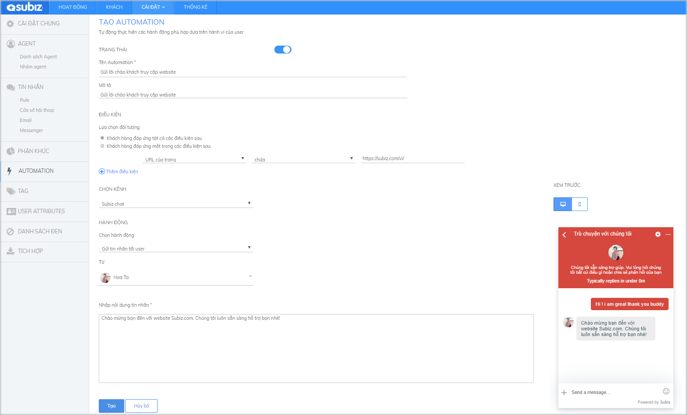
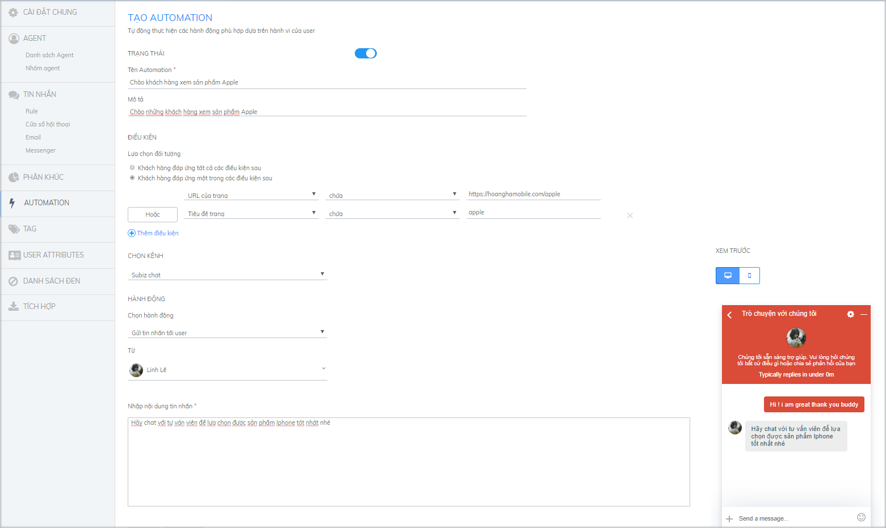
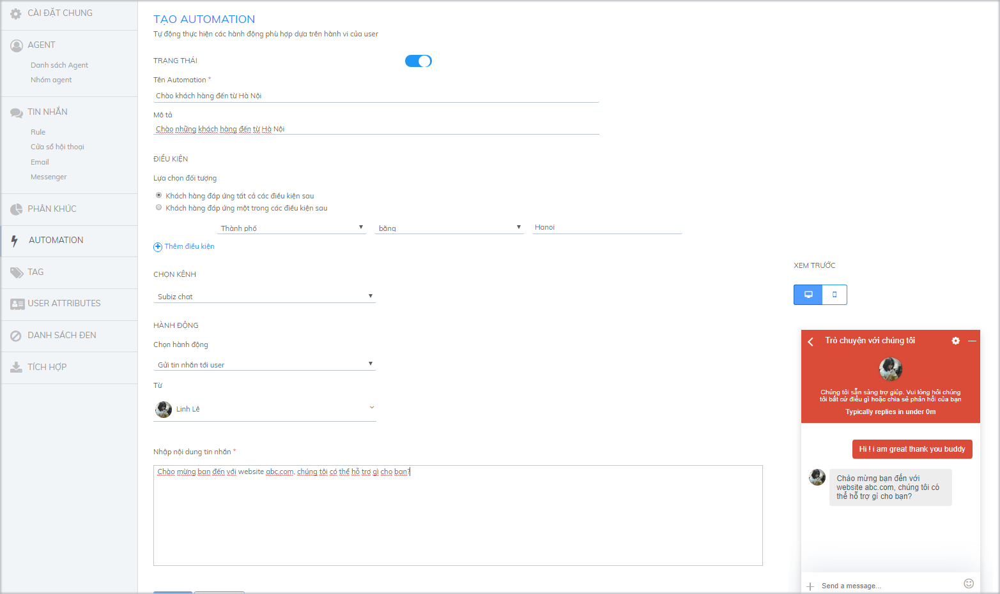
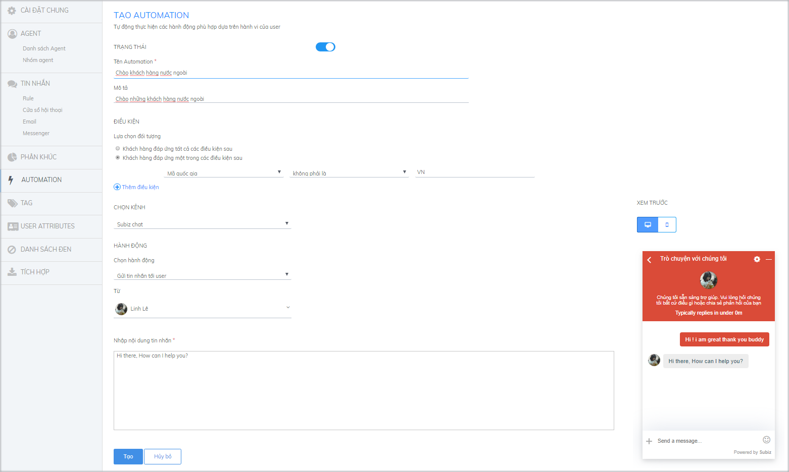
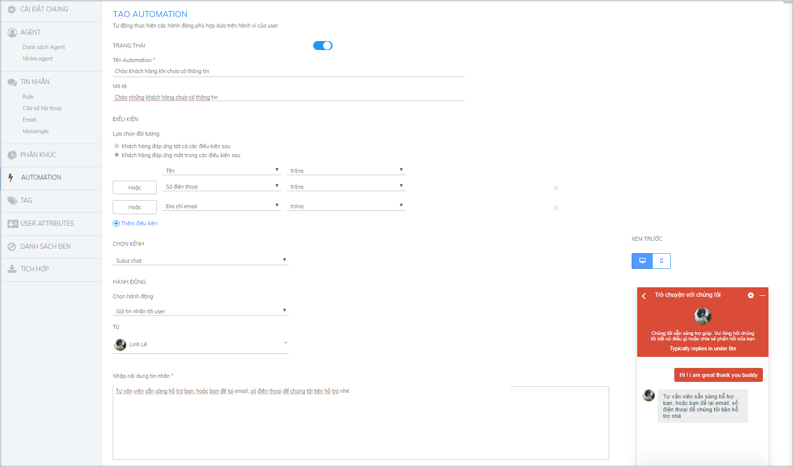

# Các ví dụ tự động gửi tin nhắn

Automation gửi tin nhắn tới user trên kênh Subiz chat là hành động tự động gửi tin nhắn tới khách truy cập website. Hành động này sẽ khởi tạo cuộc hội thoại với khách truy cập website thỏa mãn điều kiện đặt trước và gửi kèm 1 tin nhắn. **Tin nhắn này có chức năng như lời mời chat tự động, giúp bạn gửi lời chào riêng biệt tới từng đối tượng khách hàng.**

Xem thêm [Tại sao phải chào hỏi khách hàng ghé thăm website](https://subiz.com/blog/tai-sao-phai-chao-hoi-khach-hang-ghe-tham-website.html)​

Để thiết lập Automation gửi tin nhắn đến User,  bạn thao tác như sau: ****[**Cài đặt &gt;  Tài khoản &gt;  Automation &gt; Tạo mới automation**](https://app.subiz.com/settings/automation-add)


Lưu ý: Bạn có thể cài đặt nhiều kịch bản Automation cùng lúc để gửi nhiều tin nhắn với các mục đích khác nhau cho khách hàng.


Sau đây là một số kịch bản Automation để bạn tham khảo cài đặt:

### Gửi tin nhắn tới khách vào 1 trang cụ thể trên website {#1-gui-tin-nhan-toi-khach-vao-1-trang-cu-the-tren-website}

Khi khách hàng mới ghé thăm website, bạn muốn gửi đến khách hàng một lời chào, để họ biết sự hiện diện của bạn và luôn sẵn sàng giúp họ bất cứ khi nào trong quá trình mua sắm.

Ví dụ: URL của trang – chứa – http://abc.com.vn/

### Gửi tin nhắn cho khách hàng khi xem một sản phẩm cụ thể {#3-gui-tin-nhan-cho-khach-hang-theo-khu-vuc-dia-ly}

Bạn muốn gửi thông điệp quảng cáo tới các khách vào 1 trang sản phẩm cụ thể, hoặc muốn gửi chương trình khuyến mãi cho khách vào trang thanh toán? Bạn chỉ cần thiết lập Automation theo điều kiện URL của trang chứa link sản phẩm, hoặc theo tiêu đề trang sản phẩm:

### Gửi tin nhắn cho khách hàng đến từ một thành phố cụ thể

Nếu bạn có những khách hàng đến từ những thành phố khác nhau và bạn muốn có thể dễ dàng nhận diện được những khách hàng này và gửi lời chào đến họ, bạn hãy cài đặt automation theo hướng dẫn sau:

### Gửi tin nhắn cho khách hàng theo từng quốc gia

Subiz hỗ trợ bạn gửi tin nhắn riêng biệt tới từng đối tượng khách hàng chia theo khu vực địa lý theo Quốc gia. Bạn có thể sử dụng để gửi tin nhắn với ngôn ngữ phù hợp tới từng đối tượng khách hàng. Ví dụ, với khách hàng đến từ Việt Nam, bạn cài đặt tin nhắn bằng ngôn ngữ Tiếng Việt.

Điều kiện: Mã quốc gia – bằng – VN

Với khách hàng nước ngoài, bạn cài đặt tin nhắn bằng ngôn ngữ Tiếng Anh.

Điều kiện: Mã quốc gia – không phải là – VN

Về điều kiện Quốc gia và Mã quốc gia, bạn đối chiếu theo chuẩn tại [https://countrycode.org/](https://countrycode.org/). Trong đó: Tên Quốc gia xem tại cột COUNTRY và Mã quốc gia xem tại cột ISO CODES, phần mã 2 kí tự.

Ví dụ:

Quốc gia – Afghanistan. Mã quốc gia – AF

### Gửi tin nhắn đến khách chưa có thông tin cá nhân

Với các khách hàng chưa có thông tin cá nhân trên hệ thống, bạn có thể gửi chào kèm theo lời mời khách để lại thông tin cá nhân để bạn có thể liên hệ lại bất cứ lúc nào.

### Lưu ý khi tạo Automation gửi tin nhắn tự động {#luu-y-khi-tao-automation-gui-tin-nhan-tu-dong}

* Soạn thảo tin nhắn Automtion theo [chuẩn Markdown](https://vi.wikipedia.org/wiki/Markdown) sẽ làm tin nhắn ấn tượng và hấp dẫn hơn: Hình ảnh, gắn link, chữ đậm, chữ nghiêng,....  

  

* Một kịch bản automation chỉ chạy 1 lần với 1 khách truy cập. Bạn có thể cài đặt nhiều kịch bản Automation cùng lúc để gửi nhiều tin nhắn với các mục đích khác nhau cho khách hàng.
* Khi bạn đã thiết lập Automation gửi tin nhắn, Subiz sẽ tự động nhận diện khách truy cập website và mở rộng cửa sổ chat gửi tin nhắn tới khách hàng.
* Khi cửa sổ chat mở rộng, các tin nhắn tự động tiếp theo sẽ được thông báo bằng số lượng, nằm ở trên cùng bên trái của cửa số chat. Khi khách truy cập nhấn vào thông báo đó, thì tất cả các tin nhắn sẽ hiển thị ra.

* Khi cửa sổ chat thu gọn, những tin nhắn tự động sẽ sẽ hiển thị dưới dạng preview.

