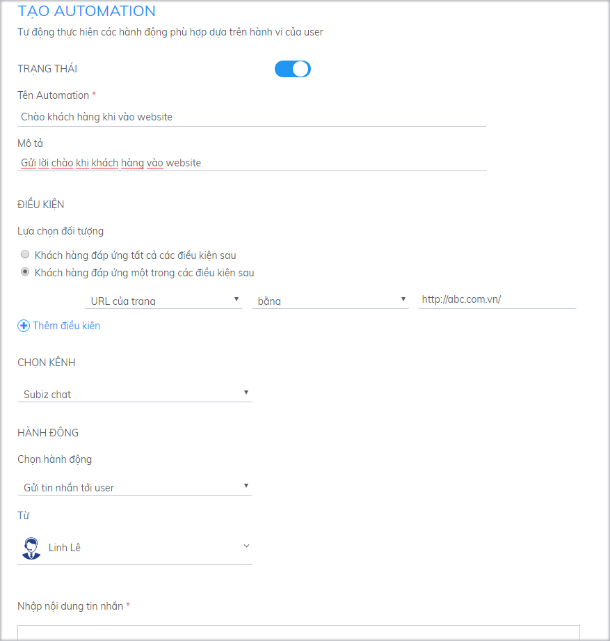
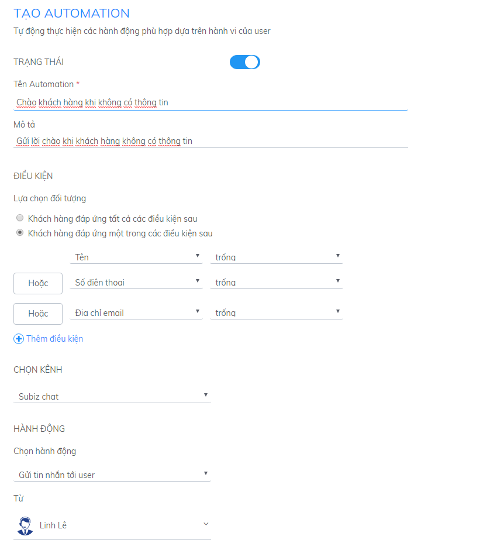
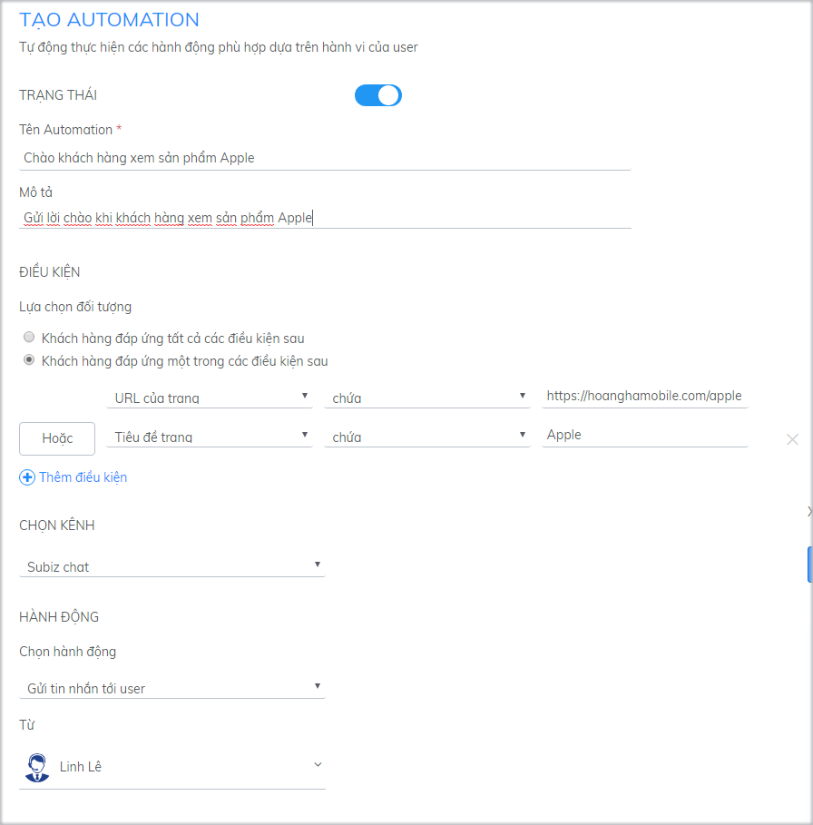
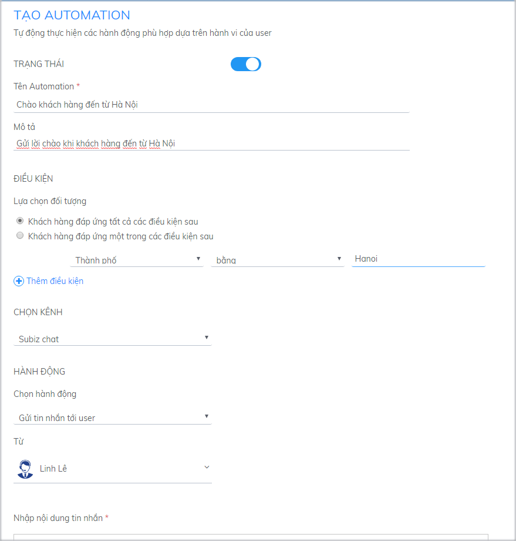
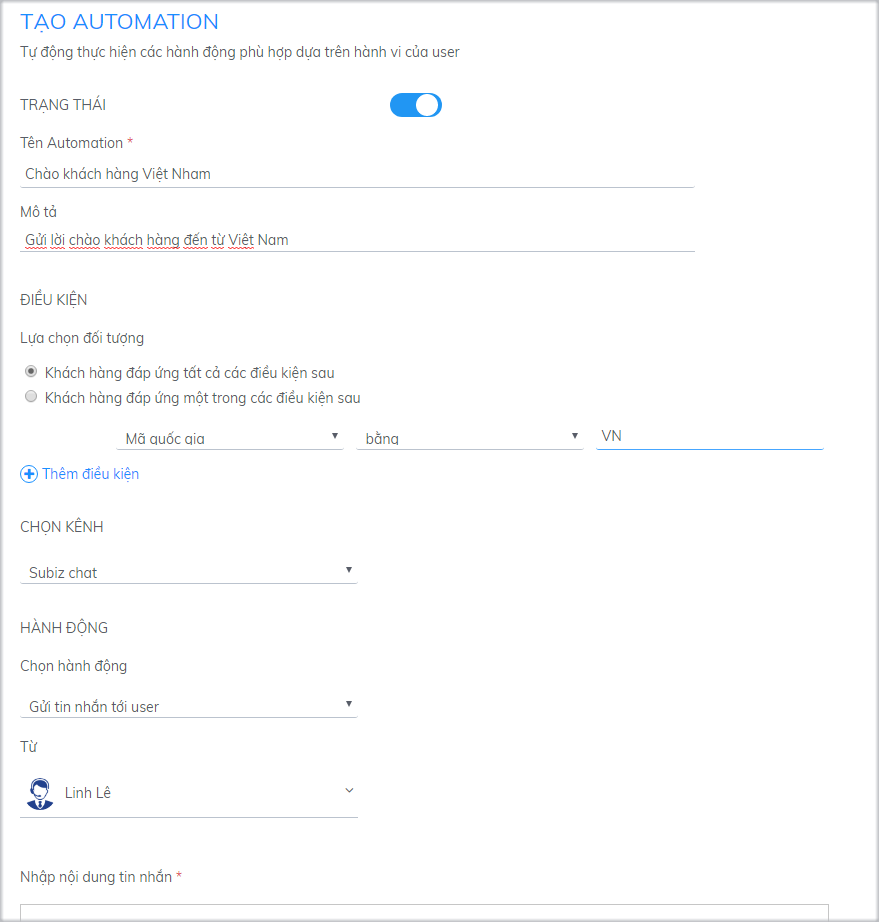

# Các ví dụ tự động gửi tin nhắn

Hành động Gửi tin nhắn tới user được thực hiện trên kênh Subiz Chat. Hành động này sẽ khởi tạo cuộc hội thoại với khách truy cập website thỏa mãn điều kiện đặt trước và gửi kèm 1 tin nhắn. **Tin nhắn có chức năng như lời mời chat tự động, giúp bạn gửi lời chào riêng biệt tới từng đối tượng khách hàng.**

Xem thêm [Tại sao phải chào hỏi khách hàng ghé thăm website](https://subiz.com/blog/tai-sao-phai-chao-hoi-khach-hang-ghe-tham-website.html)​

**Bạn có thể sử dụng nhiều Automation cùng lúc để gửi nhiều tin nhắn với các mục đích khác nhau.** Sau đây là một số gợi ý về điều kiện cài đặt Automation để bạn thuận tiện lựa chọn.

### Gửi tin nhắn tới khách vào 1 trang cụ thể trên website {#1-gui-tin-nhan-toi-khach-vao-1-trang-cu-the-tren-website}

Khi khách hàng mới ghé thăm website, bạn muốn gửi đến khách hàng một lời chào đến họ, để họ biết sự hiện diện của bạn và luôn sẵn sàng giúp họ bất cứ khi nào trong quá trình mua sắm.

Ví dụ: URL của trang – chứa – http://abc.com.vn/

### Gửi tin nhắn đến khách chưa có thông tin cá nhân {#2-gui-tin-nhan-den-khach-chua-co-thong-tin-ca-nhan}

Với các khách hàng chưa có thông tin cá nhân trên hệ thống, bạn có thể gửi chào kèm theo lời mời khách để lại thông tin cá nhân để bạn có thể liên hệ lại bất cứ lúc nào.

### Gửi tin nhắn cho khách hàng khi xem một sản phẩm cụ thể {#3-gui-tin-nhan-cho-khach-hang-theo-khu-vuc-dia-ly}

Bạn muốn gửi thông điệp quảng cáo tới các khách vào 1 trang sản phẩm cụ thể, hoặc muốn gửi chương trình khuyến mãi cho khách vào trang thanh toán? Bạn chỉ cần thiết lập Automation theo điều kiện URL của trang chứa link sản phẩm:

### Gửi tin nhắn cho khách hàng đến từ một thành phố cụ thể

Nếu bạn có những khách hàng đến từ những thành phố khác nhau và bạn muốn có thể dễ dàng nhận diện được những khách hàng này và gửi lời chào đến họ, bạn hãy cài đặt automation theo hướng dẫn sau:

### Gửi tin nhắn cho khách hàng theo khu vực địa lý

Subiz hỗ trợ bạn gửi tin nhắn riêng biệt tới từng đối tượng khách hàng chia theo khu vực địa lý theo Quốc gia. Bạn có thể sử dụng để gửi tin nhắn với ngôn ngữ phù hợp tới từng đối tượng khách hàng. Ví dụ, với khách hàng đến từ Việt Nam, bạn cài đặt tin nhắn bằng ngôn ngữ Tiếng Việt.

Điều kiện: Mã quốc gia – bằng – VN

Với khách hàng nước ngoài, bạn cài đặt tin nhắn bằng ngôn ngữ Tiếng Anh.

Điều kiện: Mã quốc gia – không phải là – VN

Về điều kiện Quốc gia và Mã quốc gia, bạn đối chiếu theo chuẩn tại [https://countrycode.org/](https://countrycode.org/). Trong đó: Tên Quốc gia xem tại cột COUNTRY và Mã quốc gia xem tại cột ISO CODES, phần mã 2 kí tự.

Ví dụ:

Quốc gia – Afghanistan. Mã quốc gia – AF

### Loại trừ 1 địa chỉ IP cụ thể {#4-loai-tru-1-dia-chi-ip-cu-the}

Trong trường hợp bạn muốn gửi tin nhắn tự động tới khách hàng, nhưng không muốn làm ảnh hưởng tới các nhân viên công ty thường xuyên vào website để làm việc, bạn có thể loại trừ địa chỉ IP nội bộ khi gửi tin nhắn.

Điều kiện: Địa chỉ IP của user – không phải là –

### Lưu ý khi tạo Automation gửi tin nhắn tự động {#luu-y-khi-tao-automation-gui-tin-nhan-tu-dong}


* Nhấn Enter để xuống dòng khi tạo tin nhắn
* Khi viết URL hệ thống sẽ hiển thị dạng link để khách hàng click trực tiếp
* Một automation chỉ chạy 1 lần với 1 khách truy cập. Bạn có thể tạo nhiều Automation để gửi nhiều tin nhắn tùy theo chiến lược của công ty.
* Khi khách vừa truy cập website, cửa sổ Subiz chat sẽ tự bật với lời chào bạn đã thiết lập.


Nếu khách truy cập “không thực hiện ẩn” cửa sổ chat này, các tin nhắn tự động tiếp theo sẽ được thông báo bằng số lượng, nằm ở trên cùng bên trái của cửa số chat. Khi khách truy cập nhấn vào thông báo đó, thì tất cả các tin nhắn sẽ hiển thị ra.

Nếu khách truy cập “thực hiện ẩn” cửa sổ chat và đọc những trang tiếp theo mà bạn có thiết lập trang thiết lập tin nhắn tự động của trang đó, thì tin nhắn sẽ hiển thị dưới dạng preview.

