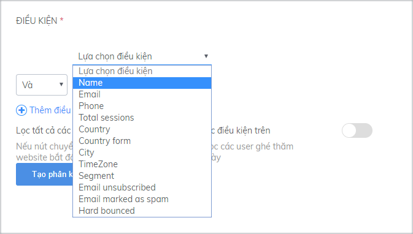
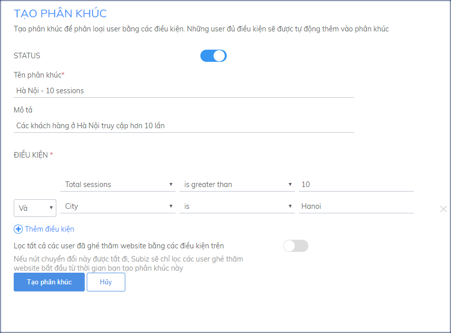
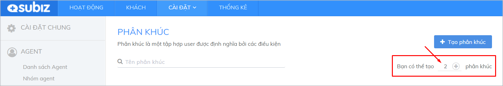
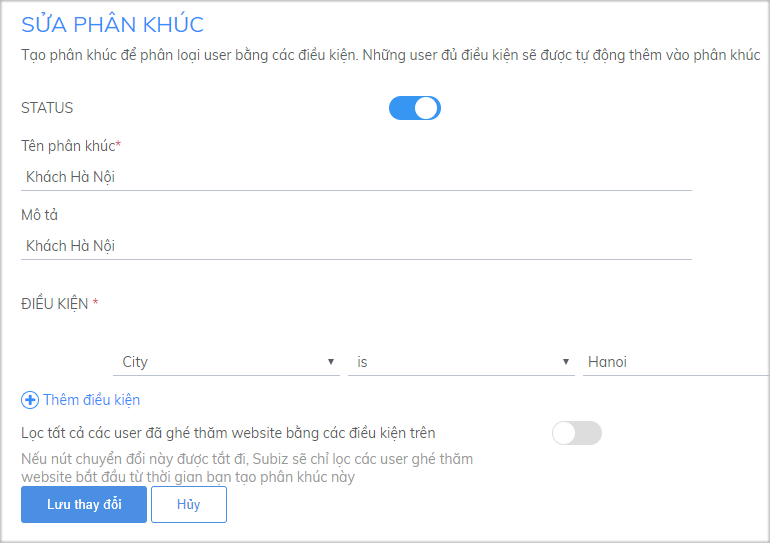
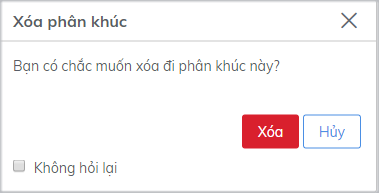

# Phân khúc khách hàng

## Tạo phân khúc khách hàng mới

**Phân khúc** là các nhóm khách hàng được phân chia theo tiêu chí nhất định. Việc tạo phân khúc nhằm giúp bạn phân loại và chia nhỏ dữ liệu khách hàng, **giúp bạn có chiến lược hiệu quả riêng cho từng đối tượng khách hàng.**

Tại trang **Cài đặt Phân khúc**, bạn có thể tạo phân khúc mới, theo dõi và chỉnh sửa danh sách phân khúc.

Để tạo Phân khúc mới, bạn vào **Cài đặt &gt; Tài khoản &gt; Phân khúc, chọn Tạo phân khúc**.

Tạo phân khúc mới theo các bước:

* Status: Chọn trạng thái **ON/OFF** cho Phân khúc
* Đặt tên cho phân khúc tại **Tên phân khúc** 
* Điền thông tin mô tả về Phân khúc tại **Mô tả**
* Lựa chọn các điều kiện thích hợp tại **ĐIỀU KIỆN** 

* Click **Thêm điều kiện** để thêm các điều kiện khác
* Lựa chọn mối quan hệ giữa các điều kiện
  * **Và:** khách hàng có tất cả các điều kiện thỏa mãn mới được đưa vào Phân khúc
  * **Hoặc:** khách hàng có một trong các điều kiện thỏa mãn thì được đưa vào Phân khúc
* Click **Tạo Phân khúc** để khởi tạo

Ví dụ về tạo Phân khúc lọc các khách hàng Việt Nam có nhiều hơn 10 lần truy cập.

Chế độ **Lọc tất cả user \(**chỉ có ở gói Nâng cao\):

* **Trạng thái ON:** hệ thống Subiz sẽ kiểm tra và lọc toàn bộ dữ liệu về user đã, đang và sẽ có trên Subiz để đưa vào phân khúc.
* **Trạng thái OFF:** chỉ kiểm tra và lọc các khách truy cập từ thời điểm tạo Phân khúc


Phân khúc khách hàng chỉ có thể được tạo khi bạn đang sử dụng gói Trial hoặc gói Nâng Cao. Bạn sẽ thấy số lượng phân khúc còn lại ngay dưới phần Tạo phân khúc. Nếu đã sử dụng hết số lượng Phân khúc cho phép, bạn cần nâng cấp tài khoản lên gói Nâng cao hoặc đăng ký mua thêm để tạo thêm Phân khúc mới.


## Quản lý danh sách phân khúc

Các Phân khúc đã được tạo sẽ hiển thị trong danh sách Phân khúc.

**Được tạo:** Thời gian Phân khúc được khởi tạo

Thời gian này liên quan đến việc kiểm tra và lọc user để đưa vào Phân khúc \(trong trường hợp chế độ “**Lọc tất cả user**” ở trạng thái OFF\).

Trường hợp có thay đổi điều kiện của phân khúc, ngày tạo sẽ được hiển thị là ngày thay đổi điều kiện gần nhất \(tương đương với tạo Phân khúc mới\).

**Số lượng user:** Số user có trong Phân khúc

Các phân khúc sau khi được tạo sẽ cần có một khoảng thời gian nhất định để xác định số user có trong phân khúc, bởi vậy, trong một số trường hợp,  số lượng user sẽ hiển thị ở dạng _“Đang ước tính”_ thay vì con số cụ thể.

**Sửa/ Xóa Phân khúc**

Khi cần sửa hoặc xóa 1 phân khúc, bạn click vào button tương ứng trong danh sách phân khúc.

Để chỉnh sửa một phân khúc, bạn chọn biểu tượng sửa, sau đó cập nhật các thông tin tại trang Sửa Phân khúc và chọn Lưu thay đổi

Nếu bạn thay đổi điều kiện trong Phân khúc, các dữ liệu sẽ được cập nhật lại từ thời điểm bạn thay đổi \(trong trường hợp chế độ “Lọc tất cả user” ở trạng thái OFF\). Việc này tương đương tạo một Phân khúc mới.

Để xóa một Phân khúc, bạn chọn biểu tượng Xóa, sau đó click button Xóa để xác nhận.

