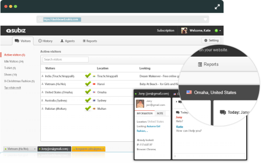

# Quan sát khách truy cập

### Làm thế nào để quan sát khách truy cập?

**Bạn có thể theo dõi các khách đang truy cập website của bạn** tại trang **Khách**. Mỗi khách truy cập được nhận diện bằng [cookie](http://vi.wikipedia.org/wiki/Cookie) trên trình duyệt của họ.

Khách truy cập là những khách hàng có nhu cầu tìm hiểu thông tin, sản phẩm và dịch vụ của doanh nghiệp. **Họ đều có thể trở thành khách hàng tiềm năng, nên hãy quan sát xem họ đang quan tâm những thông tin gì để chủ động tiếp cận và hỗ trợ họ**. Càng tương tác nhiều thì cơ hội bán hàng của bạn càng cao. Đừng bỏ lỡ hàng ngàn khách hàng hàng ngày đang truy cập vào website của bạn.

Với mỗi khách truy cập, bạn sẽ có những thông tin sau:

* **Ảnh đại diện:** Hiển thị chữ cái đầu tiên trong tên của visitor
* **Họ tên, Email**: Các thông tin này được lưu từ lần truy cập trước hoặc chuyển từ website của bạn vào hệ thống Subiz qua API Javascript
* **Vị trí địa lý**: vị trí của khách truy cập được xác định thông qua địa chỉ IP
* **Trang đang xem** : Địa chỉ trang mà khách đang xem trên website của bạn

Click vào từng khách truy cập trên trang Khách, bạn sẽ được chuyển về trang Hoạt động để tương tác trực tiếp với khách hàng đó.

### Subiz xác định thông tin vị trí khách truy cập dựa vào đâu?

Để xác định vị trí địa lý khách hàng, Subiz sử dụng dịch vụ của bên thứ 3 là **Maxmind**. Nó được xác định dựa trên địa chỉ IP. Các địa chỉ IP này đôi khi được liên kết với một ISP \(Internet Service Provider\) hoặc VPN \(Virtual Private Network\) nên sự khác biệt với địa điểm thực của khách hàng hoàn toàn có thể xảy ra.

Một trong những lý do khác khiến những thông tin này không chính xác 100% là do các cơ sở dữ liệu của bên thứ 3 cập nhật không chính xác hoặc bị cũ do chưa cập nhật kịp thời sự thay đổi.

Để điều chỉnh sự không chính xác này, bạn có thể gửi yêu cầu trực tiếp tới Maxmind để yêu cầu cập nhật chính xác: [https://support.maxmind.com/geoip-data-correction-request/](https://support.maxmind.com/geoip-data-correction-request/)

Với tình trạng sai khác thông tin vị trí khi thực hiện truy cập giữa các máy trong cùng một công ty, bạn có thể kiểm tra thông tin địa chỉ IP của các máy tính này.

