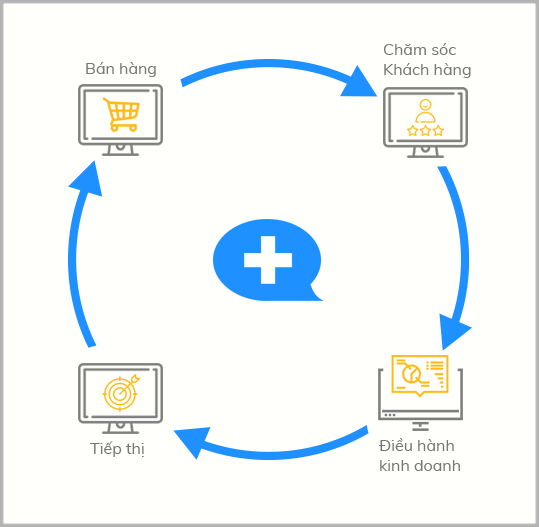
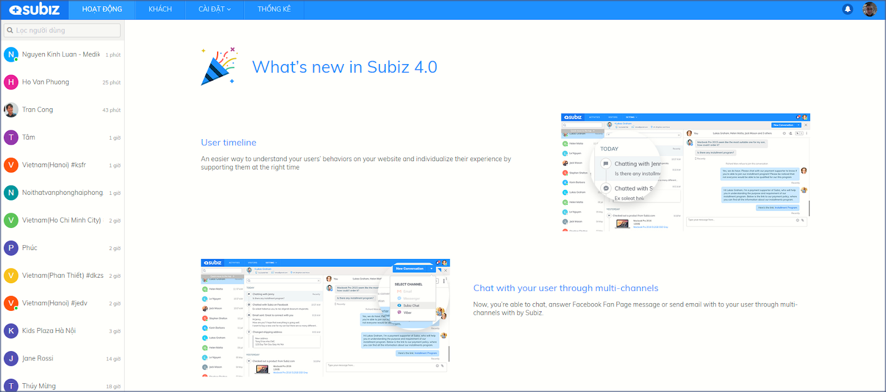

# Giới thiệu về Subiz

### Subiz là gì? 

[Subiz](https://subiz.com/vi/) là công cụ tương tác với khách hàng của doanh nghiệp mang lại doanh số cao.

Doanh nghiệp có thể tương tác với khách hàng từ nhiều kênh ngay trên [Subiz](https://subiz.com/vi/). Dữ liệu tương tác được tập trung giúp bạn hiểu rõ bức tranh khách hàng và triển khai các chiến lược tiếp thị, tương tác, chăm sóc và giữ chân khách hàng một cách hiệu quả.

### Lợi ích & giá trị từ Subiz 

Khách hàng thường tìm kiếm thông tin và có nhu cầu về thương hiệu của bạn trên các kênh Website, Facebook, Email,... bất cứ lúc nào, do đó, bạn có thể sử dụng [Subiz](https://subiz.com/vi/) để:

* **Nâng cao chất lượng dịch vụ chăm sóc khách hàng**: Luôn sẵn sàng hỗ trợ khách hàng mọi lúc, mọi nơi; tăng tốc độ phản hồi và nắm rõ lịch sử tương tác với khách hàng.
* **Tối ưu khả năng tiếp thị**: Tự động phân khúc nhóm khách hàng tiềm năng và [Email marketing](https://subiz.com/vi/email.html%20) tự động theo hành vi và đến đúng khách hàng mục tiêu.
* **Nâng cao tỉ lệ chuyển đổi khách hàng**: Nắm bắt nhu cầu khách truy cập website, chủ động tiếp cận khách hàng trên nhiều kênh, theo đuổi khách hàng một cách phù hợp và gia tăng cơ hội bán hàng.
* **Quản lý dữ liệu khách hàng hiệu quả**: Tổng hợp lịch sử tương tác của khách hàng và giải quyết chính xác các vấn đề hỗ trợ khách hàng.

Khi đó, [Subiz](https://subiz.com/vi/) là tất cả mọi thứ bạn cần để tương tác và quản lý khách hàng tại một nơi duy nhất, mà không cần phải phải sử dụng nhiều ứng dụng. Tất cả đều được thực hiện ngay trên [Dashboard](https://app.subiz.com/) của [Subiz](https://subiz.com/vi/).

### Subiz hoạt động như thế nào? 

[Subiz](https://subiz.com/vi/) là công cụ giúp bạn chào đón, tiếp cận, bán hàng và quản trị khách hàng đến từ nhiều kênh ngay tại Dashboard của [Subiz](https://subiz.com/vi/).

Tại đây, bạn có thể theo dõi khách hàng đang truy cập, nắm rõ thông tin và hành vi khách hàng, chủ động tương tác và theo đuổi khách hàng từ nhiều kênh bán hàng của doanh nghiệp như Website, Facebook, Email,...

Doanh nghiệp có thể nâng cao tỉ lệ chuyển đổi khách hàng và gia tăng doanh số bán hàng bằng cách:

* Thu thập thông tin khách hàng và triển khai các chiến lược marketing tự động với **Automation**
* Phân khúc và quản lý danh sách khách hàng tiềm năng qua **Segment**
* Phân phối các cuộc hội thoại và điều hành hoạt động của tư vấn viên thông qua tính năng **Rule**

### **Các thuật ngữ có trong Subiz** 

Thuật ngữ trong [Subiz](https://subiz.com/vi/) là các từ hoặc cụm từ dùng đề mô tả các yếu tố, hành động liên quan trong quá trình sử dụng [Subiz](https://subiz.com/vi/).

Sau đây là một số khái niệm bạn cần nắm được để sử dụng chính xác và tối ưu hiệu quả sử dụng [Subiz](https://subiz.com/vi/):

| Thuật ngữ  |  Khái niệm chung |  |
| :--- | :--- | :--- |
| Agent | Người sử dụng Subiz. Mỗi agent có một tài khoản đăng nhập Subiz riêng để thực hiện các công việc của mình. Agent có thể là người quản lý, tư vấn viên, hoặc bất kì nhân viên nào trong doanh nghiệp. |  |
| Visitor | Khách truy cập website của bạn |  |
| User | Khách hàng có tương tác, nhắn tin trò chuyện với bạn qua [Subiz](https://subiz.com/vi/) |  |
| Cuộc hội thoại | Cuộc hội thoại trò chuyện giữa Agent và User trên các kênh khác nhau của Subiz |  |
| Kênh | Các kênh tương tác của bạn với khách hàng qua [Subiz](https://subiz.com/vi/), bao gồm: [Subiz Chat](https://subiz.com/vi/live-chat.html%20), [Email](https://subiz.com/vi/email.html%20), [Facebook Messenger](https://subiz.com/vi/facebook-messenger.html%20)… |  |
| Rule | Tính năng tự động phân chia cuộc hội thoại của khách hàng cho agent theo các điều kiện cài đặt. |  |
| Phân khúc | Tính năng tự động lọc và phân nhóm user theo điều kiện cài đặt |  |
| Automation | Tính năng tương tác tự động thực hiện các hành động như gửi tin nhắn, hỏi thông tin, gửi email tới khách hàng... theo điều kiện cài đặt. |  |

​

