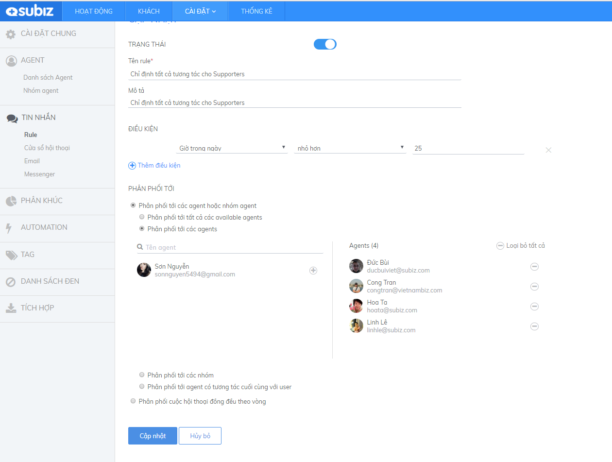

# Thanh Toán

##  Subiz tính phí như thế nào

### Cung cấp dịch vụ theo hình thức "Thuê Bao" là gì?

Subiz vận hành theo mô hình SAAS \(software as a service\), tạm dịch là phần mềm như một dịch vụ, cho phép người mua trả một khoản phí thuê bao hàng năm hoặc hàng tháng, chi phí đã bao gồm giấy phép sử dụng phần mềm, phí hỗ trợ và hầu hết các chi phí khác.

Bạn cần thanh toán gói thuê bao vào đầu mỗi chu kỳ thanh toán. \(Thuê bao trả trước\)

Hiện tại, bạn có thể lựa chọn một trong các chu kỳ: 1 tháng, 3 tháng, 6 tháng, 1 năm, 2 năm.

Với mỗi chu kỳ bạn sẽ được hưởng một mức ưu đãi khác nhau \([Chi tiết](https://subiz.com/vi/pricing.html#morestandard)\)

###  Lựa chọn gói dịch vụ phù hợp nhất?

Subiz cung cấp 02 loại gói, bạn có thể lựa chọn: Gói Cơ bản \(Standard\) và Gói Nâng cao \(Advanced\).

Sự khác biệt giữa 02 loại gói dịch vụ này là các tính năng được cung cấp.

* **Với gói Cơ bản**, bạn được sử dụng 05 Automation \(Lời mời chat tự động\), 03 Rule \( Nguyên tắc phân phối hội thoại

Nếu doanh nghiệp vừa và nhỏ, lượng tương tác tại một thời điểm thường chưa đạt mức 100 cuộc chat, kịch bản cho mời chat tự động dừng lại ở việc phân loại các nhóm đối tượng cơ bản \(khách mới, khách cũ, khách xem quá 03 trang\) thì gói Cơ bản hoàn toàn đáp ứng được nhu cầu.

Tổng lượng chat trong ngày không hề bị giới hạn, bạn có thể tăng số lượng agent tương ứng để đáp ứng tốt nhất số lượng yêu cầu chat nhận được từ khách hàng.

* **Với gói Nâng cao**, điểm mạnh là số lượng Rule sẽ không bị giới hạn. Điều này phục vụ cho những doanh nghiệp có số lượng website tích hợp lớn, cần sử dụng nhiều thiết lập hội thoại cho những đường dẫn url khác nhau, hoặc sử dụng nhiều Automation chuyên sâu cho nhiều nhóm đối tượng.

Nằm trong kế hoạch triển khai, phần thống kê báo cáo của gói Nâng cao hứa hẹn cung cấp một cơ sở dữ liệu với những phân tích chuyên sâu dành cho khách hàng doanh nghiệp.

Xem bảng so sánh chi tiết [tại đây](http://subiz.com/vi/pricing.html#morestandard).

###  Phương thức thanh toán

#### Thanh toán qua Thẻ tín dụng \(Credit và Debit card\)

Việc nâng cấp tài khoản lên gói dịch vụ trả phí sau khi bạn đã trải nghiệm thời gian dùng thử vô cùng đơn giản. Chỉ vài phút thao tác, tài khoản của bạn sẽ được nâng cấp ngay lập tức.

1. Truy nhập vào Tài khoản [Subiz](https://app.subiz.com/login?redirect=%2Factivities%2F)  . Cài đặt &gt; **Thanh toán **

1. Lựa chọn thông tin của gói dịch vụ phù hợp và Click Đăng ký ngay
   * Gói Standard/ Advanced
   * Số lượng agent
   * Chu kỳ thanh toán
   * Phương thức thanh toán

1. Nhập thông tin với cổng thanh toán Stripe

Khi bạn thực hiện thanh toán thành công, tài khoản sẽ được nâng cấp ngay lập tức, đồng thời hệ thống sẽ gửi xác nhận cung cấp dịch vụ thành công tới email đăng ký của bạn.

Dưới đây là minh họa giao diện hiển thị thông tin tài khoản của bạn khi đã hoàn tất nâng cấp:

Sau khi nâng cấp tài khoản thành công, bất kỳ lúc nào bạn đều có thể [thay đổi những thông tin thuê bao](https://docs.subiz.com/quan-ly-thong-tin-goi-dich-vu/) này. 

#### Thanh toán qua Chuyển Khoản ngân hàng 

1. Truy nhập vào Tài khoản [Subiz](https://app.subiz.com/login?redirect=%2Factivities%2F)  . Cài đặt &gt; **Thanh toán **

2. Lựa chọn thông tin của gói dịch vụ phù hợp và Click Đăng ký ngay

**Lưu ý**: Hình thức thanh toán chuyển khoản chỉ hiển thị khi trang thanh toán của bạn đang sử dụng ngôn ngữ Tiếng Việt.  
Lựa chọn Ngôn ngữ “Tiếng Việt” ở góc trên bên phải của trang.

Chọn hình thức thanh toán Chuyển khoản & Click vào Đăng ký ngay.

3. Hệ thống tự động hiển thị thông tin thanh toán tương ứng

* Số tiền
* Nội dung chuyển khoản
* Số tài khoản ghi nhận thanh toán

  
Sử dụng mã giảm giá   
Hướng dẫn sử dụng Credit Voucher   
Nạp Credit   
Tạo thanh toán online

