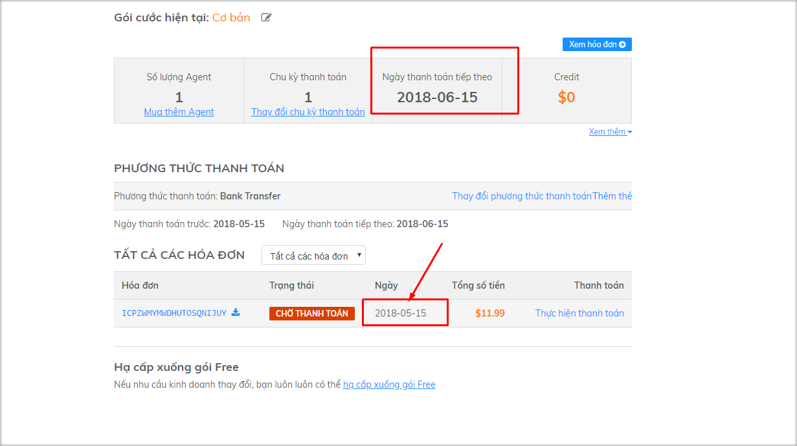
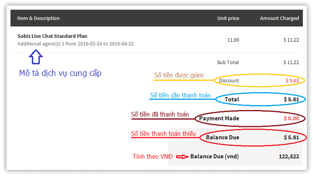
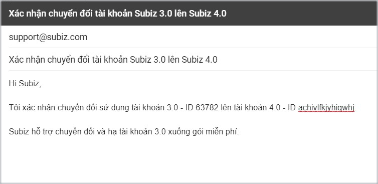

# FAQs

### Tôi đã thanh toán rồi mà hệ thống vẫn hiển thị thông báo hóa đơn chờ thanh toán? 

Tình trạng này xảy ra với những trường hợp thanh toán thiếu do chênh lệch số dư khi thực hiện chuyển khoản. Việc này đã được lưu ý ngay tại email xác nhận thanh toán từ hệ thống khi thực hiện cập nhật thanh toán cho tài khoản bạn. Bạn vui lòng thanh toán chính xác số tiền hệ thống cung cấp.


Nếu có bất kỳ câu hỏi nào liên quan đến hóa đơn phát sinh và việc thực hiện thanh toán, vui lòng gửi phản hồi đến email [billing@subiz.com](mailto:billing@subiz.com) để được hỗ trợ.


### Tại sao thanh toán thẻ không thành công? 

#### Thẻ tín dụng của bạn bị từ chối

Trong quá trình thực hiện thanh toán qua thẻ tín dụng, thông báo lỗi “thẻ bị từ chối” xảy ra có thể do nhiều nguyên nhân.

Khi nhận được lệnh đồng ý thanh toán từ bạn, cổng thanh toán của chúng tôi ngay lập tức gửi yêu cầu tới ngân hàng, phía ngân hàng bên bạn có hệ thống tự động xử lý yêu cầu này, và có thể cho phép hoặc từ chối yêu cầu thực hiện thanh toán.

Hệ thống xử lý tự động căn cứ vào một số dấu hiệu từ tài khoản của bạn như: số dư tài khoản, thói quen chi tiêu của chủ thẻ, thông tin thẻ \(tên chủ thẻ, số thẻ, ngày hết hạn, mã CVC\).

Các dấu hiệu này có thể thay đổi, phụ thuộc vào việc bạn sử dụng thẻ.

Ngay cả khi, bạn đã chắc chắn tất cả thông tin thẻ đều được điền chính xác, và các giao dịch trước đó đều thành công, thì việc thanh toán tiếp theo bị từ chối đều hoàn toàn có thể xảy ra.

Một trong những lý do để các ngân hàng thắt chặt hơn phần thanh toán này có liên quan đến rủi ro về thanh toán gian lận \(đối với từng ngân hàng\).

#### Lý do chính xác cho việc “Thẻ bị từ chối”?

Hầu hết các thông tin mà ngân hàng đưa ra đều rất chung, vì vậy, chúng tôi không thể cung cấp nguyên nhân chính xác về việc tại sao thẻ của bạn bị từ chối.

Nếu tất cả các thông tin bạn điền là chính xác, bạn có thể liên hệ trực tiếp tới ngân hàng phát hành thẻ để biết được lý do cụ thể và yêu cầu các khoản thanh toán tương tự trong tương lai sẽ được chấp thuận mà không cần sự liên lạc trực tiếp từ bạn.

#### Các phương án thay thế

Để hoàn tất thanh toán nâng cấp, bạn có thể lựa chọn một trong các phương án sau:

1. Sử dụng thẻ tín dụng khác \(nếu có\)
2. Liên hệ với ngân hàng phát hành thẻ và yêu cầu mở thanh toán

### Tôi có thể thay đổi gói dịch vụ Subiz bất cứ lúc nào?

Đúng vậy, bạn có thể thay đổi gói dịch vụ của mình bất cứ khi nào để phù hợp nhất với tình hình kinh doanh và hoạt động của công ty. Bạn có thể thêm/bớt Agent, tăng/giảm chu kỳ thanh toán hoặc thay đổi phương thức thanh toán phù hợp tại trang [THANH TOÁN](https://app.subiz.com/payment-home) của Subiz.

### Tại sao hệ thống hiển thị thông báo về hóa đơn quá hạn?

Khi tài khoản của bạn phát sinh hóa đơn dưới dạng **CHỜ THANH TOÁN**  \(Open\), hệ thống sẽ hiển thị thông báo cho đến khi bạn hoàn tất thanh toán.

Click vào “**Thực hiện thanh toán**” trên dòng thông báo – hệ thống sẽ tự động chuyển bạn đến phần Danh sách hóa đơn, cụ thể là vùng hóa đơn Chưa thanh toán để bạn có thể thuận tiện tra cứu và thực hiện thanh toán một cách dễ dàng.

### Ngày thanh toán kế tiếp của tôi chưa tới, sao vẫn có hóa đơn chưa thanh toán?

Khi tới ngày gia hạn, để dịch vụ của bạn không bị gián đoạn, hệ thống tự động gia hạn chu kỳ kế tiếp, đồng thời gửi thông báo tới bạn.

Do đó, ngày thanh toán kế tiếp sẽ hiển thị ngày kết thúc của chu kỳ mới. Bạn cần kiểm soát thông tin chi tiết trên hóa đơn để nắm rõ nội dung dịch vụ cung cấp cho thời gian nào.


**Lưu ý**: Trường hợp hóa đơn phát sinh do thao tác không mong muốn, bạn cần gửi xác nhận tới Support@subiz.com, chúng tôi sẽ giúp bạn hủy hóa đơn.


### Hướng dẫn đọc thông tin trên hóa đơn?

Hóa đơn là là sự cam kết trách nhiệm và nghĩa vụ của 2 bên: Subiz có trách nhiệm cung cấp đúng gói dịch vụ và Doanh nghiệp có nghĩa vụ thanh toán hóa đơn của gói dịch vụ. Bạn cần chủ động nắm rõ và kiểm soát các thông tin này:

**Balance Due** là số tiền chưa thanh toán \(công nợ\). Balance due &gt; 0 hệ thống sẽ hiển thị thông báo về hóa đơn quá hạn.

### Chuyển đổi sử dụng tài khoản Subiz 3.0 lên Subiz 4.0

Bạn đang có tài khoản Subiz phiên bản 3.0 và muốn sử dụng Subiz phiên bản 4.0. Bạn cần thực hiện 2 bước sau: 

**1.Cài đặt triển khai tài khoản Subiz 4.0:**

* Đăng nhập trang quản lý Subiz 4.0 qua link [app.subiz.com](https://app.subiz.com) bằng email và mật khẩu tài khoản bạn đang sở hữu. Lưu ý: Nếu bạn muốn sử dụng tài khoản Subiz 4.0 mới, bạn cần [đăng ký tài khoản mới tại đây](https://app.subiz.com/register).
* Tích hợp cửa sổ chat Subiz 4.0 lên website, kết nối Fanpage \(nếu có\) vào Subiz \([Xem chi tiết](https://app.subiz.com/settings/install)\)
* Cập nhật sử dụng Automation tự động chào mừng khách vào website \([Xem chi tiết](https://app.subiz.com/settings/automation-add?atmlibrary=3)\)
* Trò chuyện và quản lý danh sách khách hàng trên Subiz \([Xem chi tiết](https://subiz.com/blog/tuong-tac-khach-hang-hieu-qua-voi-subiz.html)\) 

**2. Xác nhận chuyển đổi lên Subiz 4.0**

Tài khoản Subiz 3.0 của bạn đang sử dụng gói trả phí, bạn cần gửi tới email Support@subiz.com xác nhận chuyển đổi tài khoản từ Subiz 3.0 lên Subiz 4.0 nhằm đảm bảo đầy đủ quyền lợi sử dụng gói dịch vụ trả phí của mình.

* **Email người gửi**: Địa chỉ email quản lý tài khoản Subiz 3.0
* **Email người nhận**: Support@Subiz.com
* **Subject**: Xác nhận chuyển đổi tài khoản Subiz 3.0 lên Subiz 4.0
* **Nội dung**: Chuyển đổi sử dụng tài khoản Subiz 3.0 - ID ......... - sang tài khoản Subiz 4.0 ID.....  Subiz hỗ trợ chuyển đổi và hạ tài khoản 3.0 xuống gói miễn phí


Bạn có băn khoăn và cần hỗ trợ, vui lòng gửi yêu cầu tới Support@subiz.com


 

