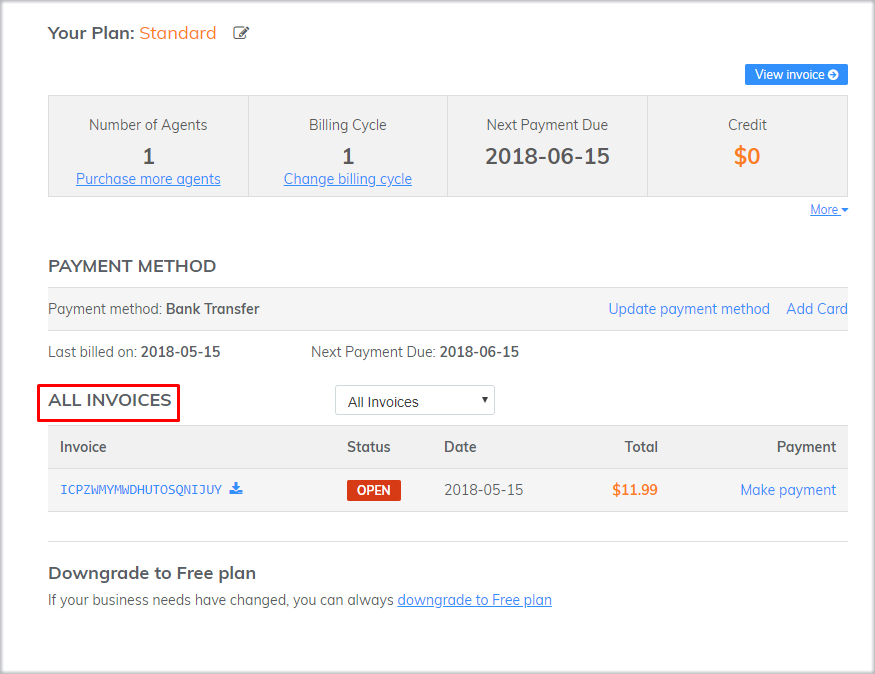

# FAQs

### Tôi đã thanh toán rồi mà hệ thống vẫn hiển thị thông báo? 

Tình trạng này xảy ra với những trường hợp thanh toán thiếu do chênh lệch số dư khi thực hiện chuyển tiền. Việc này đã được lưu ý ngay tại email xác nhận thanh toán từ hệ thống khi thực hiện cập nhật thanh toán cho tài khoản bạn. Bạn vui lòng thanh toán chính xác số tiền hệ thống cung cấp.


Nếu có bất kỳ câu hỏi nào liên quan đến hóa đơn phát sinh và việc thực hiện thanh toán, vui lòng gửi phản hồi đến email [billing@subiz.com](mailto:billing@subiz.com) để được hỗ trợ.


### Tại sao thanh toán thẻ không thành công? 

#### Thẻ tín dụng của bạn bị từ chối

Trong quá trình thực hiện thanh toán qua thẻ tín dụng, thông báo lỗi “thẻ bị từ chối” xảy ra có thể do nhiều nguyên nhân.

Khi nhận được lệnh đồng ý thanh toán từ bạn, cổng thanh toán của chúng tôi ngay lập tức gửi yêu cầu tới ngân hàng, phía ngân hàng bên bạn có hệ thống tự động xử lý yêu cầu này, và có thể cho phép hoặc từ chối yêu cầu thực hiện thanh toán.

Hệ thống xử lý tự động căn cứ vào một số dấu hiệu từ tài khoản của bạn như: số dư tài khoản, thói quen chi tiêu của chủ thẻ, thông tin thẻ \(tên chủ thẻ, số thẻ, ngày hết hạn, mã CVC\).

Các dấu hiệu này có thể thay đổi, phụ thuộc vào việc bạn sử dụng thẻ.

Ngay cả khi, bạn đã chắc chắn tất cả thông tin thẻ đều được điền chính xác, và các giao dịch trước đó đều thành công, thì việc thanh toán tiếp theo bị từ chối đều hoàn toàn có thể xảy ra.

Một trong những lý do để các ngân hàng thắt chặt hơn phần thanh toán này có liên quan đến rủi ro về thanh toán gian lận \(đối với từng ngân hàng\).

#### Lý do chính xác cho việc “Thẻ bị từ chối”?

Hầu hết các thông tin mà ngân hàng đưa ra đều rất chung, vì vậy, chúng tôi không thể cung cấp nguyên nhân chính xác về việc tại sao thẻ của bạn bị từ chối.

Nếu tất cả các thông tin bạn điền là chính xác, bạn có thể liên hệ trực tiếp tới ngân hàng phát hành thẻ để biết được lý do cụ thể và yêu cầu các khoản thanh toán tương tự trong tương lai sẽ được chấp thuận mà không cần sự liên lạc trực tiếp từ bạn.

#### Các phương án thay thế

Để hoàn tất thanh toán nâng cấp, bạn có thể lựa chọn một trong các phương án sau:

1. Sử dụng thẻ tín dụng khác \(nếu có\)
2. Liên hệ với ngân hàng phát hành thẻ và yêu cầu mở thanh toán

### Hợp đồng và Hóa đơn \(đối với khách hàng doanh nghiệp\) 

Để gửi yêu cầu thực hiện Hợp đồng và Hóa đơn, bạn vui lòng điền thông tin theo [mẫu](https://docs.subiz.com/wp-content/uploads/2017/12/Subiz_Th%C3%B4ng-tin-doanh-nghi%E1%BB%87p.doc) và gửi tới email [billing@subiz.com](mailto:billing@subiz.com).

* Phương thức vận chuyển: Chuyển phát qua đơn vị Chuyển phát nhanh
* Thời gian thực hiện: **07 – 10 ngày** làm việc


* **Hợp đồng** được thực hiện với thuê bao có chu kỳ thanh toán từ **12 tháng** trở lên.
* **Hóa đơn** được xuất theo yêu cầu của doanh nghiệp với chu kỳ thanh toán từ **03 tháng** trở lên.
* Sản phẩm của Subiz thuộc đối tượng không chịu thuế. Phần VAT trong hóa đơn sẽ được gạch chéo.


#### Xuất hóa đơn muộn?

Hóa đơn được yêu cầu thực hiện trong vòng **30 ngày** kể từ ngày doanh nghiệp hoàn tất nghĩa vụ thanh toán. Subiz không có trách nhiệm xuất hóa đơn bù nếu quá thời gian quy định. Chính sách này được áp dụng với tất cả khách hàng của Subiz.

### Quản lý hóa đơn

Để theo dõi thông tin, tình trạng Hóa đơn \(tình trạng thanh toán, chu kì, thời hạn còn lại..\) bạn có thể truy cập vào [App.subiz.com](https://app.subiz.com) &gt; [Cài đặt/**Thanh toán**](https://app.subiz.com/payment-home). Thông tin sẽ được hiển thị như sau:

### Chính sách hoàn tiền 

#### Thời gian dùng thử

Sau khi đăng ký tài khoản mới, bạn sẽ được sử dụng toàn bộ[ tính năng](https://subiz.com/vi/feature.html) của [Subiz ](https://subiz.com/vi/)gói trả phí Cơ bản trong vòng 30 ngày để có thể trải nghiệm trước khi quyết định nâng cấp tài khoản. Bạn sẽ không mất bất kỳ chi phí nào trong thời gian dùng thử này.

#### Tài khoản trả phí

Khi bạn quyết định nâng cấp tài khoản, bạn cần xác định số agent \(hỗ trợ viên\), chu kỳ thanh toán và loại gói dịch vụ. Thanh toán sẽ được hoàn tất vào đầu chu kỳ sử dụng. Chúng tôi không có chính sách hoàn thanh toán – đây là chính sách đối với tất cả khách hàng – và bạn sẽ chịu trách nhiệm về toàn bộ các lần thanh toán của tài khoản bạn sở hữu.

### Subiz có những chính sách ưu đãi nào?

* [Subiz](https://subiz.com/vi/) hỗ trợ ưu đãi ưu đãi tới 30% khi thanh toán chu kỳ dài, xem chi tiết tại bảng tính giá.
* [Subiz ](https://subiz.com/vi/)hỗ trợ giảm 40% chi phí cho các đơn vị giáo dục công lập, tổ chức phi lợi nhuận.

### Tôi có thể thay đổi gói dịch vụ Subiz bất cứ lúc nào?

Đúng vậy, bạn có thể thay đổi gói dịch vụ của mình bất cứ khi nào để phù hợp nhất với tình hình kinh doanh và hoạt động của công ty. Bạn có thể thêm/bớt Agent, tăng/giảm chu kỳ thanh toán hoặc thay đổi phương thức thanh toán phù hợp.

### Tại sao hệ thống hiển thị thông báo về hóa đơn quá hạn?

Khi tài khoản của bạn phát sinh hóa đơn dưới dạng **Chưa thanh toán** \(Open\), hệ thống sẽ hiển thị thông báo cho đến khi bạn hoàn tất thanh toán.

Click vào “**thực hiện thanh toán**” trên dòng thông báo – hệ thống sẽ tự động chuyển bạn đến phần Danh sách hóa đơn, cụ thể là vùng hóa đơn Chưa thanh toán để bạn có thể thuận tiện tra cứu và thực hiện thanh toán một cách dễ dàng.

### Ngày thanh toán kế tiếp của tôi chưa tới, sao vẫn có hóa đơn chưa thanh toán?

Khi tới ngày gia hạn, để dịch vụ của bạn không bị gián đoạn, hệ thống tự động gia hạn chu kỳ kế tiếp, đồng thời gửi thông báo tới bạn.

Do đó, ngày thanh toán kế tiếp sẽ hiển thị ngày kết thúc của chu kỳ mới. Bạn cần kiểm soát thông tin chi tiết trên hóa đơn để nắm rõ nội dung dịch vụ cung cấp cho thời gian nào.


**Lưu ý**: Trường hợp hóa đơn phát sinh do thao tác không mong muốn, bạn cần gửi xác nhận tới [Subiz](https://subiz.com/vi/), chúng tôi sẽ giúp bạn hủy hóa đơn.


### Hóa đơn gia hạn

Tại thời điểm bắt đầu chu kỳ kế tiếp, hệ thống sẽ tự động gia hạn dịch vụ đồng thời hóa đơn gia hạn sẽ phát sinh tương ứng.

Để kiểm soát thông tin tốt nhất, [Subiz ](https://subiz.com/vi/)sẽ gửi thông báo về việc gia hạn tài khoản qua các phương thức: Email tới người phụ trách tài khoản; Hiển thị thông báo trên trang quản lý Dashboard; Hiển thị thông báo tại phần Thông báo mới.

Khi nhận được thông báo, bạn có thể kiểm tra hóa đơn trực tiếp tại [trang thanh toán](https://app.subiz.com/payment-home#) như hình minh họa:


* Nếu tài khoản của bạn được thiết lập gọi thanh toán tự động qua thẻ tín dụng, hệ thống sẽ tự động gọi thanh toán trong vòng 24h tính từ thời điểm hóa đơn phát sinh. 
* Nếu tài khoản của bạn sử dụng hình thức thanh toán chuyển khoản, trong vòng 07 ngày hệ thống sẽ gửi thông báo nhắc qua email về việc đề nghị thanh toán gia hạn tài khoản.


### Hóa đơn quá hạn được thông báo qua các kênh nào?

Hóa đơn quá hạn sẽ được thông báo qua các kênh sau:

* Hiển thị thông báo trên màn hình quản lý Dashboard
* Hiển thị thông báo tại phần Thông báo mới
* Gửi Email thông báo tới email đăng ký chính \(mặc định\), hoặc email được xác nhận phụ trách.


**Lưu ý**: Để đảm bảo bạn nhận được đầy đủ thông tin từ [Subiz](https://subiz.com/vi/), trong trường hợp thay đổi người phụ trách tài khoản hoặc thay đổi email liên hệ, bạn cần gửi xác nhận tới[ Subiz](https://subiz.com/vi/) để chúng tôi cập nhật thông tin


### Hướng dẫn đọc thông tin trên hóa đơn?

Hóa đơn là chứng nhận cho việc cung cấp dịch vụ từ Subiz, bạn nên chủ động nắm rõ và kiểm soát các thông tin này:

**Balance Due** là số tiền chưa thanh toán \(công nợ\). Balance due &gt; 0 hệ thống sẽ hiển thị thông báo về hóa đơn quá hạn.

