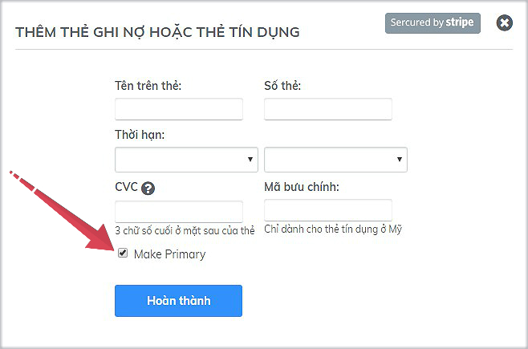
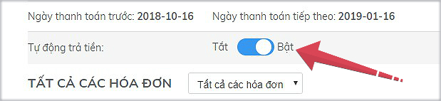

# Gia hạn Subiz

### Gia hạn Subiz là gì?

Sau khi tài khoản của bạn kết thúc chu kỳ thanh toán trước của gói dịch vụ, Subiz sẽ hỗ trợ tự động gia hạn dịch vụ theo gói trả phí bạn đã đăng ký, tránh sự gián đoạn công việc của Doanh Nghiệp.

Hóa đơn gia hạn cũng sẽ tự động sinh ra để bạn thực hiện thanh toán.

Bạn có thể xem chi tiết gói dịch vụ và hóa đơn thanh toán tại trang [THANH TOÁN](https://app.subiz.com/payment-home) của Subiz.


Lưu ý: Để thay đổi gói dịch vụ gia hạn, bạn cần thay đổi gói dịch vụ trước khi kết thúc chu kỳ thanh toán đang có, [xem chi tiết](https://help.subiz.com/thanh-toan/thay-doi-goi-dich-vu).


### Thông báo hóa đơn gia hạn

Subiz sẽ thông báo hóa đơn gia hạn cần thanh toán trên 2 kênh chính:

1. Thông báo ngay trên trang quản trị [App.subiz.com](https://app.subiz.com), bạn có thể xem chi tiết hóa đơn gia hạn tại trang [THANH TOÁN](https://app.subiz.com/payment-home)
2. Thông báo hóa đơn gia hạn qua email phụ trách tài khoản Subiz hoặc email của bạn yêu cầu nhận thông báo hóa đơn 

### Phương thức thanh toán gia hạn Subiz

Subiz hỗ trợ 2 phương thức thanh toán là Thẻ tín dụng và Chuyển khoản. Dưới đây là hướng dẫn các bước thanh toán như sau:

#### **1. Thanh toán qua thẻ tín dụng**

Nếu bạn đã chọn Phương thức thanh toán là Thẻ tín dụng và bật Tự động trả tiền thì trong 24h kể từ khi hóa đơn sinh ra, Subiz sẽ thu phí theo đúng số tiền cần thanh toán trong hóa đơn. 

Nếu bạn chưa chọn Phương thức thanh toán là thẻ tín dụng, bạn cần thao tác 3 bước sau:

* Bước 1: Vào trang [THANH TOÁN](https://app.subiz.com/payment-home) của Subiz để xem Hóa đơn chờ thanh toán
* Bước 2: Tại mục PHƯƠNG THỨC THANH TOÁN &gt; chọn Thêm thẻ &gt; Điền thông tin thẻ tín dụng hoặc thẻ ghi nợ &gt; Chọn Make Primary &gt; Hoàn thành

* Bước 3: Bật - Tự động trả tiền

#### 2. Thanh toán bằng chuyển khoản

Bạn sẽ vào trang [THANH TOÁN](https://app.subiz.com/payment-home) &gt; Mở Hóa đơn CHỜ THANH TOÁN để xem thông tin thanh toán và chuyển khoản tới:  
  
              Tài khoản số: 0451001477880   
              Tại Ngân hàng: TMCP Ngoại thương Việt Nam- Chi nhánh Thành Công - Hà Nội   
              Chủ tài khoản: Công ty cổ phần giải pháp trực tuyến VietnamBIZ  
                 
               Nội dung chuyển khoản: Mua dịch vụ cho "Mã tài khoản" hoặc "website" hoặc "email                            đăng nhập Subiz"


Bạn có băn khoăn và cần hỗ trợ thêm, vui lòng gửi yêu cầu tới mail Support@Subiz.com


