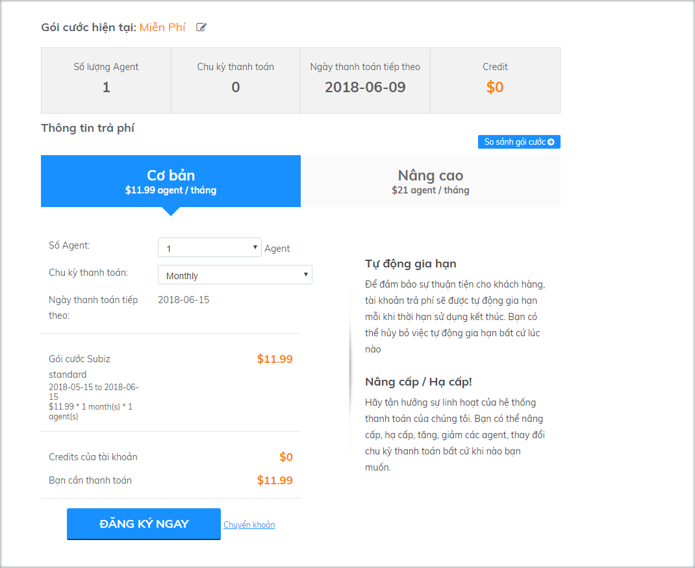
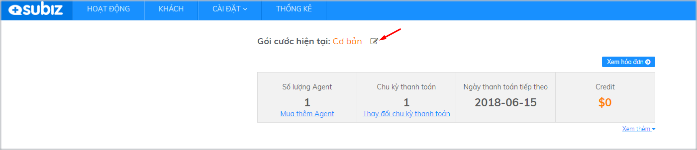

# Quản lý thông tin gói dịch vụ

Trong quá trình sử dụng Subiz, tùy vào tình hình kinh doanh và chiến lược phát triển, bạn có thể chủ động thay đổi gói dịch vụ của tài khoản bất cứ khi nào để phù hợp với nhu cầu của doanh nghiệp như Nâng cấp tài khoản, Hạ cấp tài khoản, Mua thêm agent, Giảm agent, Thay đổi chu kỳ thanh toán, Thay đổi phương thức thanh toán.

Chi tiết hướng dẫn như sau:

### Nâng cấp tài khoản

* **Tài khoản ở gói miễn phí**

Khi tài khoản của bạn ở gói miễn phí và muốn nâng cấp lên gói trả phí, bạn cần đăng nhập vào trang [THANH TOÁN](https://app.subiz.com/payment-home), sau đó chọn gói dịch vụ **ĐĂNG KÝ NGAY** và trả phí ****[theo hướng dẫn này](https://help.subiz.com/thanh-toan/tra-phi-dich-vu-subiz)**.**

* **Tài khoản ở gói Cơ bản**

Nếu bạn muốn nâng cấp gói Cơ bản lên gói Nâng Cao,  bạn click vào mục chỉnh sửa trong phần **Gói cước hiện tại**

Sau đó lựa chọn gói Nâng cao và tiến hành nâng cấp tài khoản:


Lưu ý: Sau khi Nâng cấp tài khoản, hệ thống sẽ phát sinh hóa đơn trong tài khoản của bạn. Bạn có thể lựa chọn thanh toán qua Thẻ tín dụng hoặc Chuyển khoản theo [**Hướng dẫn thanh toán**](https://help.subiz.com/thanh-toan/tra-phi-dich-vu-subiz)**.**


### Hạ cấp tài khoản

Bạn đang sử dụng gói Nâng cao và muốn hạ cấp tài khoản xuống gói cơ bản, bạn vào mục **Gói cước hiện tại** và tiến hành hạ cấp tài khoản.


 Lưu ý: Với việc hạ cấp gói dịch vụ, hệ thống sẽ không sinh hóa đơn, và bạn sẽ được bảo lưu thanh toán của gói dịch vụ chưa sử dụng đến. Hãy gửi mail xác nhận hạ cấp tài khoản tới **Support@Subiz.com** để đảm bảo quyền lợi bảo lưu thanh toán của bạn!


### Thay đổi số lượng Agent

#### Mua thêm Agent

Để tăng Agent bạn click vào mục **Mua thêm Agent** sau đó lựa chọn số lượng Agent phù hợp:


Lưu ý: Sau khi bạn Mua thêm Agent, hệ thống sẽ phát sinh hóa đơn trong tài khoản của bạn. Bạn có thể lựa chọn thanh toán qua Thẻ tín dụng hoặc Chuyển khoản theo [**Hướng dẫn thanh toán**](https://help.subiz.com/thanh-toan/tra-phi-dich-vu-subiz)**.**


**Giảm số lượng Agent**

Để giảm số lượng Agent, bạn vào mục **Xem thêm** sau đó thay đổi số lượng Agent phù hợp.


 Lưu ý: Việc giảm agent sẽ không sinh hóa đơn. Bạn sẽ được bảo lưu thanh toán của agent chưa sử dụng đến. Hãy gửi mail xác nhận giảm agent tới **Support@Subiz.com** để đảm bảo quyền lợi bảo lưu thanh toán của bạn!


### Thay đổi chu kỳ thanh toán

Để thay đổi chu kỳ thanh toán, bạn click vào mục **Thay đổi chu kỳ thanh toán** và lựa chọn chu kỳ phù hợp:


 Lưu ý: Việc thay đổi chu kỳ thanh toán sẽ được cập nhật trong hóa đơn sinh ra tại chu kỳ kế tiếp. Vì chu kỳ hiện tại hóa đơn đã được hệ thống tự sinh rồi.


### Hạ tài khoản xuống gói miễn phí

Tùy vào nhu cầu sử dụng và hoạt động kinh doanh, bạn có thể lựa chọn Hạ tài khoản xuống gói miễn phí và nâng cấp lại bất cứ khi nào  
Xem thêm [chính sách hạ cấp tài khoản xuống gói miễn phí](https://help.subiz.com/thanh-toan/chinh-sach-hoan-tien)

### Thay đổi phương thức thanh toán

Bạn có thể thay đổi thông tin thanh toán như thêm thẻ tín dụng khác, chuyển phương thức thanh toán qua thẻ tín dụng hoặc chuyển khoản,... ngay trên trang [**THANH TOÁN**](https://app.subiz.com/payment-home) của Subiz.

Hướng dẫn chi tiết như sau:

* Thêm thẻ tín dụng khác để thanh toán hoặc chuyển từ phương thanh thanh toán Chuyển khoản sang Thẻ tín dụng như sau:  1. Vào trang [**THANH TOÁN**](https://app.subiz.com/payment-home\) &gt;  chọn **Thêm thẻ** &gt; **Điền thông tin Thẻ ghi nợ hoặc Thẻ tín dụng** &gt; **Chọn Make Primary** để chọn Thẻ tín dụng này là thẻ chính mặc định thanh toán sau này &gt; **Hoàn thành** 2. ****Bật **ON - Tự động trả tiền**

* Thay đổi Phương thức thanh toán từ Thẻ tín dụng sang Chuyển khoản. Vào trang [**THANH TOÁN**](https://app.subiz.com/payment-home) &gt; Click **Thay đổi phương thức thanh toán** &gt; Click **Sửa Thẻ tín dụng** &gt; **Bỏ chọn Make Primary** để bỏ chọn mặc định thanh toán bằng thẻ tín dụng &gt; Mở **Hóa đơn CHỜ THANH TOÁN** và **Chuyển khoản** vào số tài khoản của Subiz.

Xem thêm hướng dẫn [Gia hạn dịch vụ Subiz](https://help.subiz.com/thanh-toan/gia-han-subiz).


Bạn có thắc mắc hoặc cần hỗ trợ, vui lòng gửi yêu cầu tới email Support@subiz.com.


