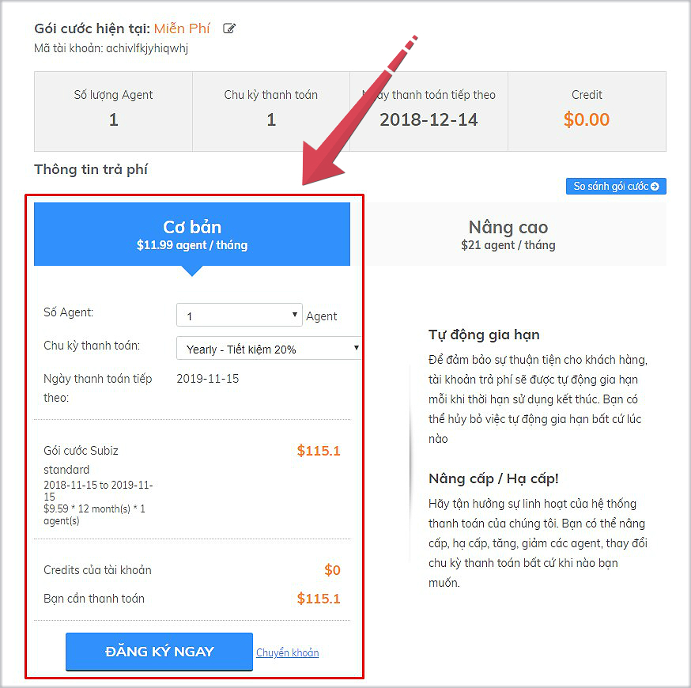

# Trả phí dịch vụ Subiz

Bạn hoàn toàn được chủ động trong việc nâng cấp gói dịch vụ Subiz và thực hiện trả phí ngay trên trang [THANH TOÁN](https://app.subiz.com/payment-home) của Subiz.  
  
Subiz hỗ trợ 2 phương thức thanh toán là Thẻ tín dụng và Chuyển khoản. Chỉ với vài bước thao tác nhanh chóng, tài khoản của bạn sẽ được nâng cấp lập tức.

### Thanh toán qua thẻ tín dụng

* Bước 1: Truy cập trang [THANH TOÁN](https://app.subiz.com/payment-home) của Subiz
* Bước 2: Chọn gói dịch vụ trả phí                + Gói **Cơ bản** hoặc **Nâng cao**                + Số Agent                + Chu kỳ thanh toán

* Bước 3: chọn ĐĂNG KÝ NGAY. Tài khoản sẽ được nâng cấp và tự sinh ra hóa đơn 
* Bước 4: Để thanh toán qua thẻ tín dụng chọn Thêm thẻ > Điền thông tin thẻ tín dụng hoăc thẻ ghi nợ > Chọn Make Primary > Hoàn thành

* Bước 5: Bật - Tự động trả tiền


Lưu ý:

* Hóa đơn đã được thanh toán thành công sẽ tự động cập nhật trạng thái ĐÃ THANH TOÁN
* Thanh toán bằng thẻ tín dụng báo lỗi/ không thanh toán được, bạn kiểm tra theo 3 bước sau: 1. Kiểm tra đủ các bước: BẬT - Tự động trả, Điền ĐÚNG thông tin thẻ tín dụng 2. Nếu đã thao tác đủ và đúng thông tin, bạn vui lòng liên hệ ngân hàng kiểm tra giao dịch lỗi do hạn mức thẻ hay lỗi hệ thống. 3. Liên hệ tư vấn viên Subiz qua email Support@subiz.com hoặc chat online tại Subiz.com


### Thanh toán bằng chuyển khoản

* Bước 1: Truy cập trang [THANH TOÁN](https://app.subiz.com/payment-home) của Subiz
* Bước 2: Chọn gói dịch vụ trả phí                + Gói **Cơ bản** hoặc **** **Nâng cao**                + Số Agent                + Chu kỳ thanh toán

* Bước 3: chọn ĐĂNG KÝ NGAY. Tài khoản sẽ được nâng cấp và tự sinh ra hóa đơn 
* Bước 4: Mở Hóa đơn CHỜ THANH TOÁN để xem thông tin thanh toán và chuyển khoản tới:                Tài khoản số: 0451001477880                Tại Ngân hàng: TMCP Ngoại thương Việt Nam- Chi nhánh Thành Công - Hà Nội                Chủ tài khoản: Công ty cổ phần giải pháp trực tuyến VietnamBIZ                                Nội dung chuyển khoản: Mua dịch vụ cho "Mã tài khoản" hoặc "website" hoặc "email                            đăng nhập Subiz"


Lưu ý:

* Hóa đơn đã được thanh toán thành công sẽ tự động cập nhật trạng thái ĐÃ THANH TOÁN
* Cần hỗ trợ thêm từ Subiz, bạn vui lòng liên hệ tư vấn viên qua email Support@subiz.com hoặc chat online tại Subiz.com.


###              

### 

