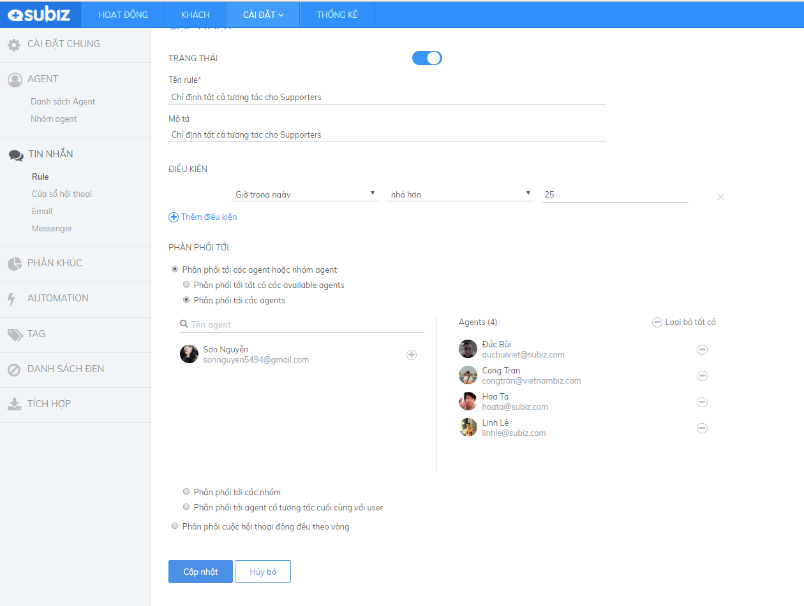
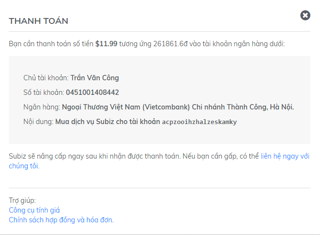

# Phương thức thanh toán

Subiz có 2 hình thức thành toán.....

## Thanh toán qua Thẻ tín dụng \(Credit và Debit card\)

Việc nâng cấp tài khoản lên gói dịch vụ trả phí sau khi bạn đã trải nghiệm thời gian dùng thử vô cùng đơn giản. Chỉ vài phút thao tác, tài khoản của bạn sẽ được nâng cấp ngay lập tức.

1. Truy nhập vào Tài khoản [Subiz](https://app.subiz.com/login?redirect=%2Factivities%2F) . Cài đặt &gt; **Thanh toán**

Thanh toán dịch vụ Subiz

2. Lựa chọn thông tin của gói dịch vụ phù hợp và Click Đăng ký ngay

* Gói Standard/ Advanced
* Số lượng agent
* Chu kỳ thanh toán
* Phương thức thanh toán

1. Nhập thông tin với cổng thanh toán Stripe

   ​

Khi bạn thực hiện thanh toán thành công, tài khoản sẽ được nâng cấp ngay lập tức, đồng thời hệ thống sẽ gửi xác nhận cung cấp dịch vụ thành công tới email đăng ký của bạn.

Dưới đây là minh họa giao diện hiển thị thông tin tài khoản của bạn khi đã hoàn tất nâng cấp:

Sau khi nâng cấp tài khoản thành công, bất kỳ lúc nào bạn đều có thể thay đổi những thông tin thuê bao này.

## Thanh toán qua Chuyển Khoản ngân hàng 

Cần đoạn giới thiệu

các bước

1. Truy nhập vào Tài khoản [Subiz](https://app.subiz.com/login?redirect=%2Factivities%2F) . Cài đặt &gt; **Thanh toán**

Thanh toán dịch vụ Subiz

2. Lựa chọn thông tin của gói dịch vụ phù hợp và Click vào mục `Chuyển khoản` , hệ thống sẽ hiển thị số tiền cần chuyển và thông tin tài khoản của Subiz.


Lưu ý: Hệ thống tự động hiển thị thông tin thanh toán tương ứng

* Số tiền
* Nội dung chuyển khoản
* Số tài khoản ghi nhận thanh toán


