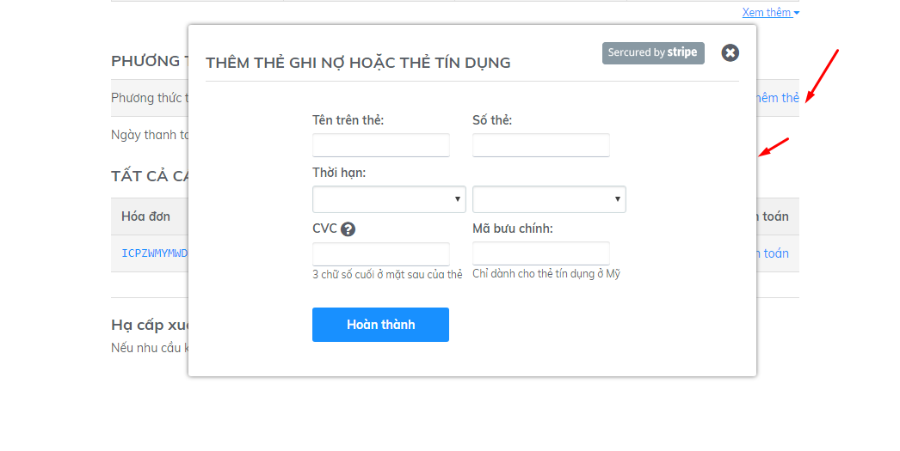

# Thay đổi phương thức thanh toán

### Thay đổi phương thức thanh toán

Để thay đổi phương thức thanh toán từ thẻ tín dụng sang chuyển khoản và ngược lại

**Chuyển từ phương thức chuyển khoản sang thẻ tín dụng:** Chọn mục **phương thức thanh toán / Thêm thẻ**

**Chuyển từ thẻ tín dụng sang chuyển khoản:** Click vào phần thẻ tín dụng và xóa thông tin thẻ, thanh toán của bạn sẽ chuyển về phương thức chuyển khoản:

###  Bật/Tắt gia hạn tự động với thẻ tín dụng

