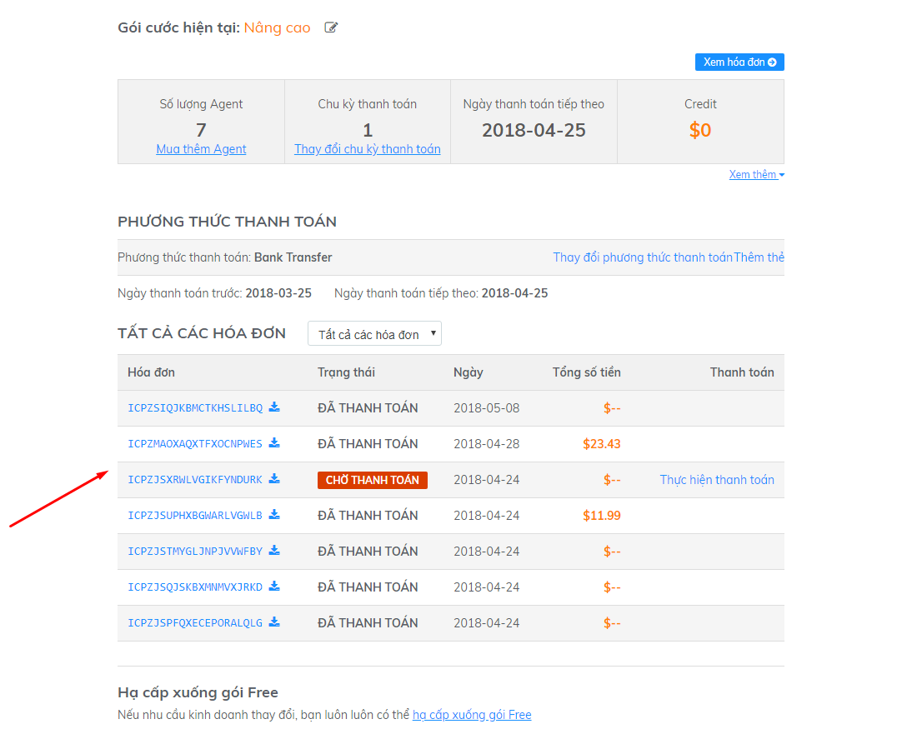
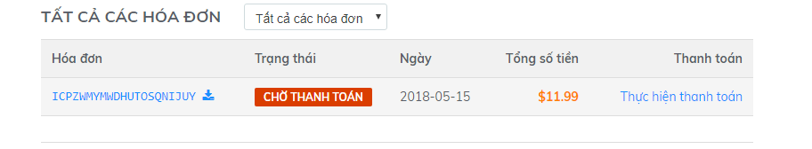

# FAQs

### Tôi có thể thay đổi gói dịch vụ Subiz bất cứ lúc nào?

Đúng vậy, bạn có thể thay đổi gói dịch vụ của mình bất cứ khi nào để phù hợp nhất với tình hình kinh doanh và hoạt động của công ty. Bạn có thể thêm/ bớt Agent, tăng/giảm chu kỳ thanh toán hoặc thay đổi phương thức thanh toán phù hợp.

###  Tại sao hệ thống hiển thị thông báo về hóa đơn quá hạn?

Khi tài khoản của bạn phát sinh hóa đơn dưới dạng **Chưa thanh toán** \(Open\), hệ thống sẽ hiển thị thông báo cho đến khi bạn hoàn tất thanh toán.

Click vào “**thực hiện thanh toán**” trên dòng thông báo – hệ thống sẽ tự động chuyển bạn đến phần Danh sách hóa đơn, cụ thể là vùng hóa đơn Chưa thanh toán để bạn có thể thuận tiện tra cứu và thực hiện thanh toán một cách dễ dàng.

###  Ngày thanh toán kế tiếp của tôi chưa tới, sao vẫn có hóa đơn chưa thanh toán?

Khi tới ngày gia hạn, để dịch vụ của bạn không bị gián đoạn, hệ thống **tự động gia hạn** chu kỳ kế tiếp, đồng thời gửi thông báo tới bạn.

Do đó, ngày thanh toán kế tiếp sẽ hiển thị ngày kết thúc của chu kỳ mới. Bạn cần kiểm soát thông tin chi tiết trên hóa đơn để nắm rõ nội dung dịch vụ cung cấp cho thời gian nào.

**Lưu ý**: Trường hợp hóa đơn phát sinh do thao tác không mong muốn, bạn cần gửi xác nhận tới Subiz, chúng tôi sẽ giúp bạn hủy hóa đơn.

###  Hóa đơn gia hạn

Tại thời điểm bắt đầu chu kỳ kế tiếp, hệ thống sẽ tự động gia hạn dịch vụ đồng thời hóa đơn gia hạn sẽ phát sinh tương ứng.

Để kiểm soát thông tin tốt nhất, Subiz sẽ gửi thông báo về việc gia hạn tài khoản qua các phương thức: Email tới người phụ trách tài khoản; Hiển thị thông báo trên trang quản lý Dashboard; Hiển thị thông báo tại phần Thông báo mới.

 Khi nhận được thông báo, bạn có thể kiểm tra hóa đơn trực tiếp tại [trang thanh toán](https://app.subiz.com/payment-home#) như hình minh họa:

* Nếu tài khoản của bạn được thiết lập gọi thanh toán tự động qua thẻ tín dụng, hệ thống sẽ tự động gọi thanh toán trong vòng 24h tính từ thời điểm hóa đơn phát sinh.  
* Nếu tài khoản của bạn sử dụng hình thức thanh toán chuyển khoản, trong vòng 07 ngày hệ thống sẽ gửi thông báo nhắc qua email về việc đề nghị thanh toán gia hạn tài khoản.

###  Hóa đơn quá hạn được thông báo qua các kênh nào?

Hóa đơn quá hạn sẽ được thông báo qua các kênh sau:

* Hiển thị thông báo trên màn hình quản lý Dashboard
*  Hiển thị thông báo tại phần Thông báo mới
* Gửi Email thông báo tới email đăng ký chính \(mặc định\), hoặc email được xác nhận phụ trách.

**Lưu ý**: Để đảm bảo bạn nhận được đầy đủ thông tin từ Subiz, trong trường hợp thay đổi người phụ trách tài khoản hoặc thay đổi email liên hệ, bạn cần gửi xác nhận tới Subiz để chúng tôi cập nhật thông tin

### Hướng dẫn đọc thông tin trên hóa đơn?

Hóa đơn là chứng nhận cho việc cung cấp dịch vụ từ Subiz, bạn nên chủ động nắm rõ và kiểm soát các thông tin này:

 **Balance Due** là số tiền chưa thanh toán \(công nợ\). Balance due &gt; 0 hệ thống sẽ hiển thị thông báo về hóa đơn quá hạn.

###  Hủy tài khoản     

